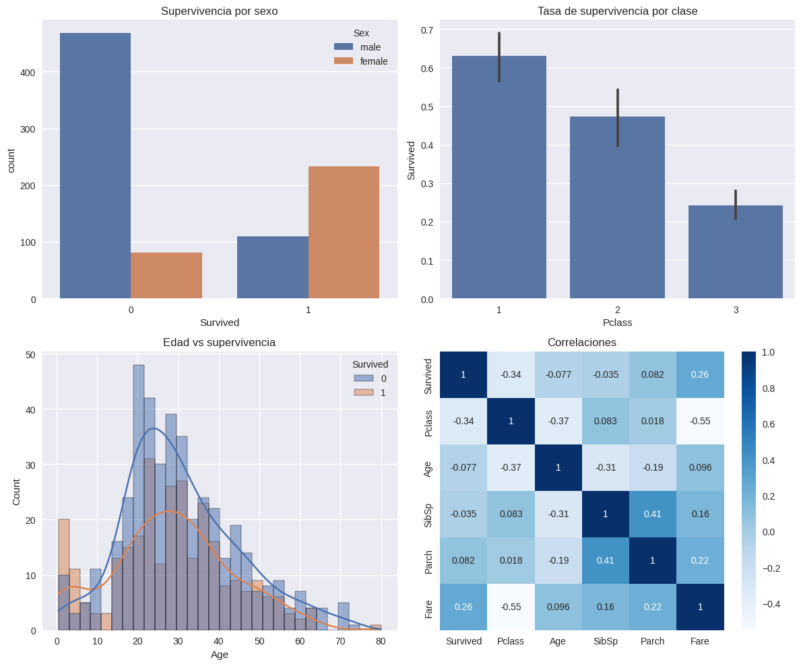

# Práctica 1 — EDA del Titanic en Google Colab

## Contexto

Realicé un análisis exploratorio (EDA) del dataset del Titanic utilizando Google Colab y las librerías estándar del ecosistema científico de Python. El propósito fue comprender la estructura de los datos, su **calidad** y las **relaciones** que pueden anticipar la variable objetivo.

## Objetivos

* Comprender la estructura y contenido del dataset del Titanic.
* Preparar el entorno de trabajo en Colab con organización de carpetas.
* Cargar correctamente los datos (vía Kaggle API).
* Ejecutar un EDA estadístico y visual que oriente hipótesis iniciales.

## Actividades (con tiempos estimados)

| Actividad                    | Tiempo | Resultado esperado                    |
| ---------------------------- | :----: | ------------------------------------- |
| Investigación rápida del set |   10m  | Resumen y variables clave             |
| Setup de entorno en Colab    |   5m   | Dependencias, Drive montado, carpetas |
| Descarga y carga de datos    |   10m  | `train.csv` y `test.csv` disponibles  |
| EDA estadístico y visual     |   15m  | Métricas básicas y gráficos           |

## Desarrollo

### 0. Investigación del dataset (resumen)

El dataset del Titanic es un clásico de Kaggle para clasificación binaria donde la meta es predecir `Survived` (0/1) a partir de atributos demográficos y del viaje (clase, tarifa, edad, etc.). Variables esperadas con mayor relación: `Sex`, `Pclass`, `Age` y `Fare`. Posibles desafíos de datos: **faltantes** en `Age`, `Cabin` y algunos en `Embarked`, además de escalas y tipos mixtos.

---

### 1. Setup en Colab

**Entrada:**

```python
import pandas as pd
import numpy as np
import matplotlib.pyplot as plt
import seaborn as sns
import warnings
warnings.filterwarnings('ignore')

plt.style.use('seaborn-v0_8')
sns.set_palette('deep')
```

**Salida:**

```text
(sin salida)
```

**Entrada:**

```python
from pathlib import Path
try:
    from google.colab import drive
    drive.mount('/content/drive')
    ROOT = Path('/content/drive/MyDrive/IA-UT1')
except Exception:
    ROOT = Path.cwd() / 'IA-UT1'

DATA_DIR = ROOT / 'data'
RESULTS_DIR = ROOT / 'results'
for d in (DATA_DIR, RESULTS_DIR):
    d.mkdir(parents=True, exist_ok=True)
print('Outputs →', ROOT)
```

**Salida:**

```text
Mounted at /content/drive
Outputs → /content/drive/MyDrive/IA-UT1
```

### 2. Cargar el dataset de Kaggle

**Entrada:**

```python
!pip -q install kaggle
from google.colab import files
files.upload()  # Subí tu archivo kaggle.json descargado
!mkdir -p ~/.kaggle && cp kaggle.json ~/.kaggle/ && chmod 600 ~/.kaggle/kaggle.json
!kaggle competitions download -c titanic -p data
!unzip -o data/titanic.zip -d data

train = pd.read_csv('data/train.csv')
test = pd.read_csv('data/test.csv')
```

**Salida:**

```text
<IPython.core.display.HTML object>Saving kaggle.json to kaggle (2).json
titanic.zip: Skipping, found more recently modified local copy (use --force to force download)
Archive:  data/titanic.zip
  inflating: data/gender_submission.csv
  inflating: data/test.csv
  inflating: data/train.csv
```

### 3. Conocer el dataset

**Entrada:**

```python
train.shape, train.columns
```

**Salida:**

```text
((891, 12),
 Index(['PassengerId', 'Survived', 'Pclass', 'Name', 'Sex', 'Age', 'SibSp',
        'Parch', 'Ticket', 'Fare', 'Cabin', 'Embarked'],
       dtype='object'))
```

**Entrada:**

```python
train.head(3)
```

**Salida:**

```text
   PassengerId  Survived  Pclass  \
0            1         0       3   
1            2         1       1   
2            3         1       3   

                                                Name     Sex   Age  SibSp  \
0                            Braund, Mr. Owen Harris    male  22.0      1   
1  Cumings, Mrs. John Bradley (Florence Briggs Th...  female  38.0      1   
2                             Heikkinen, Miss. Laina  female  26.0      0   

... (salida tabular completa en notebook)
```
**Entrada:**
```python
train.info()
```

**Salida:**

```text
<class 'pandas.core.frame.DataFrame'>
RangeIndex: 891 entries, 0 to 890
Data columns (total 12 columns):
 #   Column       Non-Null Count  Dtype  
---  ------       --------------  -----  
 0   PassengerId  891 non-null    int64  
 1   Survived     891 non-null    int64  
 2   Pclass       891 non-null    int64  
 3   Name         891 non-null    object 
 4   Sex          891 non-null    object 
 5   Age          714 non-null    float64
 6   SibSp        891 non-null    int64  
 7   Parch        891 non-null    int64  
 8   Ticket       891 non-null    object 
 9   Fare         891 non-null    float64
 10  Cabin        204 non-null    object 
 11  Embarked     889 non-null    object 
dtypes: float64(2), int64(5), object(5)
memory usage: 83.7+ KB
```

**Entrada:**
```python
train.describe(include='all').T
```

**Salida:**

```text
             count unique                  top freq       mean         std  \
PassengerId  891.0    NaN                  NaN  NaN      446.0  257.353842   
Survived     891.0    NaN                  NaN  NaN   0.383838    0.486592   
Pclass       891.0    NaN                  NaN  NaN   2.308642    0.836071   
Name           891    891  Dooley, Mr. Patrick    1        NaN         NaN   
Sex            891      2                 male  577        NaN         NaN   
Age          714.0    NaN                  NaN  NaN  29.699118   14.526497   
SibSp        891.0    NaN                  NaN  NaN   
... (salida completa en notebook)
```

```python
train.isna().sum().sort_values(ascending=False)
```

**Salida:**

```text
Cabin          687
Age            177
Embarked         2
PassengerId      0
Name             0
Pclass           0
Survived         0
Sex              0
Parch            0
SibSp            0
Fare             0
Ticket           0
dtype: int64
```

**Entrada:**

```python
train['Survived'].value_counts(normalize=True)
```

**Salida:**

```text
Survived
0    0.616162
1    0.383838
Name: proportion, dtype: float64
```

### 4. EDA visual con Seaborn/Matplotlib

**Entrada:**

```python
fig, axes = plt.subplots(2, 2, figsize=(12, 10))

# Supervivencia global por sexo
sns.countplot(data=train, x='Survived', hue='Sex', ax=axes[0,0])
axes[0,0].set_title('Supervivencia por sexo')

# Tasa de supervivencia por clase
sns.barplot(data=train, x='Pclass', y='Survived', estimator=np.mean, ax=axes[0,1])
axes[0,1].set_title('Tasa de supervivencia por clase')

# Distribución de edad por supervivencia
sns.histplot(data=train, x='Age', hue='Survived', kde=True, bins=30, ax=axes[1,0])
axes[1,0].set_title('Edad vs supervivencia')

# Correlaciones numéricas
numeric_cols = ['Survived', 'Pclass', 'Age', 'SibSp', 'Parch', 'Fare']
sns.heatmap(train[numeric_cols].corr(), annot=True, cmap='Blues', ax=axes[1,1])
axes[1,1].set_title('Correlaciones')

plt.tight_layout()
plt.show()
```

**Salida (figura):**



## Evidencias y reflexión

* `Sex` y `Pclass` muestran diferencias claras en la tasa de supervivencia (mujeres y 1ra clase sobreviven más).
* `Fare` se relaciona positivamente con `Survived` y `Pclass`.
* Faltantes relevantes en `Cabin` y `Age` ; `Embarked` esta casi completo.

**Próxima hipótesis a probar:**

* Efecto de `Age` condicionado por `Pclass` y por `Sex`.

## Referencias

* Kaggle — Titanic: Machine Learning from Disaster.
* Link al proyecto en Colab: [Practica 1.ipynb](https://colab.research.google.com/drive/1FB2uL0s_gZQBVDU-8WCBRI0n1fzaeJ3G#scrollTo=M_YMsH2Ys97J)

---
