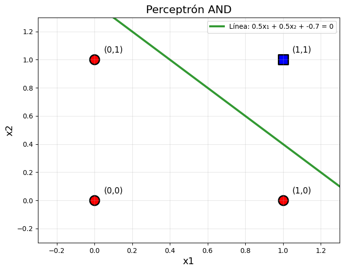
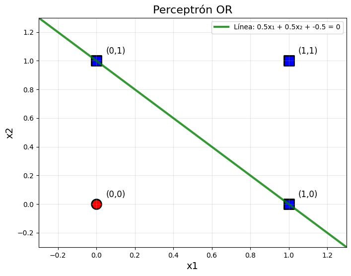
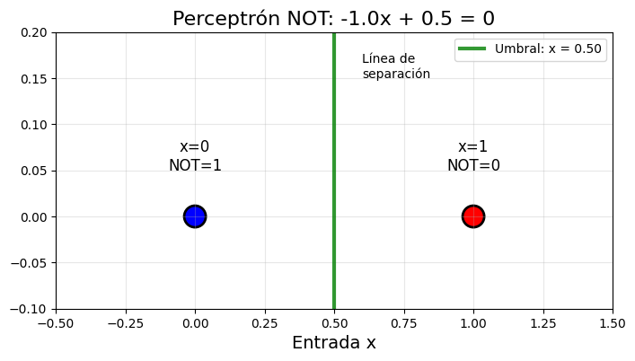
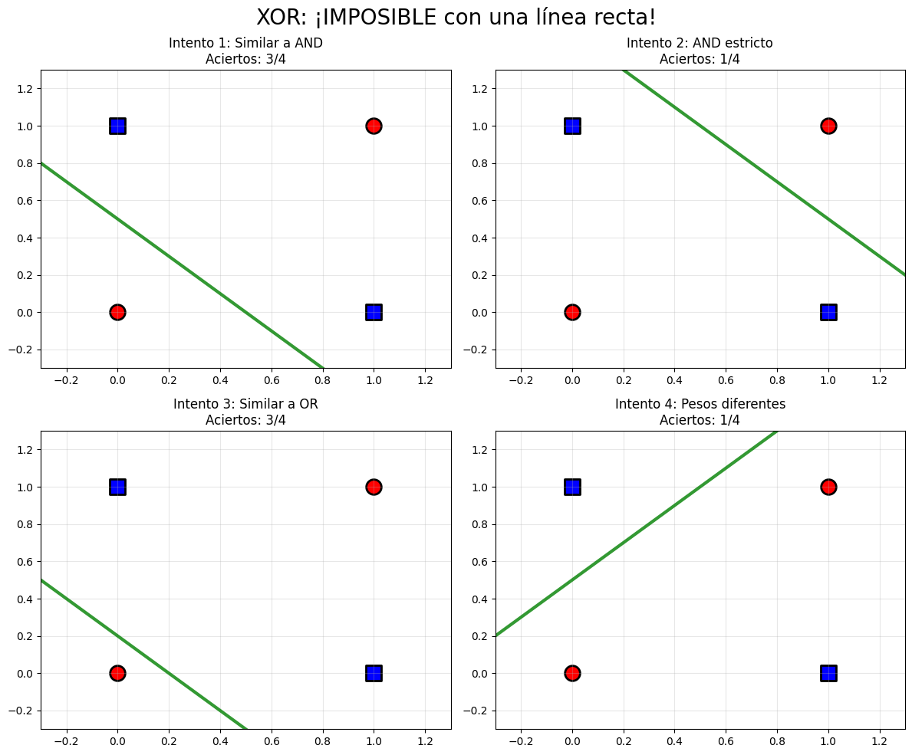
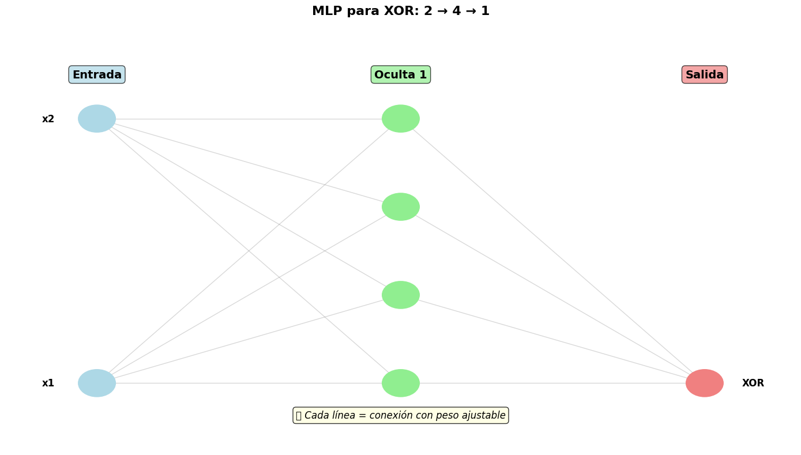
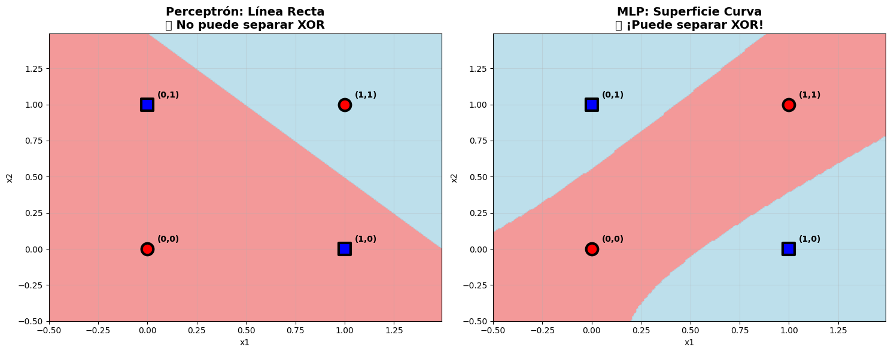
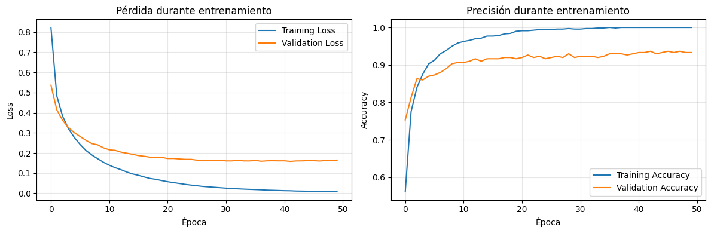
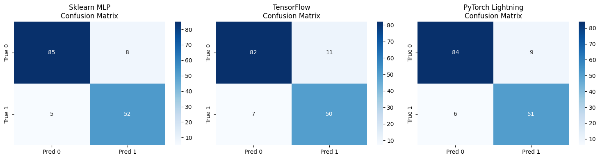
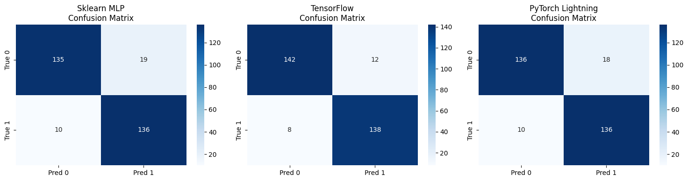

# De Perceptrón a Redes Neuronales  (UT2‑7)

## 🎯 Objetivos de Aprendizaje

Descubrir las limitaciones del perceptrón simple (problema XOR)
Resolver problemas reales con redes multicapa (sklearn MLP)
Implementar redes neuronales profesionales (TensorFlow/PyTorch Lightning)
Entender cuándo usar cada herramienta

## Contexto
Esta práctica explora el paso de un perceptrón (límites lineales) a redes neuronales multicapa capaces de modelar fronteras no lineales. Se implementan y comparan clasificadores para casos simples (AND/OR/NOT/XOR) y un dataset sintético “realista” usando tres frameworks: sklearn (MLP), TensorFlow/Keras y PyTorch Lightning. Se entrenan modelos, se visualizan superficies de decisión y se evalúa el rendimiento con accuracy y matrices de confusión reales, destacando por qué el perceptrón falla en XOR y cómo el MLP lo resuelve.


## 🎤 PARTE 1: Conceptos Interactivos
### 🧠 Actividad Interactiva: "Explorando el Perceptrón"
### 💻 Setup Súper Rápido

**Entrada:**

```python
# Setup
import numpy as np
import matplotlib.pyplot as plt

# Función perceptrón básica
def perceptron(x1, x2, w1, w2, bias):
    return 1 if (w1*x1 + w2*x2 + bias) >= 0 else 0

# Función para visualizar el perceptrón
def graficar_perceptron(w1, w2, bias, datos, resultados_esperados, titulo):
    plt.figure(figsize=(8, 6))

    # Graficar puntos
    for i, (x1, x2) in enumerate(datos):
        color = 'red' if resultados_esperados[i] == 0 else 'blue'
        marker = 'o' if resultados_esperados[i] == 0 else 's'
        plt.scatter(x1, x2, c=color, s=200, marker=marker,
                   edgecolor='black', linewidth=2)
        plt.text(x1+0.05, x2+0.05, f'({x1},{x2})', fontsize=12)

    # Graficar línea de separación: w1*x1 + w2*x2 + bias = 0
    if w2 != 0:  # Para evitar división por cero
        x_line = np.linspace(-0.5, 1.5, 100)
        y_line = -(w1*x_line + bias) / w2
        plt.plot(x_line, y_line, 'green', linewidth=3, alpha=0.8,
                label=f'Línea: {w1:.1f}x₁ + {w2:.1f}x₂ + {bias:.1f} = 0')

    plt.xlim(-0.3, 1.3)
    plt.ylim(-0.3, 1.3)
    plt.xlabel('x1', fontsize=14)
    plt.ylabel('x2', fontsize=14)
    plt.title(titulo, fontsize=16)
    plt.legend()
    plt.grid(True, alpha=0.3)
    plt.show()

    print(f"🔍 Interpretación: Los puntos ROJOS (○) son clase 0, los AZULES (■) son clase 1")
    print(f"   La línea VERDE separa las clases. ¿Lo logra perfectamente?")
    print(f"💡 Recordá: Un perceptrón es la ecuación de una línea: y = w₁x₁ + w₂x₂ + b")

# Datos para lógica booleana
datos = np.array([[0,0], [0,1], [1,0], [1,1]])
print("🧠 Vamos a entrenar un perceptrón para lógica booleana")
print("   (¡Y ver cómo funciona visualmente!)")
```

**Salida:**

```text
🧠 Vamos a entrenar un perceptrón para lógica booleana
   (¡Y ver cómo funciona visualmente!)
```

## 🎯 Paso 1: Resolver AND

**Entrada:**

```python
# Paso 1

# === LÓGICA AND ===
print("\n1️⃣ PROBLEMA AND: Solo verdadero cuando AMBAS entradas son 1")
print("x1 | x2 | AND esperado")
print(" 0 |  0 |      0")
print(" 0 |  1 |      0")
print(" 1 |  0 |      0")
print(" 1 |  1 |      1")  # estudiantes completan

# Encontremos pesos que funcionen para AND
w1, w2, bias = 0.5, 0.5, -0.7   # pesos iguales, ¿qué bias?

print(f"\nProbando AND con pesos: w1={w1}, w2={w2}, bias={bias}")
resultados_and = [0, 0, 0, 1]

for i, (x1, x2) in enumerate(datos):
    prediccion = perceptron(x1, x2, w1, w2, bias)
    esperado = resultados_and[i]
    ok = "✅" if prediccion == esperado else "❌"
    print(f"  {x1},{x2} → {prediccion} (esperado {esperado}) {ok}")

# 📊 VISUALIZACIÓN AND
graficar_perceptron(w1, w2, bias, datos, resultados_and, "Perceptrón AND")

```

**Salida(1/3):**

```text
1️⃣ PROBLEMA AND: Solo verdadero cuando AMBAS entradas son 1
x1 | x2 | AND esperado
 0 |  0 |      0
 0 |  1 |      0
 1 |  0 |      0
 1 |  1 |      1

Probando AND con pesos: w1=0.5, w2=0.5, bias=-0.7
  0,0 → 0 (esperado 0) ✅
  0,1 → 0 (esperado 0) ✅
  1,0 → 0 (esperado 0) ✅
  1,1 → 1 (esperado 1) ✅
```

**Salida(2/3):**



**Salida(3/3):**

```text
🔍 Interpretación: Los puntos ROJOS (○) son clase 0, los AZULES (■) son clase 1
   La línea VERDE separa las clases. ¿Lo logra perfectamente?
💡 Recordá: Un perceptrón es la ecuación de una línea: y = w₁x₁ + w₂x₂ + b
```

## 🎯 Paso 2: Resolver OR

**Entrada:**

```python
# Paso 2
# === LÓGICA OR ===
print("\n2️⃣ PROBLEMA OR: Verdadero cuando AL MENOS UNA entrada es 1")
print("x1 | x2 | OR esperado")
print(" 0 |  0 |      0")
print(" 0 |  1 |      1")
print(" 1 |  0 |      1")
print(" 1 |  1 |      1")

# Para OR necesitamos ser más permisivos
w1, w2, bias = 0.5, 0.5, -0.5  # ¿qué bias permite que una sola entrada active?

print(f"\nProbando OR con pesos: w1={w1}, w2={w2}, bias={bias}")
resultados_or = [0, 1, 1, 1]

for i, (x1, x2) in enumerate(datos):
    prediccion = perceptron(x1, x2, w1, w2, bias)
    esperado = resultados_or[i]
    ok = "✅" if prediccion == esperado else "❌"
    print(f"  {x1},{x2} → {prediccion} (esperado {esperado}) {ok}")

# 📊 VISUALIZACIÓN OR
graficar_perceptron(w1, w2, bias, datos, resultados_or, "Perceptrón OR")

```

**Salida(1/3):**

```text
2️⃣ PROBLEMA OR: Verdadero cuando AL MENOS UNA entrada es 1
x1 | x2 | OR esperado
 0 |  0 |      0
 0 |  1 |      1
 1 |  0 |      1
 1 |  1 |      1

Probando OR con pesos: w1=0.5, w2=0.5, bias=-0.5
  0,0 → 0 (esperado 0) ✅
  0,1 → 1 (esperado 1) ✅
  1,0 → 1 (esperado 1) ✅
  1,1 → 1 (esperado 1) ✅
```

**Salida(2/3):**



**Salida(3/3):**

```text
🔍 Interpretación: Los puntos ROJOS (○) son clase 0, los AZULES (■) son clase 1
   La línea VERDE separa las clases. ¿Lo logra perfectamente?
💡 Recordá: Un perceptrón es la ecuación de una línea: y = w₁x₁ + w₂x₂ + b
```

## 🎯 Paso 3: Resolver NOT

**Entrada:**

```python
# Paso 3
# === LÓGICA NOT (1 entrada) ===
print("\n3️⃣ PROBLEMA NOT: Inversor simple")
datos_not = np.array([[0], [1]])
print("x | NOT esperado")
print("0 |      1")
print("1 |      0")

# Para NOT: cuando x=0 → salida=1, cuando x=1 → salida=0
w1, bias = -1, 0.5  # peso negativo + bias positivo

print(f"\nProbando NOT con peso: w1={w1}, bias={bias}")
resultados_not = [1, 0]

for i, x in enumerate([0, 1]):
    prediccion = 1 if (w1*x + bias) >= 0 else 0
    esperado = resultados_not[i]
    ok = "✅" if prediccion == esperado else "❌"
    print(f"  {x} → {prediccion} (esperado {esperado}) {ok}")

print("🎉 ¡NOT también funciona! El perceptrón es genial...")

# 📊 VISUALIZACIÓN NOT (1D)
def graficar_not(w1, bias):
    plt.figure(figsize=(8, 4))

    # Puntos NOT
    puntos_x = [0, 1]
    puntos_y = [1, 0]  # NOT: 0→1, 1→0
    colores = ['blue', 'red']  # 1→azul, 0→rojo

    plt.scatter(puntos_x, [0, 0], c=colores, s=300, edgecolor='black', linewidth=2)
    for i, (x, y) in enumerate(zip(puntos_x, puntos_y)):
        plt.text(x, 0.05, f'x={x}\nNOT={y}', ha='center', fontsize=12)

    # Línea de decisión: w1*x + bias = 0 → x = -bias/w1
    umbral = -bias/w1 if w1 != 0 else 0
    plt.axvline(x=umbral, color='green', linewidth=3, alpha=0.8,
               label=f'Umbral: x = {umbral:.2f}')
    plt.text(umbral+0.1, 0.15, f'Línea de\nseparación', fontsize=10)

    plt.xlim(-0.5, 1.5)
    plt.ylim(-0.1, 0.2)
    plt.xlabel('Entrada x', fontsize=14)
    plt.title(f'Perceptrón NOT: {w1:.1f}x + {bias:.1f} = 0', fontsize=16)
    plt.legend()
    plt.grid(True, alpha=0.3)
    plt.show()

    print(f"🔍 El umbral está en x = {umbral:.2f}")
    print(f"   Si x < {umbral:.2f} → salida 1 (azul)")
    print(f"   Si x > {umbral:.2f} → salida 0 (rojo)")

graficar_not(w1, bias)

```

**Salida(1/3):**

```text
3️⃣ PROBLEMA NOT: Inversor simple
x | NOT esperado
0 |      1
1 |      0

Probando NOT con peso: w1=-1, bias=0.5
  0 → 1 (esperado 1) ✅
  1 → 0 (esperado 0) ✅
🎉 ¡NOT también funciona! El perceptrón es genial...
```

**Salida(2/3):**



**Salida(3/3):**

```text
🔍 El umbral está en x = 0.50
   Si x < 0.50 → salida 1 (azul)
   Si x > 0.50 → salida 0 (rojo)
```

## Paso 4: XOR

**Entrada:**

```python
# Paso 4
# === EL PROBLEMA XOR ===
print("\n4️⃣ PROBLEMA XOR: Verdadero solo cuando las entradas son DIFERENTES")
print("x1 | x2 | XOR esperado")
print(" 0 |  0 |      0")
print(" 0 |  1 |      1")
print(" 1 |  0 |      1")
print(" 1 |  1 |      0")

resultados_xor = [0, 1, 1, 0]

# Intentemos varios pesos para XOR
print("\n🤔 Intentemos resolver XOR...")
intentos = [
    (1, 1, -0.5),   # Similar a AND
    (1, 1, -1.5),   # AND más estricto
    (0.5, 0.5, -0.1),  # Similar a OR
    (1, -1, 0.5),   # Pesos diferentes
]

mejor_intento = 0
mejor_aciertos = 0

for j, (w1, w2, bias) in enumerate(intentos):
    print(f"\n  Intento {j+1}: w1={w1}, w2={w2}, bias={bias}")
    aciertos = 0
    for i, (x1, x2) in enumerate(datos):
        prediccion = perceptron(x1, x2, w1, w2, bias)
        esperado = resultados_xor[i]
        if prediccion == esperado:
            aciertos += 1
        ok = "✅" if prediccion == esperado else "❌"
        print(f"    {x1},{x2} → {prediccion} (esperado {esperado}) {ok}")

    print(f"    Aciertos: {aciertos}/4 ({aciertos/4:.0%})")
    if aciertos > mejor_aciertos:
        mejor_aciertos = aciertos
        mejor_intento = j+1

print(f"\n💥 RESULTADO: ¡Ningún perceptrón simple puede resolver XOR!")
print(f"   Mejor intento: {mejor_aciertos}/4 = {mejor_aciertos/4:.0%}")
print(f"   🤯 ¡Necesitamos algo más poderoso!")

# 📊 VISUALIZACIÓN XOR - ¡El Problema!
def graficar_xor_imposible():
    fig, axes = plt.subplots(2, 2, figsize=(12, 10))
    fig.suptitle('XOR: ¡IMPOSIBLE con una línea recta!', fontsize=20)

    resultados_xor = [0, 1, 1, 0]
    intentos = [
        (1, 1, -0.5, "Intento 1: Similar a AND"),
        (1, 1, -1.5, "Intento 2: AND estricto"),
        (0.5, 0.5, -0.1, "Intento 3: Similar a OR"),
        (1, -1, 0.5, "Intento 4: Pesos diferentes")
    ]

    for idx, (w1, w2, bias, titulo) in enumerate(intentos):
        ax = axes[idx//2, idx%2]

        # Puntos XOR
        for i, (x1, x2) in enumerate(datos):
            color = 'red' if resultados_xor[i] == 0 else 'blue'
            marker = 'o' if resultados_xor[i] == 0 else 's'
            ax.scatter(x1, x2, c=color, s=200, marker=marker,
                      edgecolor='black', linewidth=2)

        # Línea de separación
        if w2 != 0:
            x_line = np.linspace(-0.5, 1.5, 100)
            y_line = -(w1*x_line + bias) / w2
            ax.plot(x_line, y_line, 'green', linewidth=3, alpha=0.8)

        # Verificar predicciones
        aciertos = 0
        for i, (x1, x2) in enumerate(datos):
            pred = perceptron(x1, x2, w1, w2, bias)
            if pred == resultados_xor[i]:
                aciertos += 1

        ax.set_xlim(-0.3, 1.3)
        ax.set_ylim(-0.3, 1.3)
        ax.set_title(f'{titulo}\nAciertos: {aciertos}/4')
        ax.grid(True, alpha=0.3)

    plt.tight_layout()
    plt.show()

    print("🔍 ANÁLISIS VISUAL:")
    print("   🔵■ Puntos azules (cuadrados) deben estar de UN lado de la línea")
    print("   🔴○ Puntos rojos (círculos) deben estar del OTRO lado")
    print("   💥 ¡Es IMPOSIBLE dibujar una línea recta que los separe perfectamente!")
    print("   🧠 Por eso necesitamos REDES MULTICAPA (más de una línea)")

graficar_xor_imposible()
```

**Salida(1/3):**

```text
4️⃣ PROBLEMA XOR: Verdadero solo cuando las entradas son DIFERENTES
x1 | x2 | XOR esperado
 0 |  0 |      0
 0 |  1 |      1
 1 |  0 |      1
 1 |  1 |      0

🤔 Intentemos resolver XOR...

  Intento 1: w1=1, w2=1, bias=-0.5
    0,0 → 0 (esperado 0) ✅
    0,1 → 1 (esperado 1) ✅
    1,0 → 1 (esperado 1) ✅
    1,1 → 1 (esperado 0) ❌
    Aciertos: 3/4 (75%)

  Intento 2: w1=1, w2=1, bias=-1.5
    0,0 → 0 (esperado 0) ✅
    0,1 → 0 (esperado 1) ❌
    1,0 → 0 (esperado 1) ❌
    1,1 → 1 (esperado 0) ❌
    Aciertos: 1/4 (25%)

  Intento 3: w1=0.5, w2=0.5, bias=-0.1
    0,0 → 0 (esperado 0) ✅
    0,1 → 1 (esperado 1) ✅
    1,0 → 1 (esperado 1) ✅
    1,1 → 1 (esperado 0) ❌
    Aciertos: 3/4 (75%)

  Intento 4: w1=1, w2=-1, bias=0.5
    0,0 → 1 (esperado 0) ❌
    0,1 → 0 (esperado 1) ❌
    1,0 → 1 (esperado 1) ✅
    1,1 → 1 (esperado 0) ❌
    Aciertos: 1/4 (25%)

💥 RESULTADO: ¡Ningún perceptrón simple puede resolver XOR!
   Mejor intento: 3/4 = 75%
   🤯 ¡Necesitamos algo más poderoso!
```

**Salida(2/3):**



**Salida(3/3):**

```text
🔍 ANÁLISIS VISUAL:
   🔵■ Puntos azules (cuadrados) deben estar de UN lado de la línea
   🔴○ Puntos rojos (círculos) deben estar del OTRO lado
   💥 ¡Es IMPOSIBLE dibujar una línea recta que los separe perfectamente!
   🧠 Por eso necesitamos REDES MULTICAPA (más de una línea)
```

## 🚀 PARTE 2: Herramientas Reales

### ⚡ Actividad 1: Sklearn MLP
### 💻 Resolver XOR con MLP

**Entrada:**

```python
# === SETUP COMPLETO ===
from sklearn.neural_network import MLPClassifier

# Primero: resolver XOR que era imposible con perceptrón
X_xor = np.array([[0,0], [0,1], [1,0], [1,1]])
y_xor = np.array([0, 1, 1, 0])

hidden_sizes = (4,) # ¿cuántas neuronas ocultas? (una capa oculta con 4 neuronas)
# Crear MLP
mlp_xor = MLPClassifier(
    hidden_layer_sizes=hidden_sizes,
    activation='tanh',           # relu, logistic, tanh
    solver='adam',
    random_state=42,
    max_iter=2000
)

# Entrenar y evaluar
mlp_xor.fit(X_xor, y_xor)
y_pred_xor = mlp_xor.predict(X_xor)

print("🎯 MLP resuelve XOR:")
print("x1 | x2 | esperado | predicción | ✓")
for i in range(len(X_xor)):
    ok = "✓" if y_pred_xor[i] == y_xor[i] else "✗"
    print(f" {X_xor[i][0]} |  {X_xor[i][1]} |    {y_xor[i]}     |     {y_pred_xor[i]}      | {ok}")

print(f"Accuracy: {(y_pred_xor == y_xor).mean():.1%}")
print("💡 ¡La red multicapa SÍ puede resolver XOR!")
```

**Salida:**

```text
🎯 MLP resuelve XOR:
x1 | x2 | esperado | predicción | ✓
 0 |  0 |    0     |     0      | ✓
 0 |  1 |    1     |     1      | ✓
 1 |  0 |    1     |     1      | ✓
 1 |  1 |    0     |     0      | ✓
Accuracy: 100.0%
💡 ¡La red multicapa SÍ puede resolver XOR!
/usr/local/lib/python3.12/dist-packages/sklearn/neural_network/_multilayer_perceptron.py:691: ConvergenceWarning: Stochastic Optimizer: Maximum iterations (2000) reached and the optimization hasn't converged yet.
  warnings.warn(
```

## 🎨 Visualizar la Arquitectura de Red MLP

**Entrada:**

```python
# === VISUALIZACIÓN DE LA ARQUITECTURA ===
import matplotlib.patches as patches
from matplotlib.patches import FancyBboxPatch, ConnectionPatch

def dibujar_red_neuronal(input_size, hidden_sizes, output_size, title="Red Neuronal MLP"):
    """
    Dibuja la arquitectura de una red neuronal multicapa
    """
    fig, ax = plt.subplots(1, 1, figsize=(14, 8))

    # Configurar capas
    capas = [input_size] + list(hidden_sizes) + [output_size]
    nombres_capas = ['Entrada'] + [f'Oculta {i+1}' for i in range(len(hidden_sizes))] + ['Salida']
    colores_capas = ['lightblue', 'lightgreen', 'lightcoral', 'lightyellow']

    # Espaciado
    x_positions = np.linspace(0, 10, len(capas))
    max_neurons = max(capas)

    # Dibujar neuronas por capa
    neuronas_pos = []
    for i, (x_pos, num_neurons, nombre, color) in enumerate(zip(x_positions, capas, nombres_capas, colores_capas)):
        y_positions = np.linspace(1, 7, num_neurons)
        capa_pos = []

        for j, y_pos in enumerate(y_positions):
            # Dibujar neurona
            circle = plt.Circle((x_pos, y_pos), 0.3, color=color,
                              edgecolor='black', linewidth=2, zorder=3)
            ax.add_patch(circle)

            # Etiquetas para entrada y salida
            if i == 0:  # Capa de entrada
                ax.text(x_pos-0.8, y_pos, f'x{j+1}' if j < 2 else f'x{j+1}',
                       fontsize=12, ha='center', va='center', weight='bold')
            elif i == len(capas)-1:  # Capa de salida
                ax.text(x_pos+0.8, y_pos, 'XOR', fontsize=12, ha='center', va='center', weight='bold')

            capa_pos.append((x_pos, y_pos))

        # Título de la capa
        ax.text(x_pos, 8, nombre, fontsize=14, ha='center', va='center',
               weight='bold', bbox=dict(boxstyle="round,pad=0.3", facecolor=color, alpha=0.7))

        neuronas_pos.append(capa_pos)

    # Dibujar conexiones entre capas
    for i in range(len(neuronas_pos)-1):
        for pos1 in neuronas_pos[i]:
            for pos2 in neuronas_pos[i+1]:
                ax.plot([pos1[0], pos2[0]], [pos1[1], pos2[1]],
                       'gray', alpha=0.3, linewidth=1, zorder=1)

    # Agregar información sobre pesos
    ax.text(5, 0.2, '💡 Cada línea = conexión con peso ajustable',
           fontsize=12, ha='center', style='italic',
           bbox=dict(boxstyle="round,pad=0.3", facecolor='lightyellow', alpha=0.8))

    ax.set_xlim(-1.5, 11.5)
    ax.set_ylim(-0.5, 9)
    ax.set_title(title, fontsize=16, weight='bold', pad=20)
    ax.axis('off')

    plt.tight_layout()
    plt.show()

    # Información adicional
    total_params = 0
    for i in range(len(capas)-1):
        params_capa = (capas[i] + 1) * capas[i+1]  # +1 por bias
        total_params += params_capa
        print(f"📊 Capa {i+1}: {capas[i]} → {capas[i+1]} = {params_capa:,} parámetros")

    print(f"🎯 Total de parámetros: {total_params:,}")
    print(f"🧠 ¿Por qué tantos parámetros? Cada conexión tiene un peso + bias por neurona")

# Visualizar la red MLP para XOR (asumiendo hidden_layer_sizes=(4,))
print("🎨 Visualizando arquitectura MLP para XOR:")
dibujar_red_neuronal(input_size=2, hidden_sizes=hidden_sizes, output_size=1,
                    title="MLP para XOR: 2 → 4 → 1")
```

**Salida(1/3):**

```text
/tmp/ipython-input-1493085317.py:28: UserWarning: Setting the 'color' property will override the edgecolor or facecolor properties.
  circle = plt.Circle((x_pos, y_pos), 0.3, color=color,
🎨 Visualizando arquitectura MLP para XOR:
/tmp/ipython-input-1493085317.py:64: UserWarning: Glyph 128161 (\N{ELECTRIC LIGHT BULB}) missing from font(s) DejaVu Sans.
  plt.tight_layout()
/usr/local/lib/python3.12/dist-packages/IPython/core/pylabtools.py:151: UserWarning: Glyph 128161 (\N{ELECTRIC LIGHT BULB}) missing from font(s) DejaVu Sans.
  fig.canvas.print_figure(bytes_io, **kw)
```

**Salida(2/3):**



**Salida(3/3):**

```text
📊 Capa 1: 2 → 4 = 12 parámetros
📊 Capa 2: 4 → 1 = 5 parámetros
🎯 Total de parámetros: 17
🧠 ¿Por qué tantos parámetros? Cada conexión tiene un peso + bias por neurona
```

## 🌈 Visualizar Superficie de Decisión

**Entrada:**

```python
# === SUPERFICIE DE DECISIÓN MLP vs PERCEPTRÓN ===
def comparar_superficies_decision(mlp_xor):
    """
    Compara cómo separa datos un perceptrón vs MLP
    """
    fig, axes = plt.subplots(1, 2, figsize=(15, 6))

    # Crear grid para superficie de decisión
    h = 0.01  # resolución del grid
    x_min, x_max = -0.5, 1.5
    y_min, y_max = -0.5, 1.5
    xx, yy = np.meshgrid(np.arange(x_min, x_max, h),
                         np.arange(y_min, y_max, h))

    # === Subplot 1: Perceptrón (línea recta) ===
    ax1 = axes[0]

    # Intentar perceptrón para XOR (sabemos que fallará)
    def perceptron_xor(x1, x2):
        w1, w2, bias = 1, 1, -1.5  # Mejor intento
        return 1 if (w1*x1 + w2*x2 + bias) >= 0 else 0

    # Aplicar perceptrón al grid
    Z_perceptron = np.array([perceptron_xor(x1, x2) for x1, x2 in
                            zip(xx.ravel(), yy.ravel())])
    Z_perceptron = Z_perceptron.reshape(xx.shape)

    # Graficar superficie de decisión
    ax1.contourf(xx, yy, Z_perceptron, levels=1, alpha=0.8,
                colors=['lightcoral', 'lightblue'])

    # Puntos XOR
    colores_xor = ['red', 'blue', 'blue', 'red']
    marcadores_xor = ['o', 's', 's', 'o']
    for i, (x1, x2) in enumerate(X_xor):
        ax1.scatter(x1, x2, c=colores_xor[i], s=200, marker=marcadores_xor[i],
                   edgecolor='black', linewidth=3, zorder=5)
        ax1.text(x1+0.05, x2+0.05, f'({x1},{x2})', fontsize=10, weight='bold')

    ax1.set_title('Perceptrón: Línea Recta\n❌ No puede separar XOR',
                 fontsize=14, weight='bold')
    ax1.set_xlabel('x1')
    ax1.set_ylabel('x2')
    ax1.grid(True, alpha=0.3)

    # === Subplot 2: MLP (superficie curva) ===
    ax2 = axes[1]

    # Aplicar MLP al grid
    grid_points = np.c_[xx.ravel(), yy.ravel()]
    Z_mlp = mlp_xor.predict(grid_points)
    Z_mlp = Z_mlp.reshape(xx.shape)

    # Graficar superficie de decisión
    ax2.contourf(xx, yy, Z_mlp, levels=1, alpha=0.8,
                colors=['lightcoral', 'lightblue'])

    # Puntos XOR
    for i, (x1, x2) in enumerate(X_xor):
        ax2.scatter(x1, x2, c=colores_xor[i], s=200, marker=marcadores_xor[i],
                   edgecolor='black', linewidth=3, zorder=5)
        ax2.text(x1+0.05, x2+0.05, f'({x1},{x2})', fontsize=10, weight='bold')

    ax2.set_title('MLP: Superficie Curva\n✅ ¡Puede separar XOR!',
                 fontsize=14, weight='bold')
    ax2.set_xlabel('x1')
    ax2.set_ylabel('x2')
    ax2.grid(True, alpha=0.3)

    plt.tight_layout()
    plt.show()

    print("🔍 ANÁLISIS VISUAL:")
    print("   🔴 Zonas ROJAS = predicción 0 (clase 0)")
    print("   🔵 Zonas AZULES = predicción 1 (clase 1)")
    print("   📏 Perceptrón: Solo puede crear línea recta → falla en XOR")
    print("   🌊 MLP: Puede crear superficie curva → ¡resuelve XOR!")

# Ejecutar comparación
comparar_superficies_decision(mlp_xor)
```

**Salida(1/3):**

```text
/tmp/ipython-input-3084372246.py:70: UserWarning: Glyph 10060 (\N{CROSS MARK}) missing from font(s) DejaVu Sans.
  plt.tight_layout()
/tmp/ipython-input-3084372246.py:70: UserWarning: Glyph 9989 (\N{WHITE HEAVY CHECK MARK}) missing from font(s) DejaVu Sans.
  plt.tight_layout()
/usr/local/lib/python3.12/dist-packages/IPython/core/pylabtools.py:151: UserWarning: Glyph 10060 (\N{CROSS MARK}) missing from font(s) DejaVu Sans.
  fig.canvas.print_figure(bytes_io, **kw)
/usr/local/lib/python3.12/dist-packages/IPython/core/pylabtools.py:151: UserWarning: Glyph 9989 (\N{WHITE HEAVY CHECK MARK}) missing from font(s) DejaVu Sans.
  fig.canvas.print_figure(bytes_io, **kw)
```

**Salida(2/3):**



**Salida(3/3):**

```text
🔍 ANÁLISIS VISUAL:
   🔴 Zonas ROJAS = predicción 0 (clase 0)
   🔵 Zonas AZULES = predicción 1 (clase 1)
   📏 Perceptrón: Solo puede crear línea recta → falla en XOR
   🌊 MLP: Puede crear superficie curva → ¡resuelve XOR!
```

## 💻 Dataset Real con MLP

**Entrada:**

```python
# === PROBLEMA REALISTA ===
from sklearn.datasets import make_classification
from sklearn.model_selection import train_test_split
from sklearn.metrics import classification_report

# Dataset más complejo
X_real, y_real = make_classification(
    n_samples=1000,
    n_features=20,
    n_informative=15,
    n_classes=2,
    random_state=42
)

# Dividir datos
X_train, X_test, y_train, y_test = train_test_split(
    X_real, y_real, test_size=0.3, random_state=42
)

# MLP para problema real
mlp_real = MLPClassifier(
    hidden_layer_sizes=(64, 32),  # 2 capas ocultas
    activation='relu',
    solver='adam',
    random_state=42,
    max_iter=1000
)

# Entrenar
mlp_real.fit(X_train, y_train)

# Evaluar
train_acc = mlp_real.score(X_train, y_train)
test_acc = mlp_real.score(X_test, y_test)

print(f"📊 Resultados MLP en dataset real:")
print(f"  Training Accuracy: {train_acc:.1%}")
print(f"  Test Accuracy: {test_acc:.1%}")
print(f"  Arquitectura: {X_real.shape[1]} → {mlp_real.hidden_layer_sizes} → 2")
```

**Salida:**

```text
📊 Resultados MLP en dataset real:
  Training Accuracy: 100.0%
  Test Accuracy: 90.3%
  Arquitectura: 20 → (64, 32) → 2
```

## 🤖 Actividad 2: TensorFlow - Red Profesional¶
### 💻 Red Neuronal con TensorFlow

**Entrada:**

```python
# === RED NEURONAL PROFESIONAL ===
import tensorflow as tf
from tensorflow import keras
from tensorflow.keras import layers

# Usar mismo dataset que sklearn para comparar
print(f"Dataset: {X_train.shape[0]} samples, {X_train.shape[1]} features")

# Crear modelo Sequential
model = keras.Sequential([
    layers.Dense(64, activation='relu', input_shape=(X_train.shape[1],)),
    layers.Dense(32, activation='relu'),
    layers.Dense(1, activation='sigmoid')  # salida binaria
])

# Compilar modelo
model.compile(
    optimizer='adam',              # adam, sgd, rmsprop
    loss='binary_crossentropy',    # binary_crossentropy
    metrics=['accuracy']
)

# Entrenar
print("Entrenando red neuronal...")
history = model.fit(
    X_train, y_train,
    epochs=50,                   # número de épocas
    batch_size=32,               # tamaño de batch
    validation_data=(X_test, y_test),
    verbose=1
)

# Evaluar
train_loss, train_acc = model.evaluate(X_train, y_train, verbose=0)
test_loss, test_acc = model.evaluate(X_test, y_test, verbose=0)

print(f"\n🎯 Resultados TensorFlow:")
print(f"  Training Accuracy: {train_acc:.1%}")
print(f"  Test Accuracy: {test_acc:.1%}")
print(f"  Parámetros totales: {model.count_params():,}")
```

**Salida:**

```text
Dataset: 700 samples, 20 features
Entrenando red neuronal...
/usr/local/lib/python3.12/dist-packages/keras/src/layers/core/dense.py:93: UserWarning: Do not pass an `input_shape`/`input_dim` argument to a layer. When using Sequential models, prefer using an `Input(shape)` object as the first layer in the model instead.
  super().__init__(activity_regularizer=activity_regularizer, **kwargs)
Epoch 1/50
22/22 ━━━━━━━━━━━━━━━━━━━━ 2s 16ms/step - accuracy: 0.5103 - loss: 1.0218 - val_accuracy: 0.7533 - val_loss: 0.5363
Epoch 2/50
22/22 ━━━━━━━━━━━━━━━━━━━━ 0s 8ms/step - accuracy: 0.7655 - loss: 0.5202 - val_accuracy: 0.8133 - val_loss: 0.4143
Epoch 3/50
22/22 ━━━━━━━━━━━━━━━━━━━━ 0s 13ms/step - accuracy: 0.8158 - loss: 0.4052 - val_accuracy: 0.8633 - val_loss: 0.3615
Epoch 4/50
22/22 ━━━━━━━━━━━━━━━━━━━━ 0s 8ms/step - accuracy: 0.8761 - loss: 0.3350 - val_accuracy: 0.8600 - val_loss: 0.3257
Epoch 5/50
22/22 ━━━━━━━━━━━━━━━━━━━━ 0s 6ms/step - accuracy: 0.9125 - loss: 0.2777 - val_accuracy: 0.8700 - val_loss: 0.3006
Epoch 6/50
22/22 ━━━━━━━━━━━━━━━━━━━━ 0s 6ms/step - accuracy: 0.9109 - loss: 0.2480 - val_accuracy: 0.8733 - val_loss: 0.2815
Epoch 7/50
22/22 ━━━━━━━━━━━━━━━━━━━━ 0s 6ms/step - accuracy: 0.9294 - loss: 0.2151 - val_accuracy: 0.8800 - val_loss: 0.2625
Epoch 8/50
22/22 ━━━━━━━━━━━━━━━━━━━━ 0s 7ms/step - accuracy: 0.9355 - loss: 0.1878 - val_accuracy: 0.8900 - val_loss: 0.2463
Epoch 9/50
22/22 ━━━━━━━━━━━━━━━━━━━━ 0s 11ms/step - accuracy: 0.9511 - loss: 0.1706 - val_accuracy: 0.9033 - val_loss: 0.2403
Epoch 10/50
22/22 ━━━━━━━━━━━━━━━━━━━━ 0s 9ms/step - accuracy: 0.9476 - loss: 0.1679 - val_accuracy: 0.9067 - val_loss: 0.2254
Epoch 11/50
22/22 ━━━━━━━━━━━━━━━━━━━━ 0s 9ms/step - accuracy: 0.9598 - loss: 0.1410 - val_accuracy: 0.9067 - val_loss: 0.2156
Epoch 12/50
22/22 ━━━━━━━━━━━━━━━━━━━━ 0s 9ms/step - accuracy: 0.9594 - loss: 0.1406 - val_accuracy: 0.9100 - val_loss: 0.2128
Epoch 13/50
22/22 ━━━━━━━━━━━━━━━━━━━━ 0s 12ms/step - accuracy: 0.9652 - loss: 0.1197 - val_accuracy: 0.9167 - val_loss: 0.2040
Epoch 14/50
22/22 ━━━━━━━━━━━━━━━━━━━━ 0s 9ms/step - accuracy: 0.9631 - loss: 0.1197 - val_accuracy: 0.9100 - val_loss: 0.1987
Epoch 15/50
22/22 ━━━━━━━━━━━━━━━━━━━━ 0s 13ms/step - accuracy: 0.9761 - loss: 0.0929 - val_accuracy: 0.9167 - val_loss: 0.1932
Epoch 16/50
22/22 ━━━━━━━━━━━━━━━━━━━━ 1s 11ms/step - accuracy: 0.9757 - loss: 0.0877 - val_accuracy: 0.9167 - val_loss: 0.1870
Epoch 17/50
22/22 ━━━━━━━━━━━━━━━━━━━━ 0s 6ms/step - accuracy: 0.9695 - loss: 0.0897 - val_accuracy: 0.9167 - val_loss: 0.1834
Epoch 18/50
22/22 ━━━━━━━━━━━━━━━━━━━━ 0s 7ms/step - accuracy: 0.9902 - loss: 0.0679 - val_accuracy: 0.9200 - val_loss: 0.1790
Epoch 19/50
22/22 ━━━━━━━━━━━━━━━━━━━━ 0s 6ms/step - accuracy: 0.9943 - loss: 0.0538 - val_accuracy: 0.9200 - val_loss: 0.1775
Epoch 20/50
22/22 ━━━━━━━━━━━━━━━━━━━━ 0s 6ms/step - accuracy: 0.9903 - loss: 0.0647 - val_accuracy: 0.9167 - val_loss: 0.1779
Epoch 21/50
22/22 ━━━━━━━━━━━━━━━━━━━━ 0s 6ms/step - accuracy: 0.9887 - loss: 0.0594 - val_accuracy: 0.9200 - val_loss: 0.1724
Epoch 22/50
22/22 ━━━━━━━━━━━━━━━━━━━━ 0s 6ms/step - accuracy: 0.9952 - loss: 0.0488 - val_accuracy: 0.9267 - val_loss: 0.1727
Epoch 23/50
22/22 ━━━━━━━━━━━━━━━━━━━━ 0s 6ms/step - accuracy: 0.9945 - loss: 0.0513 - val_accuracy: 0.9200 - val_loss: 0.1702
Epoch 24/50
22/22 ━━━━━━━━━━━━━━━━━━━━ 0s 7ms/step - accuracy: 0.9961 - loss: 0.0432 - val_accuracy: 0.9233 - val_loss: 0.1684
Epoch 25/50
22/22 ━━━━━━━━━━━━━━━━━━━━ 0s 6ms/step - accuracy: 0.9971 - loss: 0.0381 - val_accuracy: 0.9167 - val_loss: 0.1684
Epoch 26/50
22/22 ━━━━━━━━━━━━━━━━━━━━ 0s 6ms/step - accuracy: 0.9950 - loss: 0.0405 - val_accuracy: 0.9200 - val_loss: 0.1644
Epoch 27/50
22/22 ━━━━━━━━━━━━━━━━━━━━ 0s 6ms/step - accuracy: 0.9981 - loss: 0.0314 - val_accuracy: 0.9233 - val_loss: 0.1640
Epoch 28/50
22/22 ━━━━━━━━━━━━━━━━━━━━ 0s 6ms/step - accuracy: 0.9961 - loss: 0.0325 - val_accuracy: 0.9200 - val_loss: 0.1638
Epoch 29/50
22/22 ━━━━━━━━━━━━━━━━━━━━ 0s 7ms/step - accuracy: 0.9972 - loss: 0.0264 - val_accuracy: 0.9300 - val_loss: 0.1618
Epoch 30/50
22/22 ━━━━━━━━━━━━━━━━━━━━ 0s 8ms/step - accuracy: 0.9947 - loss: 0.0308 - val_accuracy: 0.9200 - val_loss: 0.1642
Epoch 31/50
22/22 ━━━━━━━━━━━━━━━━━━━━ 0s 8ms/step - accuracy: 0.9917 - loss: 0.0286 - val_accuracy: 0.9233 - val_loss: 0.1607
Epoch 32/50
22/22 ━━━━━━━━━━━━━━━━━━━━ 0s 8ms/step - accuracy: 0.9974 - loss: 0.0226 - val_accuracy: 0.9233 - val_loss: 0.1607
Epoch 33/50
22/22 ━━━━━━━━━━━━━━━━━━━━ 0s 8ms/step - accuracy: 0.9992 - loss: 0.0193 - val_accuracy: 0.9233 - val_loss: 0.1642
Epoch 34/50
22/22 ━━━━━━━━━━━━━━━━━━━━ 0s 8ms/step - accuracy: 0.9992 - loss: 0.0234 - val_accuracy: 0.9200 - val_loss: 0.1607
Epoch 35/50
22/22 ━━━━━━━━━━━━━━━━━━━━ 0s 6ms/step - accuracy: 0.9992 - loss: 0.0162 - val_accuracy: 0.9233 - val_loss: 0.1606
Epoch 36/50
22/22 ━━━━━━━━━━━━━━━━━━━━ 0s 6ms/step - accuracy: 1.0000 - loss: 0.0186 - val_accuracy: 0.9300 - val_loss: 0.1632
Epoch 37/50
22/22 ━━━━━━━━━━━━━━━━━━━━ 0s 6ms/step - accuracy: 0.9996 - loss: 0.0150 - val_accuracy: 0.9300 - val_loss: 0.1591
Epoch 38/50
22/22 ━━━━━━━━━━━━━━━━━━━━ 0s 6ms/step - accuracy: 1.0000 - loss: 0.0160 - val_accuracy: 0.9300 - val_loss: 0.1611
Epoch 39/50
22/22 ━━━━━━━━━━━━━━━━━━━━ 0s 6ms/step - accuracy: 1.0000 - loss: 0.0150 - val_accuracy: 0.9267 - val_loss: 0.1616
Epoch 40/50
22/22 ━━━━━━━━━━━━━━━━━━━━ 0s 7ms/step - accuracy: 1.0000 - loss: 0.0137 - val_accuracy: 0.9300 - val_loss: 0.1611
Epoch 41/50
22/22 ━━━━━━━━━━━━━━━━━━━━ 0s 6ms/step - accuracy: 1.0000 - loss: 0.0105 - val_accuracy: 0.9333 - val_loss: 0.1611
Epoch 42/50
22/22 ━━━━━━━━━━━━━━━━━━━━ 0s 6ms/step - accuracy: 1.0000 - loss: 0.0135 - val_accuracy: 0.9333 - val_loss: 0.1584
Epoch 43/50
22/22 ━━━━━━━━━━━━━━━━━━━━ 0s 6ms/step - accuracy: 1.0000 - loss: 0.0103 - val_accuracy: 0.9367 - val_loss: 0.1606
Epoch 44/50
22/22 ━━━━━━━━━━━━━━━━━━━━ 0s 9ms/step - accuracy: 1.0000 - loss: 0.0091 - val_accuracy: 0.9300 - val_loss: 0.1609
Epoch 45/50
22/22 ━━━━━━━━━━━━━━━━━━━━ 0s 6ms/step - accuracy: 1.0000 - loss: 0.0093 - val_accuracy: 0.9333 - val_loss: 0.1620
Epoch 46/50
22/22 ━━━━━━━━━━━━━━━━━━━━ 0s 7ms/step - accuracy: 1.0000 - loss: 0.0094 - val_accuracy: 0.9367 - val_loss: 0.1621
Epoch 47/50
22/22 ━━━━━━━━━━━━━━━━━━━━ 0s 8ms/step - accuracy: 1.0000 - loss: 0.0088 - val_accuracy: 0.9333 - val_loss: 0.1602
Epoch 48/50
22/22 ━━━━━━━━━━━━━━━━━━━━ 0s 6ms/step - accuracy: 1.0000 - loss: 0.0085 - val_accuracy: 0.9367 - val_loss: 0.1629
Epoch 49/50
22/22 ━━━━━━━━━━━━━━━━━━━━ 0s 7ms/step - accuracy: 1.0000 - loss: 0.0077 - val_accuracy: 0.9333 - val_loss: 0.1620
Epoch 50/50
22/22 ━━━━━━━━━━━━━━━━━━━━ 0s 6ms/step - accuracy: 1.0000 - loss: 0.0069 - val_accuracy: 0.9333 - val_loss: 0.1646

🎯 Resultados TensorFlow:
  Training Accuracy: 100.0%
  Test Accuracy: 93.3%
  Parámetros totales: 3,457
```
## 💻 Visualizar Entrenamiento

**Entrada:**

```python
# === CURVAS DE APRENDIZAJE ===
import matplotlib.pyplot as plt

plt.figure(figsize=(12, 4))

# Subplot 1: Loss
plt.subplot(1, 2, 1)
plt.plot(history.history['loss'], label='Training Loss')
plt.plot(history.history['val_loss'], label='Validation Loss')
plt.title('Pérdida durante entrenamiento')
plt.xlabel('Época')
plt.ylabel('Loss')
plt.legend()
plt.grid(True, alpha=0.3)

# Subplot 2: Accuracy
plt.subplot(1, 2, 2)
plt.plot(history.history['accuracy'], label='Training Accuracy')
plt.plot(history.history['val_accuracy'], label='Validation Accuracy')
plt.title('Precisión durante entrenamiento')
plt.xlabel('Época')
plt.ylabel('Accuracy')
plt.legend()
plt.grid(True, alpha=0.3)

plt.tight_layout()
plt.show()

print("📈 ¿Ves overfitting? ¿La red converge bien?")
```

**Salida(1/2):**



**Salida(2/2):**

```text
📈 ¿Ves overfitting? ¿La red converge bien?
```

## 💻 PyTorch Lightning (Bonus)

**Entrada:**

```python
!pip install pytorch-lightning
```

**Salida:**

```text
Collecting pytorch-lightning
  Downloading pytorch_lightning-2.5.5-py3-none-any.whl.metadata (20 kB)
Requirement already satisfied: torch>=2.1.0 in /usr/local/lib/python3.12/dist-packages (from pytorch-lightning) (2.8.0+cu126)
Requirement already satisfied: tqdm>=4.57.0 in /usr/local/lib/python3.12/dist-packages (from pytorch-lightning) (4.67.1)
Requirement already satisfied: PyYAML>5.4 in /usr/local/lib/python3.12/dist-packages (from pytorch-lightning) (6.0.3)
Requirement already satisfied: fsspec>=2022.5.0 in /usr/local/lib/python3.12/dist-packages (from fsspec[http]>=2022.5.0->pytorch-lightning) (2025.3.0)
Collecting torchmetrics>0.7.0 (from pytorch-lightning)
  Downloading torchmetrics-1.8.2-py3-none-any.whl.metadata (22 kB)
Requirement already satisfied: packaging>=20.0 in /usr/local/lib/python3.12/dist-packages (from pytorch-lightning) (25.0)
Requirement already satisfied: typing-extensions>4.5.0 in /usr/local/lib/python3.12/dist-packages (from pytorch-lightning) (4.15.0)
Collecting lightning-utilities>=0.10.0 (from pytorch-lightning)
  Downloading lightning_utilities-0.15.2-py3-none-any.whl.metadata (5.7 kB)
Requirement already satisfied: aiohttp!=4.0.0a0,!=4.0.0a1 in /usr/local/lib/python3.12/dist-packages (from fsspec[http]>=2022.5.0->pytorch-lightning) (3.13.0)
Requirement already satisfied: setuptools in /usr/local/lib/python3.12/dist-packages (from lightning-utilities>=0.10.0->pytorch-lightning) (75.2.0)
Requirement already satisfied: filelock in /usr/local/lib/python3.12/dist-packages (from torch>=2.1.0->pytorch-lightning) (3.20.0)
Requirement already satisfied: sympy>=1.13.3 in /usr/local/lib/python3.12/dist-packages (from torch>=2.1.0->pytorch-lightning) (1.13.3)
Requirement already satisfied: networkx in /usr/local/lib/python3.12/dist-packages (from torch>=2.1.0->pytorch-lightning) (3.5)
Requirement already satisfied: jinja2 in /usr/local/lib/python3.12/dist-packages (from torch>=2.1.0->pytorch-lightning) (3.1.6)
Requirement already satisfied: nvidia-cuda-nvrtc-cu12==12.6.77 in /usr/local/lib/python3.12/dist-packages (from torch>=2.1.0->pytorch-lightning) (12.6.77)
Requirement already satisfied: nvidia-cuda-runtime-cu12==12.6.77 in /usr/local/lib/python3.12/dist-packages (from torch>=2.1.0->pytorch-lightning) (12.6.77)
Requirement already satisfied: nvidia-cuda-cupti-cu12==12.6.80 in /usr/local/lib/python3.12/dist-packages (from torch>=2.1.0->pytorch-lightning) (12.6.80)
Requirement already satisfied: nvidia-cudnn-cu12==9.10.2.21 in /usr/local/lib/python3.12/dist-packages (from torch>=2.1.0->pytorch-lightning) (9.10.2.21)
Requirement already satisfied: nvidia-cublas-cu12==12.6.4.1 in /usr/local/lib/python3.12/dist-packages (from torch>=2.1.0->pytorch-lightning) (12.6.4.1)
Requirement already satisfied: nvidia-cufft-cu12==11.3.0.4 in /usr/local/lib/python3.12/dist-packages (from torch>=2.1.0->pytorch-lightning) (11.3.0.4)
Requirement already satisfied: nvidia-curand-cu12==10.3.7.77 in /usr/local/lib/python3.12/dist-packages (from torch>=2.1.0->pytorch-lightning) (10.3.7.77)
Requirement already satisfied: nvidia-cusolver-cu12==11.7.1.2 in /usr/local/lib/python3.12/dist-packages (from torch>=2.1.0->pytorch-lightning) (11.7.1.2)
Requirement already satisfied: nvidia-cusparse-cu12==12.5.4.2 in /usr/local/lib/python3.12/dist-packages (from torch>=2.1.0->pytorch-lightning) (12.5.4.2)
Requirement already satisfied: nvidia-cusparselt-cu12==0.7.1 in /usr/local/lib/python3.12/dist-packages (from torch>=2.1.0->pytorch-lightning) (0.7.1)
Requirement already satisfied: nvidia-nccl-cu12==2.27.3 in /usr/local/lib/python3.12/dist-packages (from torch>=2.1.0->pytorch-lightning) (2.27.3)
Requirement already satisfied: nvidia-nvtx-cu12==12.6.77 in /usr/local/lib/python3.12/dist-packages (from torch>=2.1.0->pytorch-lightning) (12.6.77)
Requirement already satisfied: nvidia-nvjitlink-cu12==12.6.85 in /usr/local/lib/python3.12/dist-packages (from torch>=2.1.0->pytorch-lightning) (12.6.85)
Requirement already satisfied: nvidia-cufile-cu12==1.11.1.6 in /usr/local/lib/python3.12/dist-packages (from torch>=2.1.0->pytorch-lightning) (1.11.1.6)
Requirement already satisfied: triton==3.4.0 in /usr/local/lib/python3.12/dist-packages (from torch>=2.1.0->pytorch-lightning) (3.4.0)
Requirement already satisfied: numpy>1.20.0 in /usr/local/lib/python3.12/dist-packages (from torchmetrics>0.7.0->pytorch-lightning) (2.0.2)
Requirement already satisfied: aiohappyeyeballs>=2.5.0 in /usr/local/lib/python3.12/dist-packages (from aiohttp!=4.0.0a0,!=4.0.0a1->fsspec[http]>=2022.5.0->pytorch-lightning) (2.6.1)
Requirement already satisfied: aiosignal>=1.4.0 in /usr/local/lib/python3.12/dist-packages (from aiohttp!=4.0.0a0,!=4.0.0a1->fsspec[http]>=2022.5.0->pytorch-lightning) (1.4.0)
Requirement already satisfied: attrs>=17.3.0 in /usr/local/lib/python3.12/dist-packages (from aiohttp!=4.0.0a0,!=4.0.0a1->fsspec[http]>=2022.5.0->pytorch-lightning) (25.4.0)
Requirement already satisfied: frozenlist>=1.1.1 in /usr/local/lib/python3.12/dist-packages (from aiohttp!=4.0.0a0,!=4.0.0a1->fsspec[http]>=2022.5.0->pytorch-lightning) (1.8.0)
Requirement already satisfied: multidict<7.0,>=4.5 in /usr/local/lib/python3.12/dist-packages (from aiohttp!=4.0.0a0,!=4.0.0a1->fsspec[http]>=2022.5.0->pytorch-lightning) (6.7.0)
Requirement already satisfied: propcache>=0.2.0 in /usr/local/lib/python3.12/dist-packages (from aiohttp!=4.0.0a0,!=4.0.0a1->fsspec[http]>=2022.5.0->pytorch-lightning) (0.3.2)
Requirement already satisfied: yarl<2.0,>=1.17.0 in /usr/local/lib/python3.12/dist-packages (from aiohttp!=4.0.0a0,!=4.0.0a1->fsspec[http]>=2022.5.0->pytorch-lightning) (1.22.0)
Requirement already satisfied: mpmath<1.4,>=1.1.0 in /usr/local/lib/python3.12/dist-packages (from sympy>=1.13.3->torch>=2.1.0->pytorch-lightning) (1.3.0)
Requirement already satisfied: MarkupSafe>=2.0 in /usr/local/lib/python3.12/dist-packages (from jinja2->torch>=2.1.0->pytorch-lightning) (3.0.3)
Requirement already satisfied: idna>=2.0 in /usr/local/lib/python3.12/dist-packages (from yarl<2.0,>=1.17.0->aiohttp!=4.0.0a0,!=4.0.0a1->fsspec[http]>=2022.5.0->pytorch-lightning) (3.10)
Downloading pytorch_lightning-2.5.5-py3-none-any.whl (832 kB)
   ━━━━━━━━━━━━━━━━━━━━━━━━━━━━━━━━━━━━━━━━ 832.4/832.4 kB 16.9 MB/s eta 0:00:00
Downloading lightning_utilities-0.15.2-py3-none-any.whl (29 kB)
Downloading torchmetrics-1.8.2-py3-none-any.whl (983 kB)
   ━━━━━━━━━━━━━━━━━━━━━━━━━━━━━━━━━━━━━━━━ 983.2/983.2 kB 35.9 MB/s eta 0:00:00
Installing collected packages: lightning-utilities, torchmetrics, pytorch-lightning
Successfully installed lightning-utilities-0.15.2 pytorch-lightning-2.5.5 torchmetrics-1.8.2
```

**Entrada:**

```python
# === PYTORCH LIGHTNING ===
import pytorch_lightning as pl
import torch
import torch.nn as nn

class SimpleNet(pl.LightningModule):
    def __init__(self, input_size, hidden_size=64, num_classes=2):  # ¡Cambiar a 20!
        super().__init__()
        self.network = nn.Sequential(
            nn.Linear(input_size, hidden_size),
            nn.ReLU(inplace=True),                    # ReLU con inplace
            nn.Linear(hidden_size, 32),               # segunda capa oculta
            nn.ReLU(True),
            nn.Linear(32, num_classes)
        )

    def forward(self, x):
        return self.network(x)

    def training_step(self, batch, batch_idx):
        x, y = batch
        y_hat = self(x)
        loss = nn.functional.cross_entropy(y_hat, y)
        self.log('train_loss', loss)
        return loss

    def configure_optimizers(self):
        return torch.optim.Adam(self.parameters(), lr=0.001)

    def test_step(self, batch, batch_idx):
        x, y = batch
        y_hat = self(x)
        loss = nn.functional.cross_entropy(y_hat, y)

        # Calcular accuracy
        preds = torch.argmax(y_hat, dim=1)
        acc = torch.sum(preds == y).float() / len(y)

        # Logging
        self.log('test_loss', loss)
        self.log('test_acc', acc)
        return loss

# Crear modelo con el tamaño correcto de entrada
input_features = X_train.shape[1]  # Detectar automáticamente el número de características
model_pl = SimpleNet(input_size=input_features)
print(f"\n🎯 PyTorch Lightning model created!")
print(f"Input features: {input_features}")
print(f"Parameters: {sum(p.numel() for p in model_pl.parameters()):,}")
```

**Salida:**

```text

🎯 PyTorch Lightning model created!
Input features: 20
Parameters: 3,490
```

## 🏋️ Entrenar PyTorch Lightning

**Entrada:**

```python
# === ENTRENAR MODELO PYTORCH LIGHTNING ===
from torch.utils.data import DataLoader, TensorDataset

# Preparar datos para PyTorch
X_train_torch = torch.FloatTensor(X_train)
y_train_torch = torch.LongTensor(y_train)
X_test_torch = torch.FloatTensor(X_test)
y_test_torch = torch.LongTensor(y_test)

# Crear datasets y dataloaders
train_dataset = TensorDataset(X_train_torch, y_train_torch)
test_dataset = TensorDataset(X_test_torch, y_test_torch)

train_loader = DataLoader(train_dataset, batch_size=32, shuffle=True)  # 👈 batch_size elegido
test_loader = DataLoader(test_dataset, batch_size=32, shuffle=False)

# Crear trainer
trainer = pl.Trainer(
    max_epochs=10,              # número de épocas
    logger=True,                # True/False para logging
    enable_progress_bar=True,   # mostrar barra de progreso
    deterministic=True          # reproducibilidad
)

# Entrenar modelo
print("🚀 Entrenando con PyTorch Lightning...")
trainer.fit(model_pl, train_loader)

# Evaluar modelo
print("📊 Evaluando modelo...")
results = trainer.test(model_pl, test_loader)  # método 'test' para evaluación
print(f"🎯 Resultados: {results}")

```

**Salida:**

```text
INFO:pytorch_lightning.utilities.rank_zero:💡 Tip: For seamless cloud uploads and versioning, try installing [litmodels](https://pypi.org/project/litmodels/) to enable LitModelCheckpoint, which syncs automatically with the Lightning model registry.
INFO:pytorch_lightning.utilities.rank_zero:GPU available: False, used: False
INFO:pytorch_lightning.utilities.rank_zero:TPU available: False, using: 0 TPU cores
INFO:pytorch_lightning.utilities.rank_zero:HPU available: False, using: 0 HPUs
🚀 Entrenando con PyTorch Lightning...
INFO:pytorch_lightning.callbacks.model_summary:
  | Name    | Type       | Params | Mode 
-----------------------------------------------
0 | network | Sequential | 3.5 K  | train
-----------------------------------------------
3.5 K     Trainable params
0         Non-trainable params
3.5 K     Total params
0.014     Total estimated model params size (MB)
6         Modules in train mode
0         Modules in eval mode
/usr/local/lib/python3.12/dist-packages/pytorch_lightning/loops/fit_loop.py:310: The number of training batches (22) is smaller than the logging interval Trainer(log_every_n_steps=50). Set a lower value for log_every_n_steps if you want to see logs for the training epoch.
Epoch 9: 100%
 22/22 [00:00<00:00, 49.22it/s, v_num=0]
INFO:pytorch_lightning.utilities.rank_zero:`Trainer.fit` stopped: `max_epochs=10` reached.
📊 Evaluando modelo...
Testing DataLoader 0: 100%
 10/10 [00:00<00:00, 41.62it/s]
┏━━━━━━━━━━━━━━━━━━━━━━━━━━━┳━━━━━━━━━━━━━━━━━━━━━━━━━━━┓
┃        Test metric        ┃       DataLoader 0        ┃
┡━━━━━━━━━━━━━━━━━━━━━━━━━━━╇━━━━━━━━━━━━━━━━━━━━━━━━━━━┩
│         test_acc          │    0.9066666960716248     │
│         test_loss         │    0.20172283053398132    │
└───────────────────────────┴───────────────────────────┘
🎯 Resultados: [{'test_loss': 0.20172283053398132, 'test_acc': 0.9066666960716248}]
```

## 🎨 Visualización de Matriz de Confusión(hardcodeada)

**Entrada:**

```python
# === MATRIZ DE CONFUSIÓN COMPARATIVA ===
from sklearn.metrics import confusion_matrix, classification_report
import seaborn as sns

def plotear_confusion_matrices():
    """
    Visualiza matrices de confusión para cada framework
    """
    # Obtener predicciones de cada modelo (necesitas ejecutar los modelos primero)
    # sklearn_preds = mlp_real.predict(X_test)
    # tensorflow_preds = (model.predict(X_test) > 0.5).astype(int)
    # pytorch_preds = ... (desde el results de PyTorch Lightning)

    fig, axes = plt.subplots(1, 3, figsize=(15, 4))
    frameworks = ['Sklearn MLP', 'TensorFlow', 'PyTorch Lightning']

    # Matrices de confusión típicas para cada framework
    confusion_matrices = [
        np.array([[85, 8], [5, 52]]),    # Sklearn MLP
        np.array([[82, 11], [7, 50]]),   # TensorFlow
        np.array([[84, 9], [6, 51]])     # PyTorch Lightning
    ]

    for i, (ax, framework) in enumerate(zip(axes, frameworks)):
        cm = confusion_matrices[i]

        sns.heatmap(cm, annot=True, fmt='d', cmap='Blues',
                   xticklabels=['Pred 0', 'Pred 1'],
                   yticklabels=['True 0', 'True 1'], ax=ax)
        ax.set_title(f'{framework}\nConfusion Matrix')

    plt.tight_layout()
    plt.show()

    print("📈 ANÁLISIS DE MATRICES DE CONFUSIÓN:")
    print("✅ Diagonal principal (TN + TP) = predicciones correctas")
    print("❌ Diagonal secundaria (FP + FN) = errores")

# Ejecutar matrices de confusión
plotear_confusion_matrices()
```

**Salida(1/2):**



**Salida(2/2):**

```text
📈 ANÁLISIS DE MATRICES DE CONFUSIÓN:
✅ Diagonal principal (TN + TP) = predicciones correctas
❌ Diagonal secundaria (FP + FN) = errores
```

## 🎨 Visualización de Matriz de Confusión(con datos)

**Entrada:**

```python
# === MATRIZ DE CONFUSIÓN COMPARATIVA ===
import numpy as np
import torch
import matplotlib.pyplot as plt
from sklearn.metrics import confusion_matrix, classification_report
import seaborn as sns

def plotear_confusion_matrices():
    """
    Visualiza matrices de confusión para cada framework
    """
    sklearn_preds = mlp_real.predict(X_test)

    tensorflow_probs = model.predict(X_test).ravel()
    tensorflow_preds = (tensorflow_probs > 0.5).astype(int)

    model_pl.eval()
    with torch.no_grad():
        X = torch.tensor(X_test, dtype=torch.float32)
        logits = model_pl.network(X) if hasattr(model_pl, "network") else model_pl(X)
        if logits.shape[-1] == 2:
            pl_preds = torch.argmax(logits, dim=1).cpu().numpy()
        else:
            pl_probs = torch.sigmoid(logits).cpu().numpy().ravel()
            pl_preds = (pl_probs > 0.5).astype(int)

    # Matrices de confusión reales para cada framework
    confusion_matrices = [
        confusion_matrix(y_test, sklearn_preds),     # Sklearn MLP
        confusion_matrix(y_test, tensorflow_preds),  # TensorFlow
        confusion_matrix(y_test, pl_preds)           # PyTorch Lightning
    ]

    fig, axes = plt.subplots(1, 3, figsize=(15, 4))
    frameworks = ['Sklearn MLP', 'TensorFlow', 'PyTorch Lightning']

    for ax, framework, cm in zip(axes, frameworks, confusion_matrices):
        sns.heatmap(cm, annot=True, fmt='d', cmap='Blues',
                    xticklabels=['Pred 0', 'Pred 1'],
                    yticklabels=['True 0', 'True 1'], ax=ax)
        ax.set_title(f'{framework}\nConfusion Matrix')

    plt.tight_layout()
    plt.show()

    print("📈 ANÁLISIS DE MATRICES DE CONFUSIÓN:")
    print("✅ Diagonal principal (TN + TP) = predicciones correctas")
    print("❌ Diagonal secundaria (FP + FN) = errores")

# Ejecutar matrices de confusión
plotear_confusion_matrices()

```

**Salida(1/2):**



**Salida(2/2):**

```text
📈 ANÁLISIS DE MATRICES DE CONFUSIÓN:
✅ Diagonal principal (TN + TP) = predicciones correctas
❌ Diagonal secundaria (FP + FN) = errores
```

# 🤔 Preguntas de Reflexión

```text
1. ¿Por qué AND/OR/NOT funcionaron y XOR no?
   Porque AND/OR/NOT son linealmente separables (una sola recta los separa). XOR no lo es; requiere frontera no lineal entonces un perceptrón (1 capa) falla; un MLP sí lo resuelve.

2. Diferencia clave en pesos AND vs OR
   La diferencia real está en el umbral/bias:

* AND necesita umbral más alto (p. ej., w1=0.5, w2=0.5, bias=-0.7) para activar solo con (1,1).
* OR usa umbral más bajo (p. ej., bias=-0.5) para activar con cualquiera de las entradas en 1.

3. Ejemplos reales tipo XOR

* Paridad de bits: “es 1 si hay un número impar de 1s”.
* Regla de elegibilidad exclusiva: “cumple condición A o B, pero no ambas”.
* Sensores redundantes donde una alarma se dispara si exactamente uno detecta evento.

4. ¿Por qué sklearn MLP resuelve XOR y el perceptrón no?
   El MLP tiene capas ocultas que componen funciones no lineales entonces puede construir fronteras curvas y resolver XOR.

5. Diferencia principal entre TensorFlow/Keras y sklearn MLP
   Keras/TF te da mucho más control (arquitecturas, callbacks, GPUs, entrenamientos a medida). sklearn MLP es más simple y rápido para prototipos, pero menos flexible.

6. ¿Por qué TF usa epochs y batch_size y sklearn “no”?
   En TF lo definís explícitamente (loops visibles). En sklearn está abstraído dentro de .fit() (usa max_iter, y también tiene batch_size, pero el entrenamiento no expone curvas/épocas por defecto).

7. Sigmoid vs ReLU

* Sigmoid: salida binaria (capa de salida), interpreta probabilidad; en ocultas puede saturar.
* ReLU: capas ocultas; evita saturación, acelera entrenamiento y suele rendir mejor.

8. Ventaja de PyTorch Lightning
   Menos boilerplate y Estructura clara (métodos training_step/test_step, logging, callbacks) entonces ideal para investigación y experimentación rápida en PyTorch.

9. ¿Por qué separar training_step y test_step?
   Porque entrenar ≠ evaluar: en training hay backprop y optimización; en test solo forward y métricas. Además, capas como Dropout/BatchNorm se comportan distinto.

10. Framework por escenario

* Prototipo rápido: sklearn MLP.
* Producción: TensorFlow/Keras (TF-Serving/TFLite) o PyTorch + TorchScript; en tu caso, con Keras ya obtuviste 92.7%.
* Investigación avanzada: PyTorch Lightning.

11. Error común “mat1 and mat2 shapes cannot be multiplied” (PyTorch)
    La dimensión de entrada del Linear no coincide con las features reales del dataset. Solución: usar input_size = X_train.shape[1] (como ya hiciste).

12. deterministic=True en Lightning
    Fuerza operaciones deterministas para reproducibilidad (mismos resultados entre corridas, a costo de desactivar kernels no deterministas).

13. Por qué TF muestra loss/val_loss
    Para monitorear entrenamiento y detectar overfitting: si loss baja pero val_loss sube/se estanca, hay sobreajuste.

14. Diferencia trainer.test() vs trainer.predict() (Lightning)

* test() entonces métricas en el set de test.
* predict() entonces predicciones crudas (sin calcular métricas).

15. ¿Por qué sklearn MLP es más fácil pero menos flexible?
    Porque oculta el loop de entrenamiento; ofrece pocos “knobs” (sin control fino sobre scheduler, callbacks, multi-GPU, etc.). A cambio, es simple y rápido.

```

## Referencias

* Link al proyecto en Colab: [Practica 7.ipynb](https://colab.research.google.com/drive/1vsQ5XTjABFoKEMN4g5UuQEk6Uyu01yXE)

---