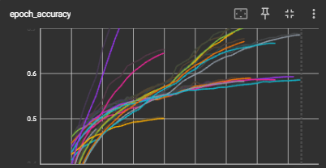
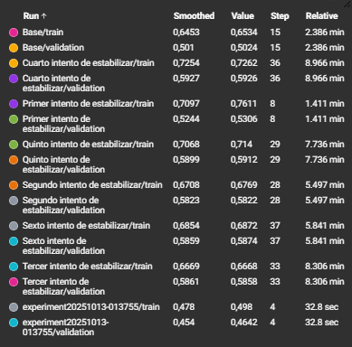

# Backpropagation y Optimizadores (UT2‑8)

## Contexto
El objetivo es mejorar progresivamente un MLP (Keras/TensorFlow) para un problema de clasificación, usando experimentación controlada y TensorBoard. Partimos de un baseline (2 capas de 64, Adam 1e-3, batch 32) y aplicamos cambios uno por vez sobre arquitectura, regularización y optimización. Cada experimento se registra como un run distinto y se compara por val_accuracy (principal) y val_loss (secundaria), controlando el gap train_acc – val_acc para evitar sobreajuste.

Palancas evaluadas

- Arquitectura: número de capas y neuronas (p.ej. [256,256,256]).

- Activaciones: ReLU y GELU.

- Normalización: BatchNormalization entre densas.

- Regularización: Dropout (0.2–0.35) y L2 (1e-4).

- Optimizadores y LR: Adam/AdamW/SGD con barrido de learning_rate.

- Batch size: 64/128/256 por estabilidad/tiempo.

- Callbacks: EarlyStopping (restore_best_weights), ReduceLROnPlateau, ModelCheckpoint, TensorBoard.

## Criterio de éxito

1) Subir val_accuracy respecto al baseline,

2) Bajar val_loss y mantener gap pequeño,

3) A igual rendimiento, preferir el modelo más simple/rápido.

# 🧮 Actividad: Explorar experimentacion

## Preparar liberias

**Entrada:**

```python
import os, math, json, time, random, datetime as dt
import numpy as np
import pandas as pd
import matplotlib.pyplot as plt
import seaborn as sns

import tensorflow as tf
from tensorflow import keras
from tensorflow.keras import layers

from sklearn.metrics import confusion_matrix, classification_report, f1_score

SEED = 42
random.seed(SEED); np.random.seed(SEED); tf.random.set_seed(SEED)

print("TensorFlow:", tf.__version__)
print("GPU disponibles:", tf.config.list_physical_devices('GPU'))

# Carpeta para logs de TensorBoard
ROOT_LOGDIR = "tb_logs"
os.makedirs(ROOT_LOGDIR, exist_ok=True)
```

**Salida:**

```text
TensorFlow: 2.19.0
GPU disponibles: []
```

## Cargar datos

**Entrada:**

```python
(x_train, y_train), (x_test, y_test) = keras.datasets.cifar10.load_data()
y_train = y_train.flatten(); y_test = y_test.flatten()

class_names = ['airplane','automobile','bird','cat','deer',
               'dog','frog','horse','ship','truck']

# 2) Normalizamos a [-1, 1] (números chicos ayudan a entrenar)
x_train = (x_train.astype("float32")/255.0 - 0.5) * 2.0
x_test  = (x_test.astype("float32")/255.0 - 0.5) * 2.0

# 3) Split de validación (10% del train)
VAL_RATIO = 0.1
n_val = int(len(x_train)*VAL_RATIO)
x_val, y_val = x_train[:n_val], y_train[:n_val]
x_train, y_train = x_train[n_val:], y_train[n_val:]

# 4) APLANAR imágenes 32x32x3 -> vectores 3072 (MLP = capas densas)
x_train = x_train.reshape(len(x_train), -1)
x_val   = x_val.reshape(len(x_val), -1)
x_test  = x_test.reshape(len(x_test), -1)

print("Train:", x_train.shape, "Val:", x_val.shape, "Test:", x_test.shape)
```

**Salida:**

```text
Downloading data from https://www.cs.toronto.edu/~kriz/cifar-10-python.tar.gz
170498071/170498071 ━━━━━━━━━━━━━━━━━━━━ 3s 0us/step
Train: (45000, 3072) Val: (5000, 3072) Test: (10000, 3072)
```


**Entrada:**

```python
# Visualizamos algunas imágenes (re-escaladas a [0,1] para plotear)
fig, axes = plt.subplots(2, 8, figsize=(16,4))
for ax in axes.ravel():
    i = np.random.randint(0, len(x_train))
    ax.imshow((x_train[i].reshape(32,32,3)/2 + 0.5).clip(0,1))
    ax.set_title(class_names[y_train[i]])
    ax.axis('off')
plt.tight_layout(); plt.show()
```

**Salida:**


## Red neuronal

**Entrada:**

```python
# === RED NEURONAL ===
import tensorflow as tf
from tensorflow import keras
from tensorflow.keras import layers

# Crear modelo Sequential
model = keras.Sequential([
    layers.Dense(32, activation='relu', input_shape=(x_train.shape[1],)),
    layers.Dense(32, activation='relu'),
    layers.Dense(len(class_names), activation='softmax')
])


# Compilar modelo
model.compile(
    optimizer='adam',              # adam, sgd, rmsprop
    loss='sparse_categorical_crossentropy',
    metrics=['accuracy']
)

# Entrenar
print("Entrenando red neuronal...")
run_dir = os.path.join(ROOT_LOGDIR, "experiment" + dt.datetime.now().strftime("%Y%m%d-%H%M%S"))
history = model.fit(
    x_train, y_train,
    epochs=5,                   # número de épocas
    batch_size=32,               # tamaño de batch
    validation_data=(x_test, y_test),
    verbose=1,
    callbacks=[keras.callbacks.TensorBoard(log_dir=run_dir, histogram_freq=1)]
)

# Evaluar
train_loss, train_acc = model.evaluate(x_train, y_train, verbose=0)
test_loss, test_acc = model.evaluate(x_test, y_test, verbose=0)

print(f"\n🎯 Resultados TensorFlow:")
print(f"  Training Accuracy: {train_acc:.1%}")
print(f"  Test Accuracy: {test_acc:.1%}")
print(f"  Parámetros totales: {model.count_params():,}")
```

**Salida:**

```text
/usr/local/lib/python3.12/dist-packages/keras/src/layers/core/dense.py:93: UserWarning: Do not pass an `input_shape`/`input_dim` argument to a layer. When using Sequential models, prefer using an `Input(shape)` object as the first layer in the model instead.
  super().__init__(activity_regularizer=activity_regularizer, **kwargs)
Entrenando red neuronal...
Epoch 1/5
1407/1407 ━━━━━━━━━━━━━━━━━━━━ 10s 6ms/step - accuracy: 0.3292 - loss: 1.8690 - val_accuracy: 0.4085 - val_loss: 1.6413
Epoch 2/5
1407/1407 ━━━━━━━━━━━━━━━━━━━━ 10s 6ms/step - accuracy: 0.4339 - loss: 1.5943 - val_accuracy: 0.4374 - val_loss: 1.5851
Epoch 3/5
1407/1407 ━━━━━━━━━━━━━━━━━━━━ 7s 5ms/step - accuracy: 0.4653 - loss: 1.5110 - val_accuracy: 0.4506 - val_loss: 1.5466
Epoch 4/5
1407/1407 ━━━━━━━━━━━━━━━━━━━━ 9s 6ms/step - accuracy: 0.4823 - loss: 1.4595 - val_accuracy: 0.4549 - val_loss: 1.5351
Epoch 5/5
1407/1407 ━━━━━━━━━━━━━━━━━━━━ 7s 5ms/step - accuracy: 0.4957 - loss: 1.4213 - val_accuracy: 0.4642 - val_loss: 1.5205

🎯 Resultados TensorFlow:
  Training Accuracy: 50.6%
  Test Accuracy: 46.4%
  Parámetros totales: 99,722
```

## Imports y helpers para intentos de mejora

**Entrada:**

```python
# Imports y helpers
import os, datetime as dt
import numpy as np
import tensorflow as tf
from tensorflow import keras
from tensorflow.keras import layers, regularizers, initializers

# Para reproducibilidad
SEED = 42
tf.keras.utils.set_random_seed(SEED)
np.random.seed(SEED)

def build_mlp(input_dim, n_classes, widths, activation="relu",
              batchnorm=False, dropout=0.0, l2=0.0, init=None):
    if init is None:
        init = initializers.HeNormal() if activation in ("relu","gelu") else initializers.GlorotUniform()
    reg = regularizers.l2(l2) if l2 and l2>0 else None

    model = keras.Sequential([layers.Input(shape=(input_dim,))])
    for u in widths:
        model.add(layers.Dense(u, activation=None, kernel_initializer=init, kernel_regularizer=reg))
        if batchnorm: model.add(layers.BatchNormalization())
        model.add(layers.Activation(activation))
        if dropout and dropout>0: model.add(layers.Dropout(dropout))
    model.add(layers.Dense(n_classes, activation="softmax"))
    return model

def make_optimizer(name="adam", lr=1e-3, **kw):
    name = name.lower()
    if name == "adam":
        return keras.optimizers.Adam(learning_rate=lr,
                                     beta_1=kw.get("beta_1",0.9),
                                     beta_2=kw.get("beta_2",0.999))
    if name == "adamw":
        return keras.optimizers.AdamW(learning_rate=lr,
                                      weight_decay=kw.get("weight_decay",0.0))
    if name == "sgd":
        return keras.optimizers.SGD(learning_rate=lr,
                                    momentum=kw.get("momentum",0.0),
                                    nesterov=kw.get("nesterov",False))
    if name == "rmsprop":
        return keras.optimizers.RMSprop(learning_rate=lr, rho=kw.get("rho",0.9))
    raise ValueError("Optimizer no soportado")

def run_experiment(x_train, y_train, x_val, y_val, *,
                   run_name, widths, activation="relu",
                   batchnorm=False, dropout=0.0, l2=0.0, init=None,
                   optimizer="adam", lr=1e-3, epochs=40, batch_size=128,
                   monitor="val_loss", patience=6, opt_kwargs=None):
    opt_kwargs = opt_kwargs or {}

    model = build_mlp(x_train.shape[1], int(np.max(y_train))+1,
                      widths, activation, batchnorm, dropout, l2, init)
    opt = make_optimizer(optimizer, lr, **opt_kwargs)
    model.compile(optimizer=opt, loss="sparse_categorical_crossentropy", metrics=["accuracy"])

    logdir = os.path.join("tb_logs", run_name)
    os.makedirs(logdir, exist_ok=True)

    cbs = [
        keras.callbacks.EarlyStopping(monitor=monitor, patience=patience, restore_best_weights=True),
        keras.callbacks.ReduceLROnPlateau(monitor="val_loss", factor=0.5, patience=2, verbose=1),
        keras.callbacks.ModelCheckpoint(os.path.join(logdir,"best.keras"), monitor=monitor, save_best_only=True),
        keras.callbacks.TensorBoard(log_dir=logdir, histogram_freq=1),
    ]

    hist = model.fit(
        x_train, y_train,
        validation_data=(x_val, y_val),
        epochs=epochs, batch_size=batch_size, verbose=1, callbacks=cbs
    )
    val_loss, val_acc = model.evaluate(x_val, y_val, verbose=0)
    print(f"[{run_name}] params={model.count_params():,}  val_acc={val_acc:.4f}  val_loss={val_loss:.4f}")
    return model, hist, {"val_acc":val_acc, "val_loss":val_loss, "params":model.count_params(), "logdir":logdir}

```

**Salida:**

```text
Sin salida.
```

## Baseline

**Entrada:**

```python
# Base
cfg0 = dict(
    run_name = "Base",
    widths   = [64, 64],
    activation="relu",
    batchnorm=False,
    dropout=0.0,
    l2=0.0,
    optimizer="adam",
    lr=1e-3,
    epochs=30,
    batch_size=32,
    monitor="val_loss",
    patience=6
)
m0, h0, r0 = run_experiment(x_train, y_train, x_val, y_val, **cfg0)

```

**Salida:**

```text
Epoch 1/30
1407/1407 ━━━━━━━━━━━━━━━━━━━━ 11s 7ms/step - accuracy: 0.3344 - loss: 1.9038 - val_accuracy: 0.4210 - val_loss: 1.6522 - learning_rate: 0.0010
Epoch 2/30
1407/1407 ━━━━━━━━━━━━━━━━━━━━ 9s 6ms/step - accuracy: 0.4427 - loss: 1.5815 - val_accuracy: 0.4392 - val_loss: 1.5899 - learning_rate: 0.0010
Epoch 3/30
1407/1407 ━━━━━━━━━━━━━━━━━━━━ 11s 6ms/step - accuracy: 0.4742 - loss: 1.4844 - val_accuracy: 0.4568 - val_loss: 1.5490 - learning_rate: 0.0010
Epoch 4/30
1407/1407 ━━━━━━━━━━━━━━━━━━━━ 10s 7ms/step - accuracy: 0.5015 - loss: 1.4138 - val_accuracy: 0.4710 - val_loss: 1.5202 - learning_rate: 0.0010
Epoch 5/30
1407/1407 ━━━━━━━━━━━━━━━━━━━━ 10s 7ms/step - accuracy: 0.5222 - loss: 1.3577 - val_accuracy: 0.4714 - val_loss: 1.5296 - learning_rate: 0.0010
Epoch 6/30
1404/1407 ━━━━━━━━━━━━━━━━━━━━ 0s 5ms/step - accuracy: 0.5380 - loss: 1.3151
Epoch 6: ReduceLROnPlateau reducing learning rate to 0.0005000000237487257.
1407/1407 ━━━━━━━━━━━━━━━━━━━━ 8s 6ms/step - accuracy: 0.5380 - loss: 1.3151 - val_accuracy: 0.4750 - val_loss: 1.5282 - learning_rate: 0.0010
Epoch 7/30
1407/1407 ━━━━━━━━━━━━━━━━━━━━ 10s 7ms/step - accuracy: 0.5656 - loss: 1.2297 - val_accuracy: 0.4866 - val_loss: 1.4900 - learning_rate: 5.0000e-04
Epoch 8/30
1407/1407 ━━━━━━━━━━━━━━━━━━━━ 10s 7ms/step - accuracy: 0.5830 - loss: 1.1820 - val_accuracy: 0.4902 - val_loss: 1.4927 - learning_rate: 5.0000e-04
Epoch 9/30
1401/1407 ━━━━━━━━━━━━━━━━━━━━ 0s 6ms/step - accuracy: 0.5899 - loss: 1.1539
Epoch 9: ReduceLROnPlateau reducing learning rate to 0.0002500000118743628.
1407/1407 ━━━━━━━━━━━━━━━━━━━━ 9s 6ms/step - accuracy: 0.5899 - loss: 1.1538 - val_accuracy: 0.4866 - val_loss: 1.5059 - learning_rate: 5.0000e-04
Epoch 10/30
1407/1407 ━━━━━━━━━━━━━━━━━━━━ 10s 7ms/step - accuracy: 0.6087 - loss: 1.1091 - val_accuracy: 0.4960 - val_loss: 1.4876 - learning_rate: 2.5000e-04
Epoch 11/30
1407/1407 ━━━━━━━━━━━━━━━━━━━━ 10s 7ms/step - accuracy: 0.6186 - loss: 1.0815 - val_accuracy: 0.4980 - val_loss: 1.4960 - learning_rate: 2.5000e-04
Epoch 12/30
1402/1407 ━━━━━━━━━━━━━━━━━━━━ 0s 7ms/step - accuracy: 0.6257 - loss: 1.0630
Epoch 12: ReduceLROnPlateau reducing learning rate to 0.0001250000059371814.
1407/1407 ━━━━━━━━━━━━━━━━━━━━ 10s 7ms/step - accuracy: 0.6257 - loss: 1.0630 - val_accuracy: 0.4950 - val_loss: 1.5049 - learning_rate: 2.5000e-04
Epoch 13/30
1407/1407 ━━━━━━━━━━━━━━━━━━━━ 8s 6ms/step - accuracy: 0.6329 - loss: 1.0428 - val_accuracy: 0.4996 - val_loss: 1.4947 - learning_rate: 1.2500e-04
Epoch 14/30
1407/1407 ━━━━━━━━━━━━━━━━━━━━ 0s 7ms/step - accuracy: 0.6392 - loss: 1.0257
Epoch 14: ReduceLROnPlateau reducing learning rate to 6.25000029685907e-05.
1407/1407 ━━━━━━━━━━━━━━━━━━━━ 10s 7ms/step - accuracy: 0.6392 - loss: 1.0256 - val_accuracy: 0.5010 - val_loss: 1.4983 - learning_rate: 1.2500e-04
Epoch 15/30
1407/1407 ━━━━━━━━━━━━━━━━━━━━ 10s 7ms/step - accuracy: 0.6441 - loss: 1.0149 - val_accuracy: 0.5034 - val_loss: 1.4907 - learning_rate: 6.2500e-05
Epoch 16/30
1403/1407 ━━━━━━━━━━━━━━━━━━━━ 0s 6ms/step - accuracy: 0.6480 - loss: 1.0053
Epoch 16: ReduceLROnPlateau reducing learning rate to 3.125000148429535e-05.
1407/1407 ━━━━━━━━━━━━━━━━━━━━ 10s 7ms/step - accuracy: 0.6480 - loss: 1.0053 - val_accuracy: 0.5024 - val_loss: 1.4934 - learning_rate: 6.2500e-05
[Base] params=201,482  val_acc=0.4960  val_loss=1.4876
```

## Primer intento de estabilizar

**Entrada:**

```python
cfg1 = dict(
    run_name = "Primer intento de estabilizar",
    widths   = [256,256,256],   # + capacidad
    activation="relu",
    batchnorm=False,
    dropout=0.0,
    l2=0.0,
    optimizer="adam",
    lr=1e-3,
    epochs=40,
    batch_size=128,             # + estable/rápido que 32
    monitor="val_loss",
    patience=6
)
m1, h1, r1 = run_experiment(x_train, y_train, x_val, y_val, **cfg1)

```

**Salida:**

```text
Epoch 1/40
352/352 ━━━━━━━━━━━━━━━━━━━━ 12s 29ms/step - accuracy: 0.3495 - loss: 1.8673 - val_accuracy: 0.4598 - val_loss: 1.5425 - learning_rate: 0.0010
Epoch 2/40
352/352 ━━━━━━━━━━━━━━━━━━━━ 20s 28ms/step - accuracy: 0.4682 - loss: 1.5087 - val_accuracy: 0.4832 - val_loss: 1.4858 - learning_rate: 0.0010
Epoch 3/40
352/352 ━━━━━━━━━━━━━━━━━━━━ 10s 28ms/step - accuracy: 0.5124 - loss: 1.3783 - val_accuracy: 0.4892 - val_loss: 1.4636 - learning_rate: 0.0010
Epoch 4/40
352/352 ━━━━━━━━━━━━━━━━━━━━ 8s 24ms/step - accuracy: 0.5517 - loss: 1.2710 - val_accuracy: 0.4964 - val_loss: 1.4637 - learning_rate: 0.0010
Epoch 5/40
350/352 ━━━━━━━━━━━━━━━━━━━━ 0s 21ms/step - accuracy: 0.5843 - loss: 1.1727
Epoch 5: ReduceLROnPlateau reducing learning rate to 0.0005000000237487257.
352/352 ━━━━━━━━━━━━━━━━━━━━ 10s 23ms/step - accuracy: 0.5844 - loss: 1.1725 - val_accuracy: 0.4868 - val_loss: 1.5175 - learning_rate: 0.0010
Epoch 6/40
352/352 ━━━━━━━━━━━━━━━━━━━━ 9s 27ms/step - accuracy: 0.6349 - loss: 1.0381 - val_accuracy: 0.5158 - val_loss: 1.4873 - learning_rate: 5.0000e-04
Epoch 7/40
351/352 ━━━━━━━━━━━━━━━━━━━━ 0s 25ms/step - accuracy: 0.6788 - loss: 0.9257
Epoch 7: ReduceLROnPlateau reducing learning rate to 0.0002500000118743628.
352/352 ━━━━━━━━━━━━━━━━━━━━ 9s 27ms/step - accuracy: 0.6789 - loss: 0.9255 - val_accuracy: 0.5270 - val_loss: 1.5247 - learning_rate: 5.0000e-04
Epoch 8/40
352/352 ━━━━━━━━━━━━━━━━━━━━ 8s 23ms/step - accuracy: 0.7164 - loss: 0.8200 - val_accuracy: 0.5338 - val_loss: 1.5274 - learning_rate: 2.5000e-04
Epoch 9/40
352/352 ━━━━━━━━━━━━━━━━━━━━ 0s 25ms/step - accuracy: 0.7471 - loss: 0.7406
Epoch 9: ReduceLROnPlateau reducing learning rate to 0.0001250000059371814.
352/352 ━━━━━━━━━━━━━━━━━━━━ 10s 27ms/step - accuracy: 0.7472 - loss: 0.7405 - val_accuracy: 0.5306 - val_loss: 1.5601 - learning_rate: 2.5000e-04
[Primer intento de estabilizar] params=920,842  val_acc=0.4892  val_loss=1.4636
```

## Segundo intento de estabilizar

**Entrada:**

```python
# Control del sobreajuste
cfg2 = dict(cfg1, **{
    "run_name":"Segundo intento de estabilizar",
    "batchnorm":True,
    "dropout":0.3
})
m2, h2, r2 = run_experiment(x_train, y_train, x_val, y_val, **cfg2)

```

**Salida:**

```text
Epoch 1/40
352/352 ━━━━━━━━━━━━━━━━━━━━ 14s 29ms/step - accuracy: 0.2675 - loss: 2.0927 - val_accuracy: 0.4252 - val_loss: 1.5962 - learning_rate: 0.0010
Epoch 2/40
352/352 ━━━━━━━━━━━━━━━━━━━━ 10s 28ms/step - accuracy: 0.3907 - loss: 1.6944 - val_accuracy: 0.4630 - val_loss: 1.4998 - learning_rate: 0.0010
Epoch 3/40
352/352 ━━━━━━━━━━━━━━━━━━━━ 11s 30ms/step - accuracy: 0.4373 - loss: 1.5789 - val_accuracy: 0.4838 - val_loss: 1.4489 - learning_rate: 0.0010
Epoch 4/40
352/352 ━━━━━━━━━━━━━━━━━━━━ 11s 30ms/step - accuracy: 0.4607 - loss: 1.5130 - val_accuracy: 0.4976 - val_loss: 1.4168 - learning_rate: 0.0010
Epoch 5/40
352/352 ━━━━━━━━━━━━━━━━━━━━ 14s 41ms/step - accuracy: 0.4742 - loss: 1.4650 - val_accuracy: 0.5106 - val_loss: 1.3758 - learning_rate: 0.0010
Epoch 6/40
352/352 ━━━━━━━━━━━━━━━━━━━━ 11s 31ms/step - accuracy: 0.4902 - loss: 1.4274 - val_accuracy: 0.5196 - val_loss: 1.3478 - learning_rate: 0.0010
Epoch 7/40
352/352 ━━━━━━━━━━━━━━━━━━━━ 10s 28ms/step - accuracy: 0.5054 - loss: 1.3869 - val_accuracy: 0.5310 - val_loss: 1.3361 - learning_rate: 0.0010
Epoch 8/40
352/352 ━━━━━━━━━━━━━━━━━━━━ 11s 31ms/step - accuracy: 0.5145 - loss: 1.3581 - val_accuracy: 0.5344 - val_loss: 1.3121 - learning_rate: 0.0010
Epoch 9/40
352/352 ━━━━━━━━━━━━━━━━━━━━ 11s 31ms/step - accuracy: 0.5293 - loss: 1.3275 - val_accuracy: 0.5310 - val_loss: 1.3136 - learning_rate: 0.0010
Epoch 10/40
352/352 ━━━━━━━━━━━━━━━━━━━━ 11s 31ms/step - accuracy: 0.5351 - loss: 1.3086 - val_accuracy: 0.5482 - val_loss: 1.2897 - learning_rate: 0.0010
Epoch 11/40
352/352 ━━━━━━━━━━━━━━━━━━━━ 11s 30ms/step - accuracy: 0.5442 - loss: 1.2722 - val_accuracy: 0.5442 - val_loss: 1.2945 - learning_rate: 0.0010
Epoch 12/40
352/352 ━━━━━━━━━━━━━━━━━━━━ 10s 27ms/step - accuracy: 0.5574 - loss: 1.2488 - val_accuracy: 0.5458 - val_loss: 1.2815 - learning_rate: 0.0010
Epoch 13/40
352/352 ━━━━━━━━━━━━━━━━━━━━ 11s 31ms/step - accuracy: 0.5651 - loss: 1.2264 - val_accuracy: 0.5504 - val_loss: 1.2802 - learning_rate: 0.0010
Epoch 14/40
352/352 ━━━━━━━━━━━━━━━━━━━━ 11s 31ms/step - accuracy: 0.5674 - loss: 1.2162 - val_accuracy: 0.5508 - val_loss: 1.2661 - learning_rate: 0.0010
Epoch 15/40
352/352 ━━━━━━━━━━━━━━━━━━━━ 11s 31ms/step - accuracy: 0.5738 - loss: 1.1957 - val_accuracy: 0.5546 - val_loss: 1.2751 - learning_rate: 0.0010
Epoch 16/40
352/352 ━━━━━━━━━━━━━━━━━━━━ 10s 29ms/step - accuracy: 0.5810 - loss: 1.1732 - val_accuracy: 0.5578 - val_loss: 1.2644 - learning_rate: 0.0010
Epoch 17/40
352/352 ━━━━━━━━━━━━━━━━━━━━ 10s 28ms/step - accuracy: 0.5916 - loss: 1.1506 - val_accuracy: 0.5536 - val_loss: 1.2781 - learning_rate: 0.0010
Epoch 18/40
350/352 ━━━━━━━━━━━━━━━━━━━━ 0s 29ms/step - accuracy: 0.5950 - loss: 1.1309
Epoch 18: ReduceLROnPlateau reducing learning rate to 0.0005000000237487257.
352/352 ━━━━━━━━━━━━━━━━━━━━ 11s 31ms/step - accuracy: 0.5950 - loss: 1.1309 - val_accuracy: 0.5558 - val_loss: 1.2683 - learning_rate: 0.0010
Epoch 19/40
352/352 ━━━━━━━━━━━━━━━━━━━━ 11s 31ms/step - accuracy: 0.6126 - loss: 1.0847 - val_accuracy: 0.5722 - val_loss: 1.2325 - learning_rate: 5.0000e-04
Epoch 20/40
352/352 ━━━━━━━━━━━━━━━━━━━━ 19s 28ms/step - accuracy: 0.6237 - loss: 1.0572 - val_accuracy: 0.5728 - val_loss: 1.2258 - learning_rate: 5.0000e-04
Epoch 21/40
352/352 ━━━━━━━━━━━━━━━━━━━━ 10s 29ms/step - accuracy: 0.6319 - loss: 1.0435 - val_accuracy: 0.5730 - val_loss: 1.2347 - learning_rate: 5.0000e-04
Epoch 22/40
352/352 ━━━━━━━━━━━━━━━━━━━━ 0s 29ms/step - accuracy: 0.6337 - loss: 1.0226
Epoch 22: ReduceLROnPlateau reducing learning rate to 0.0002500000118743628.
352/352 ━━━━━━━━━━━━━━━━━━━━ 11s 31ms/step - accuracy: 0.6337 - loss: 1.0226 - val_accuracy: 0.5734 - val_loss: 1.2305 - learning_rate: 5.0000e-04
Epoch 23/40
352/352 ━━━━━━━━━━━━━━━━━━━━ 11s 32ms/step - accuracy: 0.6423 - loss: 0.9952 - val_accuracy: 0.5796 - val_loss: 1.2165 - learning_rate: 2.5000e-04
Epoch 24/40
352/352 ━━━━━━━━━━━━━━━━━━━━ 11s 31ms/step - accuracy: 0.6578 - loss: 0.9716 - val_accuracy: 0.5796 - val_loss: 1.2269 - learning_rate: 2.5000e-04
Epoch 25/40
350/352 ━━━━━━━━━━━━━━━━━━━━ 0s 27ms/step - accuracy: 0.6579 - loss: 0.9589
Epoch 25: ReduceLROnPlateau reducing learning rate to 0.0001250000059371814.
352/352 ━━━━━━━━━━━━━━━━━━━━ 20s 29ms/step - accuracy: 0.6579 - loss: 0.9589 - val_accuracy: 0.5778 - val_loss: 1.2300 - learning_rate: 2.5000e-04
Epoch 26/40
352/352 ━━━━━━━━━━━━━━━━━━━━ 11s 31ms/step - accuracy: 0.6629 - loss: 0.9479 - val_accuracy: 0.5820 - val_loss: 1.2248 - learning_rate: 1.2500e-04
Epoch 27/40
350/352 ━━━━━━━━━━━━━━━━━━━━ 0s 29ms/step - accuracy: 0.6658 - loss: 0.9399
Epoch 27: ReduceLROnPlateau reducing learning rate to 6.25000029685907e-05.
352/352 ━━━━━━━━━━━━━━━━━━━━ 21s 32ms/step - accuracy: 0.6658 - loss: 0.9398 - val_accuracy: 0.5854 - val_loss: 1.2257 - learning_rate: 1.2500e-04
Epoch 28/40
352/352 ━━━━━━━━━━━━━━━━━━━━ 10s 28ms/step - accuracy: 0.6708 - loss: 0.9234 - val_accuracy: 0.5838 - val_loss: 1.2259 - learning_rate: 6.2500e-05
Epoch 29/40
351/352 ━━━━━━━━━━━━━━━━━━━━ 0s 27ms/step - accuracy: 0.6724 - loss: 0.9152
Epoch 29: ReduceLROnPlateau reducing learning rate to 3.125000148429535e-05.
352/352 ━━━━━━━━━━━━━━━━━━━━ 11s 30ms/step - accuracy: 0.6724 - loss: 0.9152 - val_accuracy: 0.5822 - val_loss: 1.2297 - learning_rate: 6.2500e-05
[Segundo intento de estabilizar] params=923,914  val_acc=0.5796  val_loss=1.2165
```

## Tercer intento de estabilizar

**Entrada:**

```python
# Weight decay clasico
cfg3 = dict(cfg2, **{
    "run_name":"Tercer intento de estabilizar",
    "l2":1e-4
})
m3, h3, r3 = run_experiment(x_train, y_train, x_val, y_val, **cfg3)

```

**Salida:**

```text
Epoch 1/40
352/352 ━━━━━━━━━━━━━━━━━━━━ 16s 34ms/step - accuracy: 0.2735 - loss: 2.2513 - val_accuracy: 0.4250 - val_loss: 1.7393 - learning_rate: 0.0010
Epoch 2/40
352/352 ━━━━━━━━━━━━━━━━━━━━ 11s 32ms/step - accuracy: 0.3884 - loss: 1.8623 - val_accuracy: 0.4622 - val_loss: 1.6692 - learning_rate: 0.0010
Epoch 3/40
352/352 ━━━━━━━━━━━━━━━━━━━━ 21s 34ms/step - accuracy: 0.4321 - loss: 1.7504 - val_accuracy: 0.4808 - val_loss: 1.6104 - learning_rate: 0.0010
Epoch 4/40
352/352 ━━━━━━━━━━━━━━━━━━━━ 12s 34ms/step - accuracy: 0.4550 - loss: 1.6795 - val_accuracy: 0.4886 - val_loss: 1.5759 - learning_rate: 0.0010
Epoch 5/40
352/352 ━━━━━━━━━━━━━━━━━━━━ 12s 35ms/step - accuracy: 0.4746 - loss: 1.6349 - val_accuracy: 0.5022 - val_loss: 1.5535 - learning_rate: 0.0010
Epoch 6/40
352/352 ━━━━━━━━━━━━━━━━━━━━ 12s 34ms/step - accuracy: 0.4850 - loss: 1.5993 - val_accuracy: 0.5128 - val_loss: 1.5280 - learning_rate: 0.0010
Epoch 7/40
352/352 ━━━━━━━━━━━━━━━━━━━━ 20s 34ms/step - accuracy: 0.4936 - loss: 1.5739 - val_accuracy: 0.5190 - val_loss: 1.5052 - learning_rate: 0.0010
Epoch 8/40
352/352 ━━━━━━━━━━━━━━━━━━━━ 12s 34ms/step - accuracy: 0.5023 - loss: 1.5466 - val_accuracy: 0.5136 - val_loss: 1.5104 - learning_rate: 0.0010
Epoch 9/40
352/352 ━━━━━━━━━━━━━━━━━━━━ 12s 34ms/step - accuracy: 0.5093 - loss: 1.5318 - val_accuracy: 0.5190 - val_loss: 1.5003 - learning_rate: 0.0010
Epoch 10/40
352/352 ━━━━━━━━━━━━━━━━━━━━ 12s 33ms/step - accuracy: 0.5192 - loss: 1.5043 - val_accuracy: 0.5332 - val_loss: 1.4848 - learning_rate: 0.0010
Epoch 11/40
352/352 ━━━━━━━━━━━━━━━━━━━━ 12s 33ms/step - accuracy: 0.5272 - loss: 1.4936 - val_accuracy: 0.5282 - val_loss: 1.4951 - learning_rate: 0.0010
Epoch 12/40
352/352 ━━━━━━━━━━━━━━━━━━━━ 0s 32ms/step - accuracy: 0.5346 - loss: 1.4788
Epoch 12: ReduceLROnPlateau reducing learning rate to 0.0005000000237487257.
352/352 ━━━━━━━━━━━━━━━━━━━━ 12s 34ms/step - accuracy: 0.5346 - loss: 1.4788 - val_accuracy: 0.5274 - val_loss: 1.4878 - learning_rate: 0.0010
Epoch 13/40
352/352 ━━━━━━━━━━━━━━━━━━━━ 12s 34ms/step - accuracy: 0.5512 - loss: 1.4301 - val_accuracy: 0.5502 - val_loss: 1.4242 - learning_rate: 5.0000e-04
Epoch 14/40
352/352 ━━━━━━━━━━━━━━━━━━━━ 11s 31ms/step - accuracy: 0.5678 - loss: 1.3818 - val_accuracy: 0.5556 - val_loss: 1.4213 - learning_rate: 5.0000e-04
Epoch 15/40
352/352 ━━━━━━━━━━━━━━━━━━━━ 21s 34ms/step - accuracy: 0.5713 - loss: 1.3618 - val_accuracy: 0.5608 - val_loss: 1.4081 - learning_rate: 5.0000e-04
Epoch 16/40
352/352 ━━━━━━━━━━━━━━━━━━━━ 20s 34ms/step - accuracy: 0.5756 - loss: 1.3455 - val_accuracy: 0.5590 - val_loss: 1.4023 - learning_rate: 5.0000e-04
Epoch 17/40
352/352 ━━━━━━━━━━━━━━━━━━━━ 20s 32ms/step - accuracy: 0.5787 - loss: 1.3327 - val_accuracy: 0.5520 - val_loss: 1.4113 - learning_rate: 5.0000e-04
Epoch 18/40
352/352 ━━━━━━━━━━━━━━━━━━━━ 0s 31ms/step - accuracy: 0.5869 - loss: 1.3097
Epoch 18: ReduceLROnPlateau reducing learning rate to 0.0002500000118743628.
352/352 ━━━━━━━━━━━━━━━━━━━━ 12s 34ms/step - accuracy: 0.5869 - loss: 1.3097 - val_accuracy: 0.5586 - val_loss: 1.4109 - learning_rate: 5.0000e-04
Epoch 19/40
352/352 ━━━━━━━━━━━━━━━━━━━━ 22s 38ms/step - accuracy: 0.6023 - loss: 1.2640 - val_accuracy: 0.5670 - val_loss: 1.3709 - learning_rate: 2.5000e-04
Epoch 20/40
352/352 ━━━━━━━━━━━━━━━━━━━━ 12s 34ms/step - accuracy: 0.6197 - loss: 1.2309 - val_accuracy: 0.5726 - val_loss: 1.3779 - learning_rate: 2.5000e-04
Epoch 21/40
350/352 ━━━━━━━━━━━━━━━━━━━━ 0s 31ms/step - accuracy: 0.6196 - loss: 1.2094
Epoch 21: ReduceLROnPlateau reducing learning rate to 0.0001250000059371814.
352/352 ━━━━━━━━━━━━━━━━━━━━ 20s 33ms/step - accuracy: 0.6196 - loss: 1.2093 - val_accuracy: 0.5660 - val_loss: 1.3764 - learning_rate: 2.5000e-04
Epoch 22/40
352/352 ━━━━━━━━━━━━━━━━━━━━ 12s 35ms/step - accuracy: 0.6351 - loss: 1.1809 - val_accuracy: 0.5772 - val_loss: 1.3560 - learning_rate: 1.2500e-04
Epoch 23/40
352/352 ━━━━━━━━━━━━━━━━━━━━ 20s 34ms/step - accuracy: 0.6360 - loss: 1.1543 - val_accuracy: 0.5744 - val_loss: 1.3579 - learning_rate: 1.2500e-04
Epoch 24/40
352/352 ━━━━━━━━━━━━━━━━━━━━ 0s 31ms/step - accuracy: 0.6419 - loss: 1.1483
Epoch 24: ReduceLROnPlateau reducing learning rate to 6.25000029685907e-05.
352/352 ━━━━━━━━━━━━━━━━━━━━ 12s 34ms/step - accuracy: 0.6419 - loss: 1.1482 - val_accuracy: 0.5794 - val_loss: 1.3589 - learning_rate: 1.2500e-04
Epoch 25/40
352/352 ━━━━━━━━━━━━━━━━━━━━ 21s 34ms/step - accuracy: 0.6489 - loss: 1.1282 - val_accuracy: 0.5816 - val_loss: 1.3488 - learning_rate: 6.2500e-05
Epoch 26/40
352/352 ━━━━━━━━━━━━━━━━━━━━ 12s 34ms/step - accuracy: 0.6515 - loss: 1.1140 - val_accuracy: 0.5862 - val_loss: 1.3519 - learning_rate: 6.2500e-05
Epoch 27/40
351/352 ━━━━━━━━━━━━━━━━━━━━ 0s 32ms/step - accuracy: 0.6563 - loss: 1.1044
Epoch 27: ReduceLROnPlateau reducing learning rate to 3.125000148429535e-05.
352/352 ━━━━━━━━━━━━━━━━━━━━ 20s 34ms/step - accuracy: 0.6563 - loss: 1.1043 - val_accuracy: 0.5860 - val_loss: 1.3509 - learning_rate: 6.2500e-05
Epoch 28/40
352/352 ━━━━━━━━━━━━━━━━━━━━ 13s 35ms/step - accuracy: 0.6545 - loss: 1.1032 - val_accuracy: 0.5866 - val_loss: 1.3487 - learning_rate: 3.1250e-05
Epoch 29/40
352/352 ━━━━━━━━━━━━━━━━━━━━ 0s 30ms/step - accuracy: 0.6589 - loss: 1.0935
Epoch 29: ReduceLROnPlateau reducing learning rate to 1.5625000742147677e-05.
352/352 ━━━━━━━━━━━━━━━━━━━━ 12s 33ms/step - accuracy: 0.6590 - loss: 1.0934 - val_accuracy: 0.5862 - val_loss: 1.3496 - learning_rate: 3.1250e-05
Epoch 30/40
352/352 ━━━━━━━━━━━━━━━━━━━━ 11s 31ms/step - accuracy: 0.6615 - loss: 1.0851 - val_accuracy: 0.5898 - val_loss: 1.3495 - learning_rate: 1.5625e-05
Epoch 31/40
351/352 ━━━━━━━━━━━━━━━━━━━━ 0s 32ms/step - accuracy: 0.6617 - loss: 1.0807
Epoch 31: ReduceLROnPlateau reducing learning rate to 7.812500371073838e-06.
352/352 ━━━━━━━━━━━━━━━━━━━━ 22s 35ms/step - accuracy: 0.6617 - loss: 1.0806 - val_accuracy: 0.5860 - val_loss: 1.3515 - learning_rate: 1.5625e-05
Epoch 32/40
352/352 ━━━━━━━━━━━━━━━━━━━━ 12s 34ms/step - accuracy: 0.6625 - loss: 1.0786 - val_accuracy: 0.5862 - val_loss: 1.3513 - learning_rate: 7.8125e-06
Epoch 33/40
351/352 ━━━━━━━━━━━━━━━━━━━━ 0s 32ms/step - accuracy: 0.6696 - loss: 1.0697
Epoch 33: ReduceLROnPlateau reducing learning rate to 3.906250185536919e-06.
352/352 ━━━━━━━━━━━━━━━━━━━━ 12s 34ms/step - accuracy: 0.6696 - loss: 1.0696 - val_accuracy: 0.5862 - val_loss: 1.3505 - learning_rate: 7.8125e-06
Epoch 34/40
352/352 ━━━━━━━━━━━━━━━━━━━━ 20s 34ms/step - accuracy: 0.6611 - loss: 1.0773 - val_accuracy: 0.5858 - val_loss: 1.3515 - learning_rate: 3.9063e-06
[Tercer intento de estabilizar] params=923,914  val_acc=0.5866  val_loss=1.3487
```

## Cuarto intento de estabilizar

**Entrada:**

```python
# Activación GELU
cfg4 = dict(cfg3, **{
    "run_name":"Cuarto intento de estabilizar",
    "activation":"gelu"
})
m4, h4, r4 = run_experiment(x_train, y_train, x_val, y_val, **cfg4)

```

**Salida:**

```text
Epoch 1/40
352/352 ━━━━━━━━━━━━━━━━━━━━ 16s 38ms/step - accuracy: 0.2926 - loss: 2.1790 - val_accuracy: 0.4368 - val_loss: 1.7154 - learning_rate: 0.0010
Epoch 2/40
352/352 ━━━━━━━━━━━━━━━━━━━━ 13s 37ms/step - accuracy: 0.4101 - loss: 1.8010 - val_accuracy: 0.4720 - val_loss: 1.6387 - learning_rate: 0.0010
Epoch 3/40
352/352 ━━━━━━━━━━━━━━━━━━━━ 13s 36ms/step - accuracy: 0.4494 - loss: 1.6908 - val_accuracy: 0.4976 - val_loss: 1.5740 - learning_rate: 0.0010
Epoch 4/40
352/352 ━━━━━━━━━━━━━━━━━━━━ 13s 37ms/step - accuracy: 0.4732 - loss: 1.6275 - val_accuracy: 0.5100 - val_loss: 1.5302 - learning_rate: 0.0010
Epoch 5/40
352/352 ━━━━━━━━━━━━━━━━━━━━ 13s 38ms/step - accuracy: 0.4932 - loss: 1.5742 - val_accuracy: 0.5162 - val_loss: 1.5029 - learning_rate: 0.0010
Epoch 6/40
352/352 ━━━━━━━━━━━━━━━━━━━━ 20s 37ms/step - accuracy: 0.5030 - loss: 1.5423 - val_accuracy: 0.5246 - val_loss: 1.4879 - learning_rate: 0.0010
Epoch 7/40
352/352 ━━━━━━━━━━━━━━━━━━━━ 13s 37ms/step - accuracy: 0.5171 - loss: 1.5068 - val_accuracy: 0.5272 - val_loss: 1.4831 - learning_rate: 0.0010
Epoch 8/40
352/352 ━━━━━━━━━━━━━━━━━━━━ 13s 38ms/step - accuracy: 0.5260 - loss: 1.4894 - val_accuracy: 0.5370 - val_loss: 1.4554 - learning_rate: 0.0010
Epoch 9/40
352/352 ━━━━━━━━━━━━━━━━━━━━ 20s 37ms/step - accuracy: 0.5327 - loss: 1.4680 - val_accuracy: 0.5420 - val_loss: 1.4493 - learning_rate: 0.0010
Epoch 10/40
352/352 ━━━━━━━━━━━━━━━━━━━━ 13s 37ms/step - accuracy: 0.5456 - loss: 1.4422 - val_accuracy: 0.5402 - val_loss: 1.4579 - learning_rate: 0.0010
Epoch 11/40
352/352 ━━━━━━━━━━━━━━━━━━━━ 13s 36ms/step - accuracy: 0.5477 - loss: 1.4248 - val_accuracy: 0.5454 - val_loss: 1.4491 - learning_rate: 0.0010
Epoch 12/40
352/352 ━━━━━━━━━━━━━━━━━━━━ 13s 37ms/step - accuracy: 0.5556 - loss: 1.4029 - val_accuracy: 0.5426 - val_loss: 1.4450 - learning_rate: 0.0010
Epoch 13/40
352/352 ━━━━━━━━━━━━━━━━━━━━ 13s 37ms/step - accuracy: 0.5646 - loss: 1.3922 - val_accuracy: 0.5452 - val_loss: 1.4336 - learning_rate: 0.0010
Epoch 14/40
352/352 ━━━━━━━━━━━━━━━━━━━━ 13s 37ms/step - accuracy: 0.5710 - loss: 1.3753 - val_accuracy: 0.5486 - val_loss: 1.4411 - learning_rate: 0.0010
Epoch 15/40
352/352 ━━━━━━━━━━━━━━━━━━━━ 20s 37ms/step - accuracy: 0.5724 - loss: 1.3720 - val_accuracy: 0.5584 - val_loss: 1.4206 - learning_rate: 0.0010
Epoch 16/40
352/352 ━━━━━━━━━━━━━━━━━━━━ 13s 37ms/step - accuracy: 0.5775 - loss: 1.3517 - val_accuracy: 0.5556 - val_loss: 1.4383 - learning_rate: 0.0010
Epoch 17/40
352/352 ━━━━━━━━━━━━━━━━━━━━ 0s 34ms/step - accuracy: 0.5857 - loss: 1.3462
Epoch 17: ReduceLROnPlateau reducing learning rate to 0.0005000000237487257.
352/352 ━━━━━━━━━━━━━━━━━━━━ 13s 36ms/step - accuracy: 0.5857 - loss: 1.3462 - val_accuracy: 0.5502 - val_loss: 1.4488 - learning_rate: 0.0010
Epoch 18/40
352/352 ━━━━━━━━━━━━━━━━━━━━ 13s 37ms/step - accuracy: 0.6077 - loss: 1.2802 - val_accuracy: 0.5628 - val_loss: 1.3965 - learning_rate: 5.0000e-04
Epoch 19/40
352/352 ━━━━━━━━━━━━━━━━━━━━ 14s 39ms/step - accuracy: 0.6207 - loss: 1.2333 - val_accuracy: 0.5682 - val_loss: 1.3902 - learning_rate: 5.0000e-04
Epoch 20/40
352/352 ━━━━━━━━━━━━━━━━━━━━ 14s 39ms/step - accuracy: 0.6288 - loss: 1.2083 - val_accuracy: 0.5672 - val_loss: 1.4028 - learning_rate: 5.0000e-04
Epoch 21/40
352/352 ━━━━━━━━━━━━━━━━━━━━ 0s 34ms/step - accuracy: 0.6396 - loss: 1.1899
Epoch 21: ReduceLROnPlateau reducing learning rate to 0.0002500000118743628.
352/352 ━━━━━━━━━━━━━━━━━━━━ 20s 37ms/step - accuracy: 0.6396 - loss: 1.1899 - val_accuracy: 0.5684 - val_loss: 1.3911 - learning_rate: 5.0000e-04
Epoch 22/40
352/352 ━━━━━━━━━━━━━━━━━━━━ 13s 38ms/step - accuracy: 0.6559 - loss: 1.1362 - val_accuracy: 0.5748 - val_loss: 1.3730 - learning_rate: 2.5000e-04
Epoch 23/40
352/352 ━━━━━━━━━━━━━━━━━━━━ 13s 37ms/step - accuracy: 0.6696 - loss: 1.0997 - val_accuracy: 0.5830 - val_loss: 1.3726 - learning_rate: 2.5000e-04
Epoch 24/40
352/352 ━━━━━━━━━━━━━━━━━━━━ 13s 37ms/step - accuracy: 0.6703 - loss: 1.0872 - val_accuracy: 0.5800 - val_loss: 1.3846 - learning_rate: 2.5000e-04
Epoch 25/40
352/352 ━━━━━━━━━━━━━━━━━━━━ 0s 34ms/step - accuracy: 0.6747 - loss: 1.0698
Epoch 25: ReduceLROnPlateau reducing learning rate to 0.0001250000059371814.
352/352 ━━━━━━━━━━━━━━━━━━━━ 20s 37ms/step - accuracy: 0.6748 - loss: 1.0698 - val_accuracy: 0.5810 - val_loss: 1.3747 - learning_rate: 2.5000e-04
Epoch 26/40
352/352 ━━━━━━━━━━━━━━━━━━━━ 21s 38ms/step - accuracy: 0.6876 - loss: 1.0323 - val_accuracy: 0.5810 - val_loss: 1.3726 - learning_rate: 1.2500e-04
Epoch 27/40
351/352 ━━━━━━━━━━━━━━━━━━━━ 0s 34ms/step - accuracy: 0.6944 - loss: 1.0097
Epoch 27: ReduceLROnPlateau reducing learning rate to 6.25000029685907e-05.
352/352 ━━━━━━━━━━━━━━━━━━━━ 20s 36ms/step - accuracy: 0.6944 - loss: 1.0096 - val_accuracy: 0.5824 - val_loss: 1.3748 - learning_rate: 1.2500e-04
Epoch 28/40
352/352 ━━━━━━━━━━━━━━━━━━━━ 13s 38ms/step - accuracy: 0.7036 - loss: 0.9907 - val_accuracy: 0.5862 - val_loss: 1.3701 - learning_rate: 6.2500e-05
Epoch 29/40
352/352 ━━━━━━━━━━━━━━━━━━━━ 13s 37ms/step - accuracy: 0.7046 - loss: 0.9793 - val_accuracy: 0.5874 - val_loss: 1.3722 - learning_rate: 6.2500e-05
Epoch 30/40
351/352 ━━━━━━━━━━━━━━━━━━━━ 0s 35ms/step - accuracy: 0.7064 - loss: 0.9703
Epoch 30: ReduceLROnPlateau reducing learning rate to 3.125000148429535e-05.
352/352 ━━━━━━━━━━━━━━━━━━━━ 13s 37ms/step - accuracy: 0.7065 - loss: 0.9701 - val_accuracy: 0.5884 - val_loss: 1.3720 - learning_rate: 6.2500e-05
Epoch 31/40
352/352 ━━━━━━━━━━━━━━━━━━━━ 13s 38ms/step - accuracy: 0.7153 - loss: 0.9468 - val_accuracy: 0.5890 - val_loss: 1.3692 - learning_rate: 3.1250e-05
Epoch 32/40
352/352 ━━━━━━━━━━━━━━━━━━━━ 13s 37ms/step - accuracy: 0.7145 - loss: 0.9484 - val_accuracy: 0.5900 - val_loss: 1.3716 - learning_rate: 3.1250e-05
Epoch 33/40
351/352 ━━━━━━━━━━━━━━━━━━━━ 0s 35ms/step - accuracy: 0.7161 - loss: 0.9506
Epoch 33: ReduceLROnPlateau reducing learning rate to 1.5625000742147677e-05.
352/352 ━━━━━━━━━━━━━━━━━━━━ 20s 37ms/step - accuracy: 0.7162 - loss: 0.9504 - val_accuracy: 0.5908 - val_loss: 1.3709 - learning_rate: 3.1250e-05
Epoch 34/40
352/352 ━━━━━━━━━━━━━━━━━━━━ 13s 38ms/step - accuracy: 0.7218 - loss: 0.9393 - val_accuracy: 0.5934 - val_loss: 1.3720 - learning_rate: 1.5625e-05
Epoch 35/40
350/352 ━━━━━━━━━━━━━━━━━━━━ 0s 34ms/step - accuracy: 0.7207 - loss: 0.9377
Epoch 35: ReduceLROnPlateau reducing learning rate to 7.812500371073838e-06.
352/352 ━━━━━━━━━━━━━━━━━━━━ 13s 37ms/step - accuracy: 0.7207 - loss: 0.9375 - val_accuracy: 0.5936 - val_loss: 1.3728 - learning_rate: 1.5625e-05
Epoch 36/40
352/352 ━━━━━━━━━━━━━━━━━━━━ 21s 37ms/step - accuracy: 0.7217 - loss: 0.9330 - val_accuracy: 0.5940 - val_loss: 1.3727 - learning_rate: 7.8125e-06
Epoch 37/40
351/352 ━━━━━━━━━━━━━━━━━━━━ 0s 36ms/step - accuracy: 0.7212 - loss: 0.9343
Epoch 37: ReduceLROnPlateau reducing learning rate to 3.906250185536919e-06.
352/352 ━━━━━━━━━━━━━━━━━━━━ 13s 38ms/step - accuracy: 0.7212 - loss: 0.9342 - val_accuracy: 0.5926 - val_loss: 1.3729 - learning_rate: 7.8125e-06
[Cuarto intento de estabilizar] params=923,914  val_acc=0.5890  val_loss=1.3692
```

## Quinto intento de estabilizar

**Entrada:**

```python
# AdamW
cfg5 = dict(cfg4, **{
    "run_name":"Quinto intento de estabilizar",
    "optimizer":"adamw",
    "lr":1e-3
})
m5, h5, r5 = run_experiment(x_train, y_train, x_val, y_val, opt_kwargs={"weight_decay":1e-4}, **cfg5)

```

**Salida:**

```text
Epoch 1/40
352/352 ━━━━━━━━━━━━━━━━━━━━ 19s 44ms/step - accuracy: 0.2911 - loss: 2.1957 - val_accuracy: 0.4462 - val_loss: 1.7162 - learning_rate: 0.0010
Epoch 2/40
352/352 ━━━━━━━━━━━━━━━━━━━━ 16s 44ms/step - accuracy: 0.4164 - loss: 1.7953 - val_accuracy: 0.4696 - val_loss: 1.6156 - learning_rate: 0.0010
Epoch 3/40
352/352 ━━━━━━━━━━━━━━━━━━━━ 15s 42ms/step - accuracy: 0.4518 - loss: 1.6874 - val_accuracy: 0.4930 - val_loss: 1.5700 - learning_rate: 0.0010
Epoch 4/40
352/352 ━━━━━━━━━━━━━━━━━━━━ 20s 40ms/step - accuracy: 0.4730 - loss: 1.6239 - val_accuracy: 0.5078 - val_loss: 1.5340 - learning_rate: 0.0010
Epoch 5/40
352/352 ━━━━━━━━━━━━━━━━━━━━ 14s 40ms/step - accuracy: 0.4894 - loss: 1.5787 - val_accuracy: 0.5124 - val_loss: 1.5143 - learning_rate: 0.0010
Epoch 6/40
352/352 ━━━━━━━━━━━━━━━━━━━━ 14s 40ms/step - accuracy: 0.5087 - loss: 1.5437 - val_accuracy: 0.5294 - val_loss: 1.4986 - learning_rate: 0.0010
Epoch 7/40
352/352 ━━━━━━━━━━━━━━━━━━━━ 14s 40ms/step - accuracy: 0.5162 - loss: 1.5109 - val_accuracy: 0.5280 - val_loss: 1.4877 - learning_rate: 0.0010
Epoch 8/40
352/352 ━━━━━━━━━━━━━━━━━━━━ 14s 40ms/step - accuracy: 0.5259 - loss: 1.4859 - val_accuracy: 0.5356 - val_loss: 1.4781 - learning_rate: 0.0010
Epoch 9/40
352/352 ━━━━━━━━━━━━━━━━━━━━ 14s 39ms/step - accuracy: 0.5336 - loss: 1.4653 - val_accuracy: 0.5390 - val_loss: 1.4719 - learning_rate: 0.0010
Epoch 10/40
352/352 ━━━━━━━━━━━━━━━━━━━━ 14s 40ms/step - accuracy: 0.5448 - loss: 1.4468 - val_accuracy: 0.5330 - val_loss: 1.4767 - learning_rate: 0.0010
Epoch 11/40
352/352 ━━━━━━━━━━━━━━━━━━━━ 14s 40ms/step - accuracy: 0.5525 - loss: 1.4201 - val_accuracy: 0.5388 - val_loss: 1.4631 - learning_rate: 0.0010
Epoch 12/40
352/352 ━━━━━━━━━━━━━━━━━━━━ 14s 39ms/step - accuracy: 0.5550 - loss: 1.4123 - val_accuracy: 0.5416 - val_loss: 1.4601 - learning_rate: 0.0010
Epoch 13/40
352/352 ━━━━━━━━━━━━━━━━━━━━ 16s 45ms/step - accuracy: 0.5587 - loss: 1.3968 - val_accuracy: 0.5452 - val_loss: 1.4515 - learning_rate: 0.0010
Epoch 14/40
352/352 ━━━━━━━━━━━━━━━━━━━━ 18s 39ms/step - accuracy: 0.5689 - loss: 1.3768 - val_accuracy: 0.5440 - val_loss: 1.4635 - learning_rate: 0.0010
Epoch 15/40
352/352 ━━━━━━━━━━━━━━━━━━━━ 21s 39ms/step - accuracy: 0.5743 - loss: 1.3747 - val_accuracy: 0.5426 - val_loss: 1.4477 - learning_rate: 0.0010
Epoch 16/40
352/352 ━━━━━━━━━━━━━━━━━━━━ 20s 38ms/step - accuracy: 0.5782 - loss: 1.3571 - val_accuracy: 0.5556 - val_loss: 1.4533 - learning_rate: 0.0010
Epoch 17/40
351/352 ━━━━━━━━━━━━━━━━━━━━ 0s 36ms/step - accuracy: 0.5841 - loss: 1.3469
Epoch 17: ReduceLROnPlateau reducing learning rate to 0.0005000000237487257.
352/352 ━━━━━━━━━━━━━━━━━━━━ 14s 39ms/step - accuracy: 0.5841 - loss: 1.3469 - val_accuracy: 0.5544 - val_loss: 1.4493 - learning_rate: 0.0010
Epoch 18/40
352/352 ━━━━━━━━━━━━━━━━━━━━ 14s 40ms/step - accuracy: 0.6097 - loss: 1.2819 - val_accuracy: 0.5664 - val_loss: 1.4019 - learning_rate: 5.0000e-04
Epoch 19/40
352/352 ━━━━━━━━━━━━━━━━━━━━ 20s 39ms/step - accuracy: 0.6196 - loss: 1.2378 - val_accuracy: 0.5720 - val_loss: 1.4069 - learning_rate: 5.0000e-04
Epoch 20/40
352/352 ━━━━━━━━━━━━━━━━━━━━ 0s 36ms/step - accuracy: 0.6278 - loss: 1.2040
Epoch 20: ReduceLROnPlateau reducing learning rate to 0.0002500000118743628.
352/352 ━━━━━━━━━━━━━━━━━━━━ 20s 39ms/step - accuracy: 0.6278 - loss: 1.2040 - val_accuracy: 0.5696 - val_loss: 1.4157 - learning_rate: 5.0000e-04
Epoch 21/40
352/352 ━━━━━━━━━━━━━━━━━━━━ 21s 39ms/step - accuracy: 0.6432 - loss: 1.1594 - val_accuracy: 0.5824 - val_loss: 1.3765 - learning_rate: 2.5000e-04
Epoch 22/40
352/352 ━━━━━━━━━━━━━━━━━━━━ 14s 40ms/step - accuracy: 0.6563 - loss: 1.1246 - val_accuracy: 0.5752 - val_loss: 1.3830 - learning_rate: 2.5000e-04
Epoch 23/40
352/352 ━━━━━━━━━━━━━━━━━━━━ 0s 37ms/step - accuracy: 0.6681 - loss: 1.0988
Epoch 23: ReduceLROnPlateau reducing learning rate to 0.0001250000059371814.
352/352 ━━━━━━━━━━━━━━━━━━━━ 14s 39ms/step - accuracy: 0.6681 - loss: 1.0987 - val_accuracy: 0.5792 - val_loss: 1.3789 - learning_rate: 2.5000e-04
Epoch 24/40
352/352 ━━━━━━━━━━━━━━━━━━━━ 14s 40ms/step - accuracy: 0.6781 - loss: 1.0646 - val_accuracy: 0.5828 - val_loss: 1.3632 - learning_rate: 1.2500e-04
Epoch 25/40
352/352 ━━━━━━━━━━━━━━━━━━━━ 20s 39ms/step - accuracy: 0.6880 - loss: 1.0419 - val_accuracy: 0.5866 - val_loss: 1.3723 - learning_rate: 1.2500e-04
Epoch 26/40
352/352 ━━━━━━━━━━━━━━━━━━━━ 0s 35ms/step - accuracy: 0.6902 - loss: 1.0313
Epoch 26: ReduceLROnPlateau reducing learning rate to 6.25000029685907e-05.
352/352 ━━━━━━━━━━━━━━━━━━━━ 14s 40ms/step - accuracy: 0.6902 - loss: 1.0313 - val_accuracy: 0.5858 - val_loss: 1.3743 - learning_rate: 1.2500e-04
Epoch 27/40
352/352 ━━━━━━━━━━━━━━━━━━━━ 20s 39ms/step - accuracy: 0.6962 - loss: 1.0034 - val_accuracy: 0.5914 - val_loss: 1.3656 - learning_rate: 6.2500e-05
Epoch 28/40
351/352 ━━━━━━━━━━━━━━━━━━━━ 0s 36ms/step - accuracy: 0.6987 - loss: 0.9938
Epoch 28: ReduceLROnPlateau reducing learning rate to 3.125000148429535e-05.
352/352 ━━━━━━━━━━━━━━━━━━━━ 14s 39ms/step - accuracy: 0.6987 - loss: 0.9937 - val_accuracy: 0.5900 - val_loss: 1.3688 - learning_rate: 6.2500e-05
Epoch 29/40
352/352 ━━━━━━━━━━━━━━━━━━━━ 14s 39ms/step - accuracy: 0.7047 - loss: 0.9793 - val_accuracy: 0.5908 - val_loss: 1.3671 - learning_rate: 3.1250e-05
Epoch 30/40
352/352 ━━━━━━━━━━━━━━━━━━━━ 0s 36ms/step - accuracy: 0.7074 - loss: 0.9718
Epoch 30: ReduceLROnPlateau reducing learning rate to 1.5625000742147677e-05.
352/352 ━━━━━━━━━━━━━━━━━━━━ 14s 39ms/step - accuracy: 0.7074 - loss: 0.9718 - val_accuracy: 0.5912 - val_loss: 1.3679 - learning_rate: 3.1250e-05
[Quinto intento de estabilizar] params=923,914  val_acc=0.5828  val_loss=1.3632
```

## Sexto intento de estabilizar

**Entrada:**

```python
best_cfg = cfg3
for bs in [64, 128, 256]:
    cfg = dict(best_cfg, **{"run_name":"Sexto intento de estabilizar", "batch_size":bs})
    _, _, _ = run_experiment(x_train, y_train, x_val, y_val, **cfg)

```

**Salida:**

```text
Epoch 1/40
704/704 ━━━━━━━━━━━━━━━━━━━━ 21s 26ms/step - accuracy: 0.2706 - loss: 2.2359 - val_accuracy: 0.4376 - val_loss: 1.7381 - learning_rate: 0.0010
Epoch 2/40
704/704 ━━━━━━━━━━━━━━━━━━━━ 19s 27ms/step - accuracy: 0.3957 - loss: 1.8567 - val_accuracy: 0.4750 - val_loss: 1.6443 - learning_rate: 0.0010
Epoch 3/40
704/704 ━━━━━━━━━━━━━━━━━━━━ 17s 25ms/step - accuracy: 0.4304 - loss: 1.7588 - val_accuracy: 0.4874 - val_loss: 1.5988 - learning_rate: 0.0010
Epoch 4/40
704/704 ━━━━━━━━━━━━━━━━━━━━ 17s 25ms/step - accuracy: 0.4503 - loss: 1.7003 - val_accuracy: 0.4936 - val_loss: 1.5802 - learning_rate: 0.0010
Epoch 5/40
704/704 ━━━━━━━━━━━━━━━━━━━━ 21s 25ms/step - accuracy: 0.4668 - loss: 1.6670 - val_accuracy: 0.5052 - val_loss: 1.5597 - learning_rate: 0.0010
Epoch 6/40
704/704 ━━━━━━━━━━━━━━━━━━━━ 18s 25ms/step - accuracy: 0.4780 - loss: 1.6372 - val_accuracy: 0.5166 - val_loss: 1.5523 - learning_rate: 0.0010
Epoch 7/40
704/704 ━━━━━━━━━━━━━━━━━━━━ 21s 26ms/step - accuracy: 0.4843 - loss: 1.6267 - val_accuracy: 0.5152 - val_loss: 1.5360 - learning_rate: 0.0010
Epoch 8/40
704/704 ━━━━━━━━━━━━━━━━━━━━ 18s 25ms/step - accuracy: 0.4926 - loss: 1.6048 - val_accuracy: 0.5216 - val_loss: 1.5216 - learning_rate: 0.0010
Epoch 9/40
704/704 ━━━━━━━━━━━━━━━━━━━━ 17s 25ms/step - accuracy: 0.4985 - loss: 1.5933 - val_accuracy: 0.5290 - val_loss: 1.5231 - learning_rate: 0.0010
Epoch 10/40
704/704 ━━━━━━━━━━━━━━━━━━━━ 18s 26ms/step - accuracy: 0.5006 - loss: 1.5795 - val_accuracy: 0.5288 - val_loss: 1.5173 - learning_rate: 0.0010
Epoch 11/40
704/704 ━━━━━━━━━━━━━━━━━━━━ 17s 25ms/step - accuracy: 0.5097 - loss: 1.5679 - val_accuracy: 0.5292 - val_loss: 1.5081 - learning_rate: 0.0010
Epoch 12/40
704/704 ━━━━━━━━━━━━━━━━━━━━ 17s 25ms/step - accuracy: 0.5122 - loss: 1.5580 - val_accuracy: 0.5292 - val_loss: 1.5089 - learning_rate: 0.0010
Epoch 13/40
704/704 ━━━━━━━━━━━━━━━━━━━━ 19s 26ms/step - accuracy: 0.5161 - loss: 1.5546 - val_accuracy: 0.5350 - val_loss: 1.4988 - learning_rate: 0.0010
Epoch 14/40
704/704 ━━━━━━━━━━━━━━━━━━━━ 18s 25ms/step - accuracy: 0.5191 - loss: 1.5403 - val_accuracy: 0.5296 - val_loss: 1.5119 - learning_rate: 0.0010
Epoch 15/40
704/704 ━━━━━━━━━━━━━━━━━━━━ 18s 25ms/step - accuracy: 0.5238 - loss: 1.5287 - val_accuracy: 0.5410 - val_loss: 1.4936 - learning_rate: 0.0010
Epoch 16/40
704/704 ━━━━━━━━━━━━━━━━━━━━ 19s 26ms/step - accuracy: 0.5247 - loss: 1.5331 - val_accuracy: 0.5370 - val_loss: 1.5022 - learning_rate: 0.0010
Epoch 17/40
703/704 ━━━━━━━━━━━━━━━━━━━━ 0s 24ms/step - accuracy: 0.5276 - loss: 1.5269
Epoch 17: ReduceLROnPlateau reducing learning rate to 0.0005000000237487257.
704/704 ━━━━━━━━━━━━━━━━━━━━ 20s 25ms/step - accuracy: 0.5276 - loss: 1.5268 - val_accuracy: 0.5374 - val_loss: 1.4997 - learning_rate: 0.0010
Epoch 18/40
704/704 ━━━━━━━━━━━━━━━━━━━━ 20s 29ms/step - accuracy: 0.5503 - loss: 1.4648 - val_accuracy: 0.5638 - val_loss: 1.4278 - learning_rate: 5.0000e-04
Epoch 19/40
704/704 ━━━━━━━━━━━━━━━━━━━━ 18s 26ms/step - accuracy: 0.5636 - loss: 1.4138 - val_accuracy: 0.5560 - val_loss: 1.4241 - learning_rate: 5.0000e-04
Epoch 20/40
704/704 ━━━━━━━━━━━━━━━━━━━━ 18s 25ms/step - accuracy: 0.5713 - loss: 1.3839 - val_accuracy: 0.5618 - val_loss: 1.4138 - learning_rate: 5.0000e-04
Epoch 21/40
704/704 ━━━━━━━━━━━━━━━━━━━━ 21s 25ms/step - accuracy: 0.5792 - loss: 1.3688 - val_accuracy: 0.5656 - val_loss: 1.4175 - learning_rate: 5.0000e-04
Epoch 22/40
702/704 ━━━━━━━━━━━━━━━━━━━━ 0s 23ms/step - accuracy: 0.5823 - loss: 1.3524
Epoch 22: ReduceLROnPlateau reducing learning rate to 0.0002500000118743628.
704/704 ━━━━━━━━━━━━━━━━━━━━ 17s 25ms/step - accuracy: 0.5823 - loss: 1.3523 - val_accuracy: 0.5658 - val_loss: 1.4169 - learning_rate: 5.0000e-04
Epoch 23/40
704/704 ━━━━━━━━━━━━━━━━━━━━ 19s 27ms/step - accuracy: 0.6046 - loss: 1.2989 - val_accuracy: 0.5716 - val_loss: 1.3838 - learning_rate: 2.5000e-04
Epoch 24/40
704/704 ━━━━━━━━━━━━━━━━━━━━ 17s 25ms/step - accuracy: 0.6092 - loss: 1.2587 - val_accuracy: 0.5708 - val_loss: 1.3954 - learning_rate: 2.5000e-04
Epoch 25/40
704/704 ━━━━━━━━━━━━━━━━━━━━ 0s 23ms/step - accuracy: 0.6225 - loss: 1.2363
Epoch 25: ReduceLROnPlateau reducing learning rate to 0.0001250000059371814.
704/704 ━━━━━━━━━━━━━━━━━━━━ 17s 25ms/step - accuracy: 0.6225 - loss: 1.2363 - val_accuracy: 0.5664 - val_loss: 1.3865 - learning_rate: 2.5000e-04
Epoch 26/40
704/704 ━━━━━━━━━━━━━━━━━━━━ 21s 25ms/step - accuracy: 0.6335 - loss: 1.1958 - val_accuracy: 0.5804 - val_loss: 1.3734 - learning_rate: 1.2500e-04
Epoch 27/40
704/704 ━━━━━━━━━━━━━━━━━━━━ 17s 25ms/step - accuracy: 0.6417 - loss: 1.1763 - val_accuracy: 0.5778 - val_loss: 1.3759 - learning_rate: 1.2500e-04
Epoch 28/40
704/704 ━━━━━━━━━━━━━━━━━━━━ 0s 26ms/step - accuracy: 0.6436 - loss: 1.1596
Epoch 28: ReduceLROnPlateau reducing learning rate to 6.25000029685907e-05.
704/704 ━━━━━━━━━━━━━━━━━━━━ 19s 27ms/step - accuracy: 0.6436 - loss: 1.1596 - val_accuracy: 0.5728 - val_loss: 1.3782 - learning_rate: 1.2500e-04
Epoch 29/40
704/704 ━━━━━━━━━━━━━━━━━━━━ 18s 25ms/step - accuracy: 0.6474 - loss: 1.1428 - val_accuracy: 0.5816 - val_loss: 1.3689 - learning_rate: 6.2500e-05
Epoch 30/40
704/704 ━━━━━━━━━━━━━━━━━━━━ 18s 25ms/step - accuracy: 0.6526 - loss: 1.1228 - val_accuracy: 0.5788 - val_loss: 1.3673 - learning_rate: 6.2500e-05
Epoch 31/40
704/704 ━━━━━━━━━━━━━━━━━━━━ 20s 25ms/step - accuracy: 0.6582 - loss: 1.1173 - val_accuracy: 0.5790 - val_loss: 1.3683 - learning_rate: 6.2500e-05
Epoch 32/40
704/704 ━━━━━━━━━━━━━━━━━━━━ 18s 25ms/step - accuracy: 0.6614 - loss: 1.1120 - val_accuracy: 0.5822 - val_loss: 1.3670 - learning_rate: 6.2500e-05
Epoch 33/40
704/704 ━━━━━━━━━━━━━━━━━━━━ 19s 26ms/step - accuracy: 0.6673 - loss: 1.0946 - val_accuracy: 0.5832 - val_loss: 1.3673 - learning_rate: 6.2500e-05
Epoch 34/40
703/704 ━━━━━━━━━━━━━━━━━━━━ 0s 23ms/step - accuracy: 0.6688 - loss: 1.0878
Epoch 34: ReduceLROnPlateau reducing learning rate to 3.125000148429535e-05.
704/704 ━━━━━━━━━━━━━━━━━━━━ 17s 24ms/step - accuracy: 0.6688 - loss: 1.0878 - val_accuracy: 0.5844 - val_loss: 1.3676 - learning_rate: 6.2500e-05
Epoch 35/40
704/704 ━━━━━━━━━━━━━━━━━━━━ 17s 25ms/step - accuracy: 0.6667 - loss: 1.0870 - val_accuracy: 0.5796 - val_loss: 1.3664 - learning_rate: 3.1250e-05
Epoch 36/40
704/704 ━━━━━━━━━━━━━━━━━━━━ 18s 26ms/step - accuracy: 0.6696 - loss: 1.0678 - val_accuracy: 0.5860 - val_loss: 1.3657 - learning_rate: 3.1250e-05
Epoch 37/40
704/704 ━━━━━━━━━━━━━━━━━━━━ 17s 25ms/step - accuracy: 0.6675 - loss: 1.0743 - val_accuracy: 0.5866 - val_loss: 1.3689 - learning_rate: 3.1250e-05
Epoch 38/40
702/704 ━━━━━━━━━━━━━━━━━━━━ 0s 23ms/step - accuracy: 0.6722 - loss: 1.0560
Epoch 38: ReduceLROnPlateau reducing learning rate to 1.5625000742147677e-05.
704/704 ━━━━━━━━━━━━━━━━━━━━ 21s 25ms/step - accuracy: 0.6722 - loss: 1.0559 - val_accuracy: 0.5852 - val_loss: 1.3703 - learning_rate: 3.1250e-05
Epoch 39/40
704/704 ━━━━━━━━━━━━━━━━━━━━ 19s 27ms/step - accuracy: 0.6780 - loss: 1.0511 - val_accuracy: 0.5842 - val_loss: 1.3666 - learning_rate: 1.5625e-05
Epoch 40/40
702/704 ━━━━━━━━━━━━━━━━━━━━ 0s 24ms/step - accuracy: 0.6808 - loss: 1.0467
Epoch 40: ReduceLROnPlateau reducing learning rate to 7.812500371073838e-06.
704/704 ━━━━━━━━━━━━━━━━━━━━ 18s 25ms/step - accuracy: 0.6808 - loss: 1.0466 - val_accuracy: 0.5856 - val_loss: 1.3680 - learning_rate: 1.5625e-05
[Sexto intento de estabilizar] params=923,914  val_acc=0.5860  val_loss=1.3657
Epoch 1/40
352/352 ━━━━━━━━━━━━━━━━━━━━ 16s 35ms/step - accuracy: 0.2727 - loss: 2.2428 - val_accuracy: 0.4252 - val_loss: 1.7500 - learning_rate: 0.0010
Epoch 2/40
352/352 ━━━━━━━━━━━━━━━━━━━━ 12s 33ms/step - accuracy: 0.3940 - loss: 1.8556 - val_accuracy: 0.4576 - val_loss: 1.6588 - learning_rate: 0.0010
Epoch 3/40
352/352 ━━━━━━━━━━━━━━━━━━━━ 12s 34ms/step - accuracy: 0.4323 - loss: 1.7408 - val_accuracy: 0.4766 - val_loss: 1.6033 - learning_rate: 0.0010
Epoch 4/40
352/352 ━━━━━━━━━━━━━━━━━━━━ 12s 34ms/step - accuracy: 0.4563 - loss: 1.6721 - val_accuracy: 0.5044 - val_loss: 1.5536 - learning_rate: 0.0010
Epoch 5/40
352/352 ━━━━━━━━━━━━━━━━━━━━ 12s 35ms/step - accuracy: 0.4744 - loss: 1.6280 - val_accuracy: 0.5134 - val_loss: 1.5316 - learning_rate: 0.0010
Epoch 6/40
352/352 ━━━━━━━━━━━━━━━━━━━━ 13s 36ms/step - accuracy: 0.4870 - loss: 1.5941 - val_accuracy: 0.5152 - val_loss: 1.5217 - learning_rate: 0.0010
Epoch 7/40
352/352 ━━━━━━━━━━━━━━━━━━━━ 12s 34ms/step - accuracy: 0.4927 - loss: 1.5699 - val_accuracy: 0.5266 - val_loss: 1.4942 - learning_rate: 0.0010
Epoch 8/40
352/352 ━━━━━━━━━━━━━━━━━━━━ 12s 35ms/step - accuracy: 0.5074 - loss: 1.5400 - val_accuracy: 0.5214 - val_loss: 1.4894 - learning_rate: 0.0010
Epoch 9/40
352/352 ━━━━━━━━━━━━━━━━━━━━ 12s 34ms/step - accuracy: 0.5109 - loss: 1.5274 - val_accuracy: 0.5244 - val_loss: 1.4880 - learning_rate: 0.0010
Epoch 10/40
352/352 ━━━━━━━━━━━━━━━━━━━━ 12s 34ms/step - accuracy: 0.5239 - loss: 1.5006 - val_accuracy: 0.5286 - val_loss: 1.4763 - learning_rate: 0.0010
Epoch 11/40
352/352 ━━━━━━━━━━━━━━━━━━━━ 20s 34ms/step - accuracy: 0.5278 - loss: 1.4860 - val_accuracy: 0.5348 - val_loss: 1.4711 - learning_rate: 0.0010
Epoch 12/40
352/352 ━━━━━━━━━━━━━━━━━━━━ 12s 35ms/step - accuracy: 0.5331 - loss: 1.4772 - val_accuracy: 0.5304 - val_loss: 1.4692 - learning_rate: 0.0010
Epoch 13/40
352/352 ━━━━━━━━━━━━━━━━━━━━ 21s 35ms/step - accuracy: 0.5370 - loss: 1.4617 - val_accuracy: 0.5372 - val_loss: 1.4690 - learning_rate: 0.0010
Epoch 14/40
352/352 ━━━━━━━━━━━━━━━━━━━━ 20s 35ms/step - accuracy: 0.5408 - loss: 1.4524 - val_accuracy: 0.5384 - val_loss: 1.4740 - learning_rate: 0.0010
Epoch 15/40
352/352 ━━━━━━━━━━━━━━━━━━━━ 12s 35ms/step - accuracy: 0.5447 - loss: 1.4423 - val_accuracy: 0.5484 - val_loss: 1.4593 - learning_rate: 0.0010
Epoch 16/40
352/352 ━━━━━━━━━━━━━━━━━━━━ 12s 35ms/step - accuracy: 0.5450 - loss: 1.4393 - val_accuracy: 0.5520 - val_loss: 1.4501 - learning_rate: 0.0010
Epoch 17/40
352/352 ━━━━━━━━━━━━━━━━━━━━ 12s 35ms/step - accuracy: 0.5566 - loss: 1.4235 - val_accuracy: 0.5388 - val_loss: 1.4670 - learning_rate: 0.0010
Epoch 18/40
352/352 ━━━━━━━━━━━━━━━━━━━━ 13s 36ms/step - accuracy: 0.5587 - loss: 1.4167 - val_accuracy: 0.5514 - val_loss: 1.4437 - learning_rate: 0.0010
Epoch 19/40
352/352 ━━━━━━━━━━━━━━━━━━━━ 12s 34ms/step - accuracy: 0.5610 - loss: 1.4062 - val_accuracy: 0.5468 - val_loss: 1.4566 - learning_rate: 0.0010
Epoch 20/40
352/352 ━━━━━━━━━━━━━━━━━━━━ 0s 32ms/step - accuracy: 0.5675 - loss: 1.4027
Epoch 20: ReduceLROnPlateau reducing learning rate to 0.0005000000237487257.
352/352 ━━━━━━━━━━━━━━━━━━━━ 12s 34ms/step - accuracy: 0.5675 - loss: 1.4027 - val_accuracy: 0.5498 - val_loss: 1.4656 - learning_rate: 0.0010
Epoch 21/40
352/352 ━━━━━━━━━━━━━━━━━━━━ 12s 35ms/step - accuracy: 0.5856 - loss: 1.3497 - val_accuracy: 0.5630 - val_loss: 1.4097 - learning_rate: 5.0000e-04
Epoch 22/40
352/352 ━━━━━━━━━━━━━━━━━━━━ 11s 32ms/step - accuracy: 0.5989 - loss: 1.3020 - val_accuracy: 0.5638 - val_loss: 1.4123 - learning_rate: 5.0000e-04
Epoch 23/40
352/352 ━━━━━━━━━━━━━━━━━━━━ 0s 30ms/step - accuracy: 0.6079 - loss: 1.2792
Epoch 23: ReduceLROnPlateau reducing learning rate to 0.0002500000118743628.
352/352 ━━━━━━━━━━━━━━━━━━━━ 12s 33ms/step - accuracy: 0.6079 - loss: 1.2792 - val_accuracy: 0.5576 - val_loss: 1.4177 - learning_rate: 5.0000e-04
Epoch 24/40
352/352 ━━━━━━━━━━━━━━━━━━━━ 21s 35ms/step - accuracy: 0.6205 - loss: 1.2341 - val_accuracy: 0.5774 - val_loss: 1.3723 - learning_rate: 2.5000e-04
Epoch 25/40
352/352 ━━━━━━━━━━━━━━━━━━━━ 12s 35ms/step - accuracy: 0.6338 - loss: 1.1993 - val_accuracy: 0.5762 - val_loss: 1.3787 - learning_rate: 2.5000e-04
Epoch 26/40
350/352 ━━━━━━━━━━━━━━━━━━━━ 0s 32ms/step - accuracy: 0.6401 - loss: 1.1823
Epoch 26: ReduceLROnPlateau reducing learning rate to 0.0001250000059371814.
352/352 ━━━━━━━━━━━━━━━━━━━━ 12s 34ms/step - accuracy: 0.6401 - loss: 1.1822 - val_accuracy: 0.5770 - val_loss: 1.3746 - learning_rate: 2.5000e-04
Epoch 27/40
352/352 ━━━━━━━━━━━━━━━━━━━━ 12s 35ms/step - accuracy: 0.6480 - loss: 1.1522 - val_accuracy: 0.5814 - val_loss: 1.3636 - learning_rate: 1.2500e-04
Epoch 28/40
352/352 ━━━━━━━━━━━━━━━━━━━━ 13s 37ms/step - accuracy: 0.6524 - loss: 1.1348 - val_accuracy: 0.5810 - val_loss: 1.3599 - learning_rate: 1.2500e-04
Epoch 29/40
352/352 ━━━━━━━━━━━━━━━━━━━━ 12s 34ms/step - accuracy: 0.6633 - loss: 1.1107 - val_accuracy: 0.5766 - val_loss: 1.3631 - learning_rate: 1.2500e-04
Epoch 30/40
352/352 ━━━━━━━━━━━━━━━━━━━━ 0s 29ms/step - accuracy: 0.6620 - loss: 1.1043
Epoch 30: ReduceLROnPlateau reducing learning rate to 6.25000029685907e-05.
352/352 ━━━━━━━━━━━━━━━━━━━━ 12s 33ms/step - accuracy: 0.6620 - loss: 1.1043 - val_accuracy: 0.5798 - val_loss: 1.3644 - learning_rate: 1.2500e-04
Epoch 31/40
352/352 ━━━━━━━━━━━━━━━━━━━━ 12s 34ms/step - accuracy: 0.6695 - loss: 1.0870 - val_accuracy: 0.5808 - val_loss: 1.3570 - learning_rate: 6.2500e-05
Epoch 32/40
352/352 ━━━━━━━━━━━━━━━━━━━━ 13s 36ms/step - accuracy: 0.6779 - loss: 1.0698 - val_accuracy: 0.5812 - val_loss: 1.3566 - learning_rate: 6.2500e-05
Epoch 33/40
352/352 ━━━━━━━━━━━━━━━━━━━━ 13s 36ms/step - accuracy: 0.6765 - loss: 1.0577 - val_accuracy: 0.5804 - val_loss: 1.3570 - learning_rate: 6.2500e-05
Epoch 34/40
350/352 ━━━━━━━━━━━━━━━━━━━━ 0s 33ms/step - accuracy: 0.6744 - loss: 1.0603
Epoch 34: ReduceLROnPlateau reducing learning rate to 3.125000148429535e-05.
352/352 ━━━━━━━━━━━━━━━━━━━━ 13s 36ms/step - accuracy: 0.6745 - loss: 1.0602 - val_accuracy: 0.5814 - val_loss: 1.3594 - learning_rate: 6.2500e-05
Epoch 35/40
352/352 ━━━━━━━━━━━━━━━━━━━━ 12s 35ms/step - accuracy: 0.6817 - loss: 1.0492 - val_accuracy: 0.5836 - val_loss: 1.3550 - learning_rate: 3.1250e-05
Epoch 36/40
352/352 ━━━━━━━━━━━━━━━━━━━━ 12s 35ms/step - accuracy: 0.6821 - loss: 1.0470 - val_accuracy: 0.5818 - val_loss: 1.3580 - learning_rate: 3.1250e-05
Epoch 37/40
351/352 ━━━━━━━━━━━━━━━━━━━━ 0s 29ms/step - accuracy: 0.6800 - loss: 1.0450
Epoch 37: ReduceLROnPlateau reducing learning rate to 1.5625000742147677e-05.
352/352 ━━━━━━━━━━━━━━━━━━━━ 20s 35ms/step - accuracy: 0.6800 - loss: 1.0449 - val_accuracy: 0.5810 - val_loss: 1.3581 - learning_rate: 3.1250e-05
Epoch 38/40
352/352 ━━━━━━━━━━━━━━━━━━━━ 11s 32ms/step - accuracy: 0.6857 - loss: 1.0303 - val_accuracy: 0.5836 - val_loss: 1.3591 - learning_rate: 1.5625e-05
Epoch 39/40
351/352 ━━━━━━━━━━━━━━━━━━━━ 0s 33ms/step - accuracy: 0.6921 - loss: 1.0292
Epoch 39: ReduceLROnPlateau reducing learning rate to 7.812500371073838e-06.
352/352 ━━━━━━━━━━━━━━━━━━━━ 22s 35ms/step - accuracy: 0.6921 - loss: 1.0291 - val_accuracy: 0.5836 - val_loss: 1.3587 - learning_rate: 1.5625e-05
Epoch 40/40
352/352 ━━━━━━━━━━━━━━━━━━━━ 13s 36ms/step - accuracy: 0.6885 - loss: 1.0258 - val_accuracy: 0.5820 - val_loss: 1.3601 - learning_rate: 7.8125e-06
[Sexto intento de estabilizar] params=923,914  val_acc=0.5836  val_loss=1.3550
Epoch 1/40
176/176 ━━━━━━━━━━━━━━━━━━━━ 13s 57ms/step - accuracy: 0.2589 - loss: 2.2984 - val_accuracy: 0.4264 - val_loss: 1.7681 - learning_rate: 0.0010
Epoch 2/40
176/176 ━━━━━━━━━━━━━━━━━━━━ 9s 51ms/step - accuracy: 0.3894 - loss: 1.8668 - val_accuracy: 0.4602 - val_loss: 1.6686 - learning_rate: 0.0010
Epoch 3/40
176/176 ━━━━━━━━━━━━━━━━━━━━ 8s 48ms/step - accuracy: 0.4258 - loss: 1.7553 - val_accuracy: 0.4846 - val_loss: 1.5966 - learning_rate: 0.0010
Epoch 4/40
176/176 ━━━━━━━━━━━━━━━━━━━━ 11s 54ms/step - accuracy: 0.4544 - loss: 1.6845 - val_accuracy: 0.5004 - val_loss: 1.5661 - learning_rate: 0.0010
Epoch 5/40
176/176 ━━━━━━━━━━━━━━━━━━━━ 10s 54ms/step - accuracy: 0.4722 - loss: 1.6338 - val_accuracy: 0.5144 - val_loss: 1.5280 - learning_rate: 0.0010
Epoch 6/40
176/176 ━━━━━━━━━━━━━━━━━━━━ 9s 45ms/step - accuracy: 0.4881 - loss: 1.5922 - val_accuracy: 0.5180 - val_loss: 1.5121 - learning_rate: 0.0010
Epoch 7/40
176/176 ━━━━━━━━━━━━━━━━━━━━ 10s 45ms/step - accuracy: 0.5005 - loss: 1.5624 - val_accuracy: 0.5258 - val_loss: 1.4879 - learning_rate: 0.0010
Epoch 8/40
176/176 ━━━━━━━━━━━━━━━━━━━━ 12s 53ms/step - accuracy: 0.5032 - loss: 1.5326 - val_accuracy: 0.5272 - val_loss: 1.4741 - learning_rate: 0.0010
Epoch 9/40
176/176 ━━━━━━━━━━━━━━━━━━━━ 9s 54ms/step - accuracy: 0.5180 - loss: 1.5039 - val_accuracy: 0.5406 - val_loss: 1.4496 - learning_rate: 0.0010
Epoch 10/40
176/176 ━━━━━━━━━━━━━━━━━━━━ 9s 45ms/step - accuracy: 0.5244 - loss: 1.4805 - val_accuracy: 0.5378 - val_loss: 1.4460 - learning_rate: 0.0010
Epoch 11/40
176/176 ━━━━━━━━━━━━━━━━━━━━ 9s 54ms/step - accuracy: 0.5297 - loss: 1.4715 - val_accuracy: 0.5354 - val_loss: 1.4377 - learning_rate: 0.0010
Epoch 12/40
176/176 ━━━━━━━━━━━━━━━━━━━━ 10s 54ms/step - accuracy: 0.5401 - loss: 1.4489 - val_accuracy: 0.5428 - val_loss: 1.4316 - learning_rate: 0.0010
Epoch 13/40
176/176 ━━━━━━━━━━━━━━━━━━━━ 8s 45ms/step - accuracy: 0.5442 - loss: 1.4360 - val_accuracy: 0.5448 - val_loss: 1.4231 - learning_rate: 0.0010
Epoch 14/40
176/176 ━━━━━━━━━━━━━━━━━━━━ 9s 54ms/step - accuracy: 0.5515 - loss: 1.4120 - val_accuracy: 0.5528 - val_loss: 1.4193 - learning_rate: 0.0010
Epoch 15/40
176/176 ━━━━━━━━━━━━━━━━━━━━ 10s 54ms/step - accuracy: 0.5548 - loss: 1.3995 - val_accuracy: 0.5500 - val_loss: 1.4100 - learning_rate: 0.0010
Epoch 16/40
176/176 ━━━━━━━━━━━━━━━━━━━━ 8s 45ms/step - accuracy: 0.5602 - loss: 1.3837 - val_accuracy: 0.5560 - val_loss: 1.4125 - learning_rate: 0.0010
Epoch 17/40
175/176 ━━━━━━━━━━━━━━━━━━━━ 0s 49ms/step - accuracy: 0.5685 - loss: 1.3727
Epoch 17: ReduceLROnPlateau reducing learning rate to 0.0005000000237487257.
176/176 ━━━━━━━━━━━━━━━━━━━━ 9s 53ms/step - accuracy: 0.5685 - loss: 1.3726 - val_accuracy: 0.5582 - val_loss: 1.4177 - learning_rate: 0.0010
Epoch 18/40
176/176 ━━━━━━━━━━━━━━━━━━━━ 10s 54ms/step - accuracy: 0.5823 - loss: 1.3288 - val_accuracy: 0.5612 - val_loss: 1.3872 - learning_rate: 5.0000e-04
Epoch 19/40
176/176 ━━━━━━━━━━━━━━━━━━━━ 9s 45ms/step - accuracy: 0.5990 - loss: 1.2871 - val_accuracy: 0.5652 - val_loss: 1.3798 - learning_rate: 5.0000e-04
Epoch 20/40
176/176 ━━━━━━━━━━━━━━━━━━━━ 9s 53ms/step - accuracy: 0.6020 - loss: 1.2668 - val_accuracy: 0.5678 - val_loss: 1.3746 - learning_rate: 5.0000e-04
Epoch 21/40
176/176 ━━━━━━━━━━━━━━━━━━━━ 10s 56ms/step - accuracy: 0.6074 - loss: 1.2486 - val_accuracy: 0.5626 - val_loss: 1.3858 - learning_rate: 5.0000e-04
Epoch 22/40
176/176 ━━━━━━━━━━━━━━━━━━━━ 0s 41ms/step - accuracy: 0.6131 - loss: 1.2417
Epoch 22: ReduceLROnPlateau reducing learning rate to 0.0002500000118743628.
176/176 ━━━━━━━━━━━━━━━━━━━━ 8s 45ms/step - accuracy: 0.6131 - loss: 1.2416 - val_accuracy: 0.5686 - val_loss: 1.3804 - learning_rate: 5.0000e-04
Epoch 23/40
176/176 ━━━━━━━━━━━━━━━━━━━━ 10s 54ms/step - accuracy: 0.6234 - loss: 1.2018 - val_accuracy: 0.5668 - val_loss: 1.3680 - learning_rate: 2.5000e-04
Epoch 24/40
176/176 ━━━━━━━━━━━━━━━━━━━━ 10s 54ms/step - accuracy: 0.6369 - loss: 1.1693 - val_accuracy: 0.5678 - val_loss: 1.3649 - learning_rate: 2.5000e-04
Epoch 25/40
176/176 ━━━━━━━━━━━━━━━━━━━━ 8s 45ms/step - accuracy: 0.6380 - loss: 1.1522 - val_accuracy: 0.5732 - val_loss: 1.3604 - learning_rate: 2.5000e-04
Epoch 26/40
176/176 ━━━━━━━━━━━━━━━━━━━━ 10s 45ms/step - accuracy: 0.6456 - loss: 1.1386 - val_accuracy: 0.5702 - val_loss: 1.3603 - learning_rate: 2.5000e-04
Epoch 27/40
176/176 ━━━━━━━━━━━━━━━━━━━━ 0s 49ms/step - accuracy: 0.6433 - loss: 1.1384
Epoch 27: ReduceLROnPlateau reducing learning rate to 0.0001250000059371814.
176/176 ━━━━━━━━━━━━━━━━━━━━ 9s 53ms/step - accuracy: 0.6434 - loss: 1.1383 - val_accuracy: 0.5748 - val_loss: 1.3661 - learning_rate: 2.5000e-04
Epoch 28/40
176/176 ━━━━━━━━━━━━━━━━━━━━ 10s 54ms/step - accuracy: 0.6546 - loss: 1.1073 - val_accuracy: 0.5774 - val_loss: 1.3599 - learning_rate: 1.2500e-04
Epoch 29/40
176/176 ━━━━━━━━━━━━━━━━━━━━ 9s 48ms/step - accuracy: 0.6614 - loss: 1.0882 - val_accuracy: 0.5776 - val_loss: 1.3611 - learning_rate: 1.2500e-04
Epoch 30/40
176/176 ━━━━━━━━━━━━━━━━━━━━ 0s 42ms/step - accuracy: 0.6608 - loss: 1.0857
Epoch 30: ReduceLROnPlateau reducing learning rate to 6.25000029685907e-05.
176/176 ━━━━━━━━━━━━━━━━━━━━ 10s 46ms/step - accuracy: 0.6608 - loss: 1.0857 - val_accuracy: 0.5782 - val_loss: 1.3602 - learning_rate: 1.2500e-04
Epoch 31/40
176/176 ━━━━━━━━━━━━━━━━━━━━ 10s 54ms/step - accuracy: 0.6649 - loss: 1.0674 - val_accuracy: 0.5810 - val_loss: 1.3515 - learning_rate: 6.2500e-05
Epoch 32/40
176/176 ━━━━━━━━━━━━━━━━━━━━ 9s 52ms/step - accuracy: 0.6716 - loss: 1.0525 - val_accuracy: 0.5878 - val_loss: 1.3502 - learning_rate: 6.2500e-05
Epoch 33/40
176/176 ━━━━━━━━━━━━━━━━━━━━ 9s 45ms/step - accuracy: 0.6762 - loss: 1.0470 - val_accuracy: 0.5806 - val_loss: 1.3539 - learning_rate: 6.2500e-05
Epoch 34/40
175/176 ━━━━━━━━━━━━━━━━━━━━ 0s 49ms/step - accuracy: 0.6771 - loss: 1.0424
Epoch 34: ReduceLROnPlateau reducing learning rate to 3.125000148429535e-05.
176/176 ━━━━━━━━━━━━━━━━━━━━ 9s 53ms/step - accuracy: 0.6772 - loss: 1.0422 - val_accuracy: 0.5850 - val_loss: 1.3541 - learning_rate: 6.2500e-05
Epoch 35/40
176/176 ━━━━━━━━━━━━━━━━━━━━ 9s 54ms/step - accuracy: 0.6810 - loss: 1.0296 - val_accuracy: 0.5848 - val_loss: 1.3540 - learning_rate: 3.1250e-05
Epoch 36/40
176/176 ━━━━━━━━━━━━━━━━━━━━ 0s 44ms/step - accuracy: 0.6818 - loss: 1.0280
Epoch 36: ReduceLROnPlateau reducing learning rate to 1.5625000742147677e-05.
176/176 ━━━━━━━━━━━━━━━━━━━━ 9s 49ms/step - accuracy: 0.6818 - loss: 1.0279 - val_accuracy: 0.5846 - val_loss: 1.3514 - learning_rate: 3.1250e-05
Epoch 37/40
176/176 ━━━━━━━━━━━━━━━━━━━━ 10s 57ms/step - accuracy: 0.6838 - loss: 1.0244 - val_accuracy: 0.5862 - val_loss: 1.3533 - learning_rate: 1.5625e-05
Epoch 38/40
176/176 ━━━━━━━━━━━━━━━━━━━━ 0s 64ms/step - accuracy: 0.6844 - loss: 1.0232
Epoch 38: ReduceLROnPlateau reducing learning rate to 7.812500371073838e-06.
176/176 ━━━━━━━━━━━━━━━━━━━━ 12s 68ms/step - accuracy: 0.6844 - loss: 1.0231 - val_accuracy: 0.5874 - val_loss: 1.3541 - learning_rate: 1.5625e-05
[Sexto intento de estabilizar] params=923,914  val_acc=0.5878  val_loss=1.3502
```

## Tensor Board

**Entrada:**

```python
%load_ext tensorboard
%tensorboard --logdir tb_logs
```

**Salida:**






```text
Según todos estos intentos, se llego a que por val_accuracy, el mejor intento es el  cuarto con ~0.5965** (step ~26). Es el que más alto llegó en validación, por encima de quinto (~0.5912), sexto (~0.5874), tercero (~0.5837) y segundo (~0.5828). El baseline por otra parte, quedó en ~0.5024.

Según todos estos intentos, se llego a que por gap más chico, es decir, el que generaliza mejor, fue el sexto intento, con unos valores de val ≈ 0.5874, train ≈ 0.6872, gap ≈ 0.10. Sacrifica un poquito de val_acc frente al cuarto, pero es más robusto, es decir, tiene menos sobreajuste.
```

## Referencias

* Link al proyecto en Colab: [Practica 8.ipynb](https://colab.research.google.com/drive/1GAUOr2Y13pCWITi_fTkvBdV2UiJm6mop#scrollTo=-3P62FLzXq0s)

---