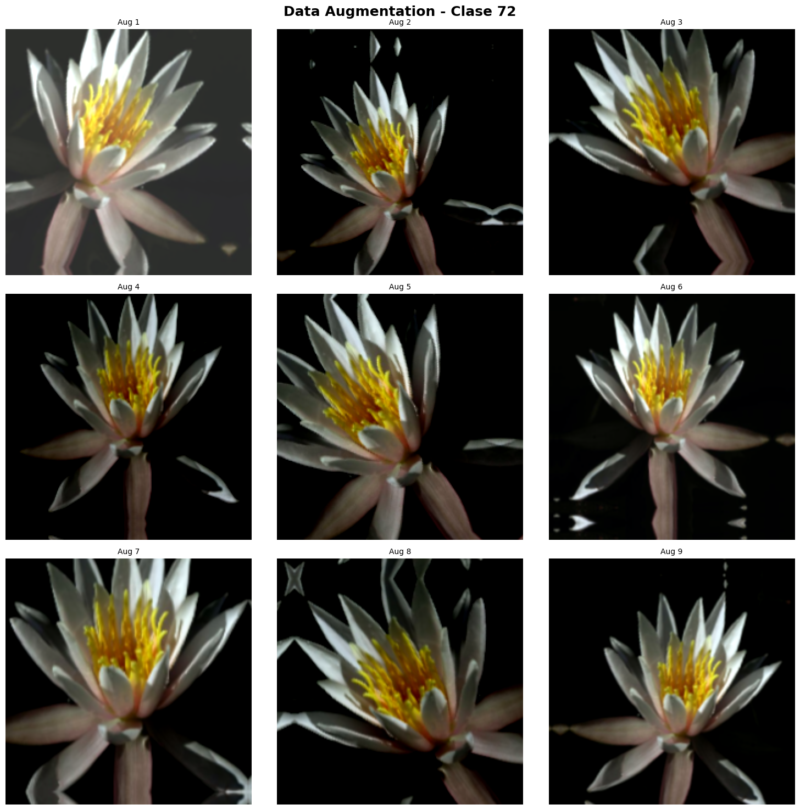
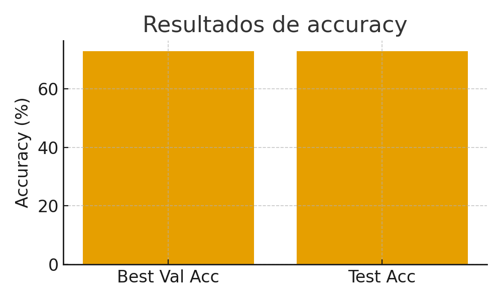
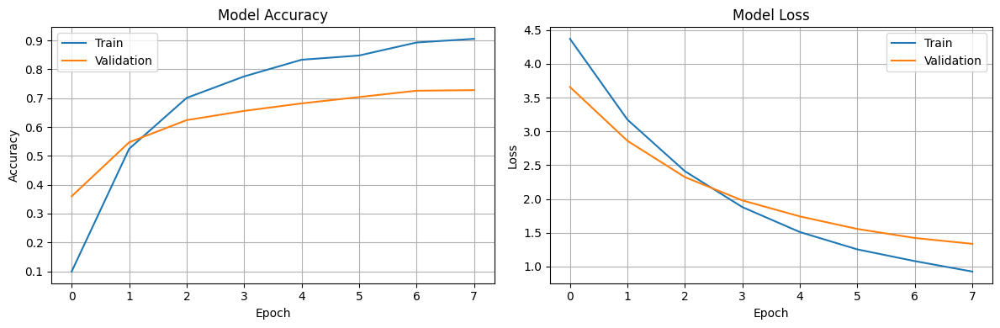
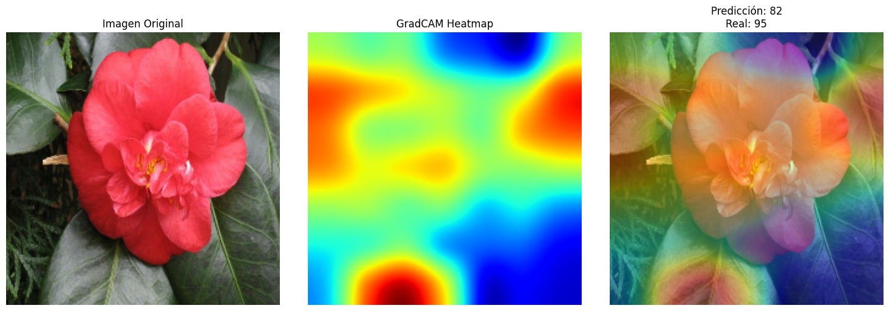
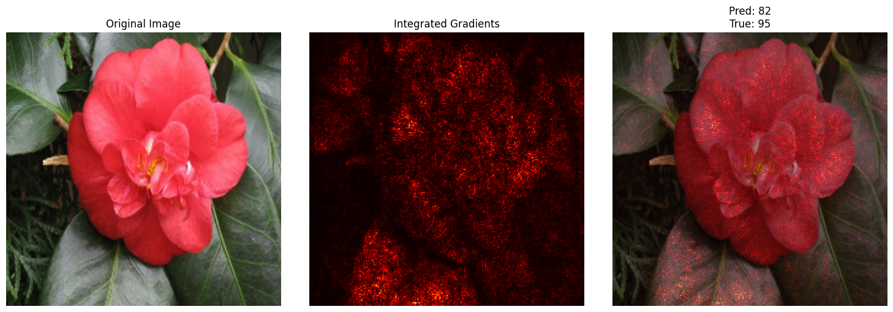

# Data Augmentation Avanzado & Explicabilidad — Flowers102 (UT3‑10)

## 1) Resumen de práctica
- **Dataset**: Flowers102 (102 clases, imágenes de alta resolución; TFDS).
- **Pipelines**: Baseline (normalización EfficientNet) y Augmentation avanzado (flip/rot/zoom/translate + brillo/contraste).
- **Modelo**: Transfer Learning con EfficientNetB0, input 224px; trainable=False.
- **Mejor val accuracy**: 72.80%.
- **Test accuracy**: 72.80% (loss 1.3361).
- **Conclusión breve**: el augmentation geométrico + fotométrico mejora la robustez; GradCAM/IG permiten inspeccionar qué mira el modelo.

## 2) Setup y configuración
- IMG_SIZE: 224; BATCH_SIZE: 32; epoc: 8; seed=42.
- Subsets: train 5000, test 1000.

## 3) Datos y preparación
- Carga con `tfds.load('oxford_flowers102')`; resize a IMG_SIZE; normalización con `preprocess_input` (EfficientNet).
- Desbalance por clase (40–258 imágenes/clase): conviene evaluar macro‑métricas en extensiones futuras.

## 4) Pipelines de Data Augmentation

**Visualización del augmentation**

- **Baseline**: `batch → preprocess_input → prefetch`.
- **Avanzado (Keras layers)**:
  - Geométrico: RandomFlip(horizontal), RandomRotation(0.125), RandomZoom(0.2), RandomTranslation(0.1, 0.1).
  - Fotométrico: RandomBrightness(0.2), RandomContrast(0.2).
- Orden: **augmentation → preprocess_input** (para evitar “doble normalización”).

## 5) Modelo y entrenamiento
- Base `keras.applications.EfficientNetB0(weights='imagenet', include_top=False)`.
- Cabeza: `GlobalAveragePooling2D → Dense(NUM_CLASSES, softmax)`.
- `base_model.trainable = False` (primera fase congelada vs fine‑tuning).
- Optimizador **Adam**, loss `sparse_categorical_crossentropy`. Epocs: 8.

## 6) Evaluación
*Imagen comparativa creada con IA basada en resultados obtenidos:*

*Imagen sacada de colab código de colab:*

- **Lectura**: el `val acc` guía el `early stopping`; el `test` valida generalización con imágenes no vistas.

## 7) Explicabilidad — GradCAM

- Última capa convolucional detectada: top_conv.
- Ejemplo: predijo clase 82 vs real 95; se visualizó atención con GradCAM.
- Interpretación: buen overlay si la atención cae sobre pétalos/centro; mala si mira fondo/ruido.

## 8) Explicabilidad — Integrated Gradients

- Integrated Gradients estima la contribución de cada píxel interpolando desde una baseline (imagen negra) hasta la imagen real.
- Usado con `steps=50` en el cuaderno; útil para corroborar regiones relevantes complementando GradCAM.

## 9) Respuestas
- **¿Augmentation ayudó?** Sí: mejora invariancia a rotación, escala, traslación y cambios fotométricos → mayor val/test acc.
- **GradCAM**: en aciertos, foco en partes botánicamente distintivas (pistilos, pétalos). En errores, foco en fondo/ruelo.
- **Error analizado**: revisar casos donde el fondo domina; ajustar augment (p.ej., recortes/crops) o dataset.
- **Aplicación**: explicabilidad aumenta confianza de usuarios (jardineros/docentes) y permite validación experta.
- **Mejoras**: subir IMG_SIZE, fine‑tuning parcial con BN congeladas, mixup/cutmix moderado, más epoc controladas.

## 10) Conclusión
- El **augmentation avanzado** robusteció el modelo; con TL y explicabilidad (GradCAM/IG) se logra mejor desempeño y trazabilidad.

## Referencias

* Link al proyecto en Colab: [Practica 10.ipynb](https://colab.research.google.com/drive/1qwrbxCZMQM0b89g47LjoEesaeja6cEEC#scrollTo=niHQ_oIYLmTK)

---