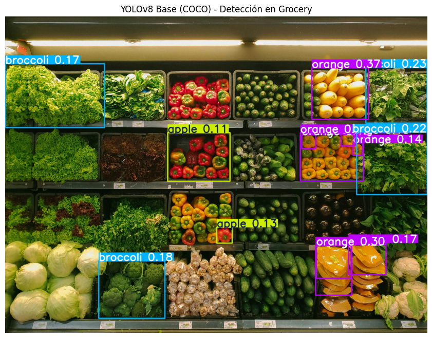
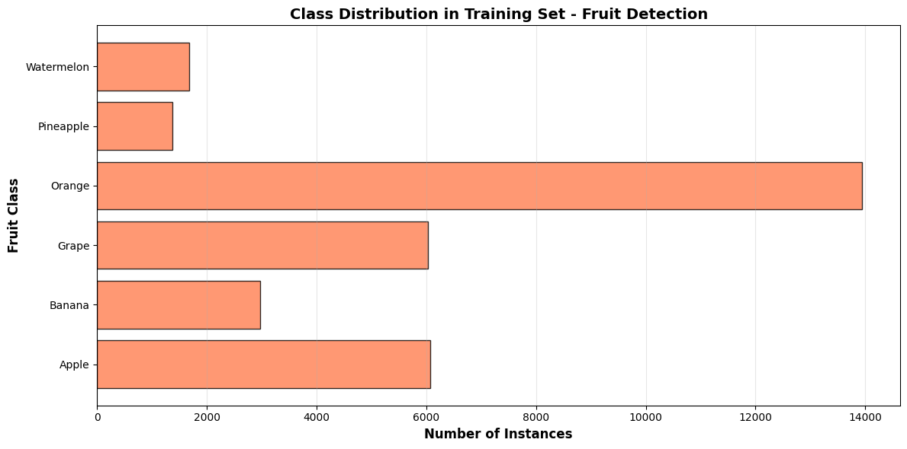
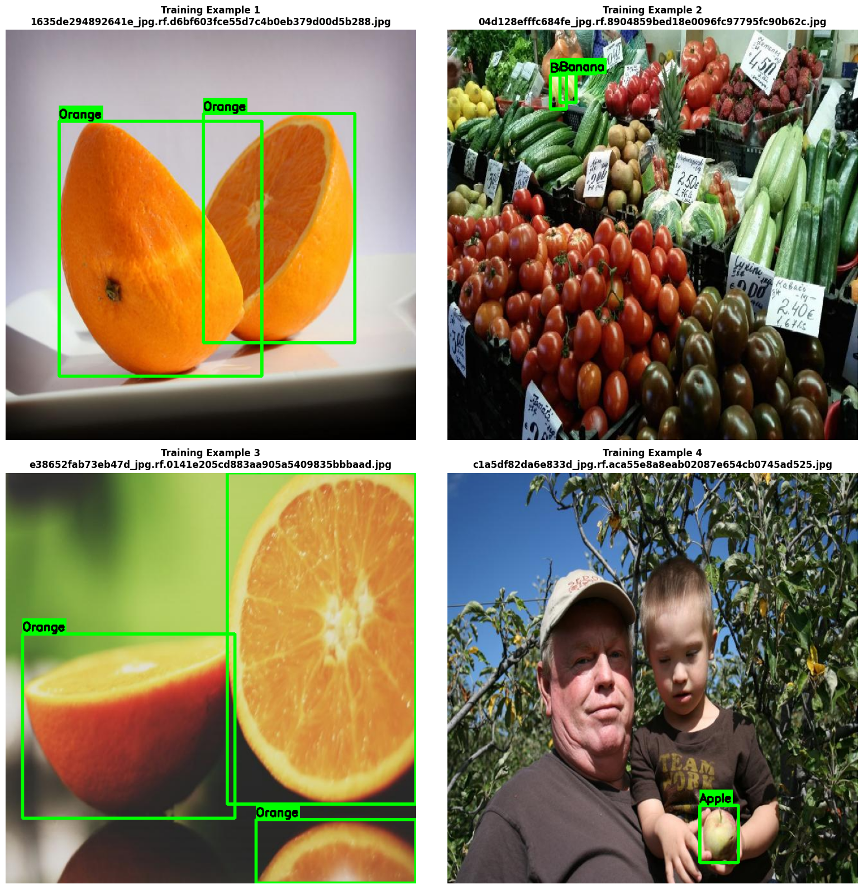
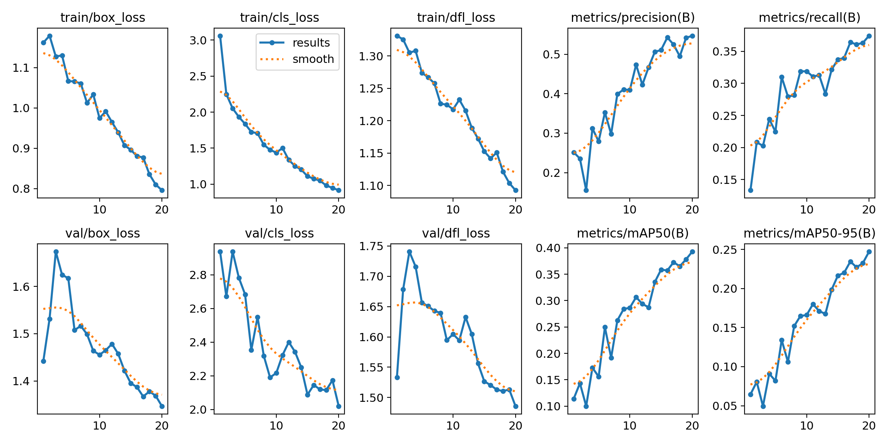
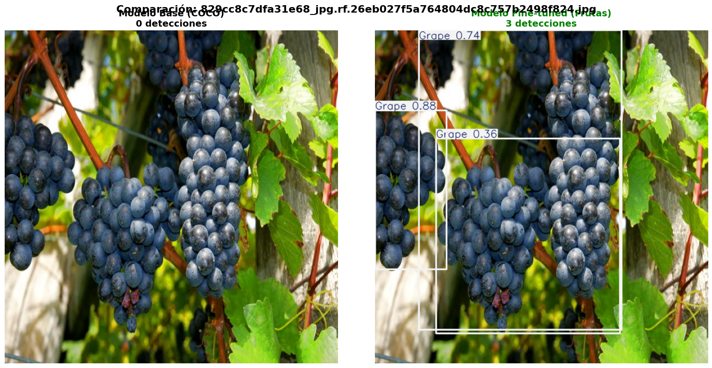
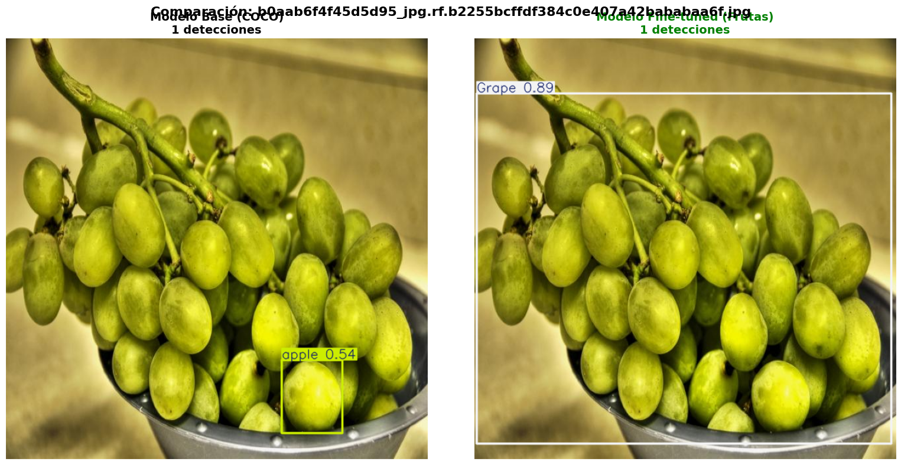
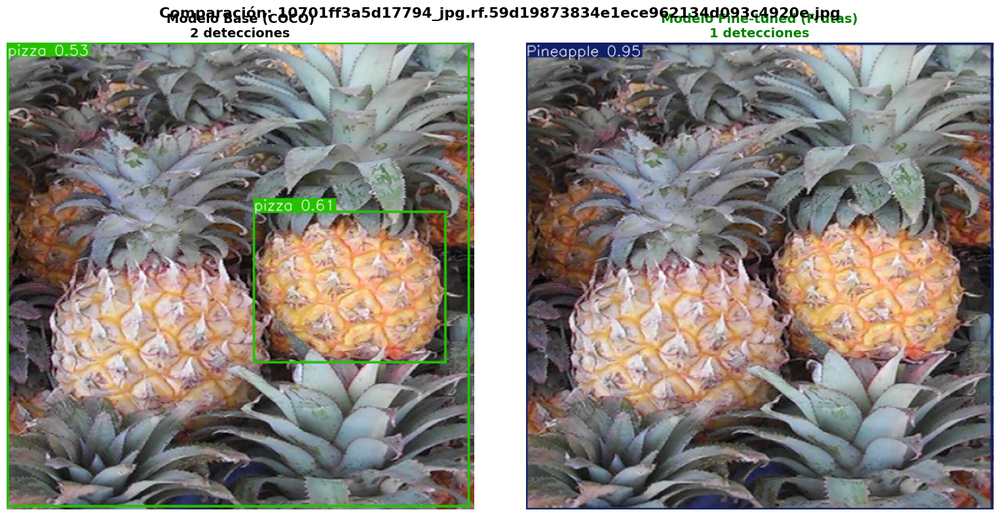
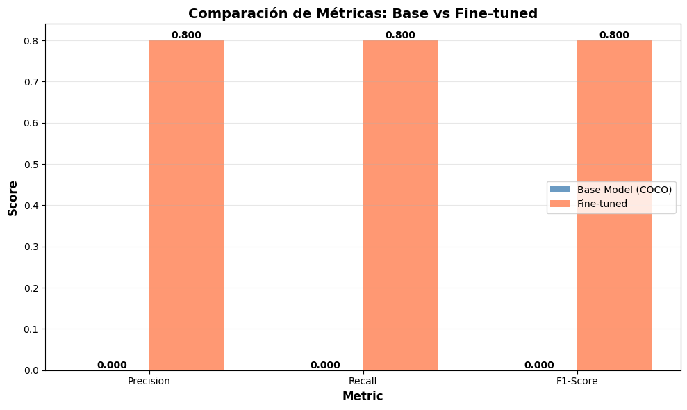
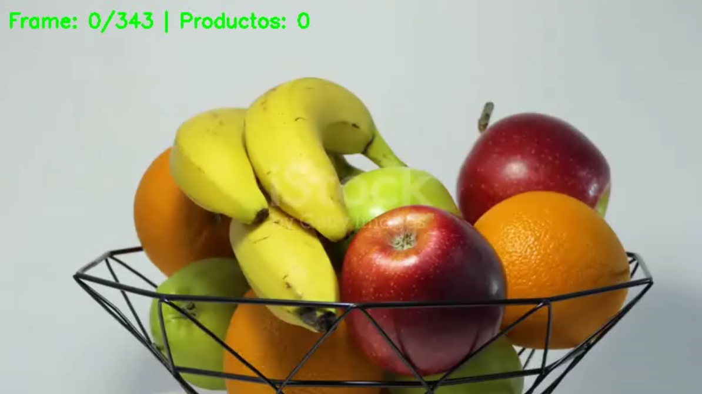
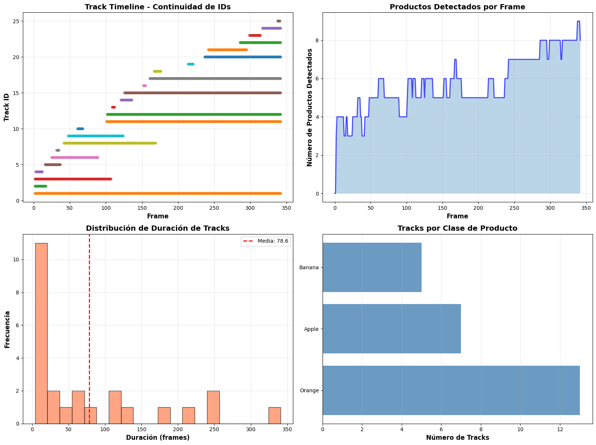

# Detección & Tracking de Frutas con YOLOv8 —(UT3‑11)

## 1) Resumen de práctica
- **Objetivo**: mostrar que el modelo COCO no distingue productos específicos y que el **fine-tuning** en frutas mejora mAP/Precision/Recall.
- **Dataset**: Fruit Detection (formato YOLO).
- **Modelos**: **YOLOv8n** base (COCO) vs **YOLOv8n** fine-tuned en frutas.
- **Tracking**: Norfair (+ Kalman opcional).
- **Métricas**: `mAP@0.5`, `mAP@0.5:0.95`, `Precision`, `Recall`.
- **Conclusión breve**: el fine-tuning especializa el detector y habilita tracking estable.

---

## 2) Inferencia con modelo base (COCO)
**Idea**: el modelo pre-entrenado detecta clases genéricas, no variedades/frutas específicas.

---

## 3) Dataset: verificación y distribución
- Estructura YOLO correcta (`images/labels`) y `data.yaml` ajustado.
- Chequeo de balance por clase y ejemplos anotados.

---

## 4) Fine-tuning en frutas (YOLOv8n)
- `EPOCHS`, `BATCH`, `IMGSZ`, fracción de datos y `data_fixed.yaml`.
- Entrenamiento con Ultralytics; curvas y métricas por epoc:

---

## 5) Evaluación del modelo fine-tuned
- Validación con `model_finetuned.val()` y reporte global.

| Métrica        | Valor |
|----------------|------:|
| mAP@0.5        | 0.393 |
| mAP@0.5:0.95   | 0.248 |
| Precision      | 0.545 |
| Recall         | 0.375 |

---

## 6) Comparación visual — Base vs Fine-tuned
**Mismas imágenes, lado a lado.**

**Comparativa de métricas (subset TP/FP/FN)**

---

## 7) Tracking con Norfair ( + Kalman opcional )
- YOLOv8n fine-tuned → detecciones por frame → asociación/IDs con Norfair.

**Video resultado (preview, descarga mas abajo)**  

<a href="/portfolio-ia//docs/assets/ta11_9.mp4" download="ta11_9.mp4"
   style="display:inline-block;background:#0ea5e9;color:#fff;padding:10px 14px;border-radius:10px;text-decoration:none">
  ⬇️ Descargar video (MP4)
</a>

**Dashboard de tracking (4 vistas)**

---

## 8) Conclusión
- El **fine-tuning** aumentó la especialización (↓ FP/ FN, ↑ mAP).
- El **tracking** funciona bien con thresholds ajustados a la escena.
- Próximo paso: probar **YOLOv8s/m**, **ByteTrack** e incluir **IDF1/ID-switches**.

## Referencias

* Link al proyecto en Colab: [Practica 11.ipynb](https://colab.research.google.com/drive/1uUyXvEWkvDFfmtIjxCYdFIvs_R18e1fV#scrollTo=HlfAwzEJCehn)

---

**NOTA Post Subida:**

Revisando todo me di cuenta de que el video no se podía reproducir asi que cambie la manera de visualizarlo.