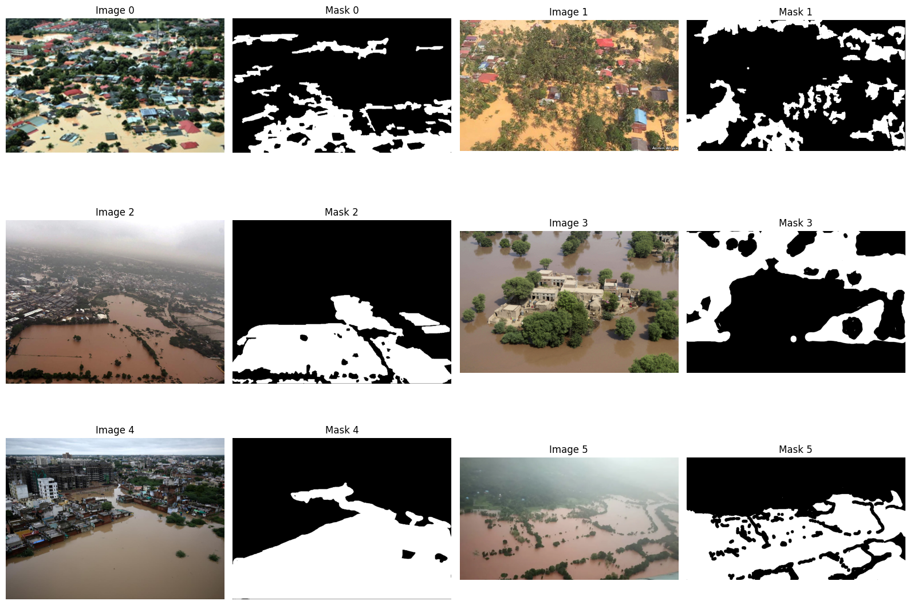
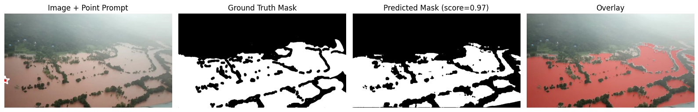
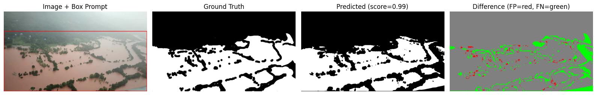
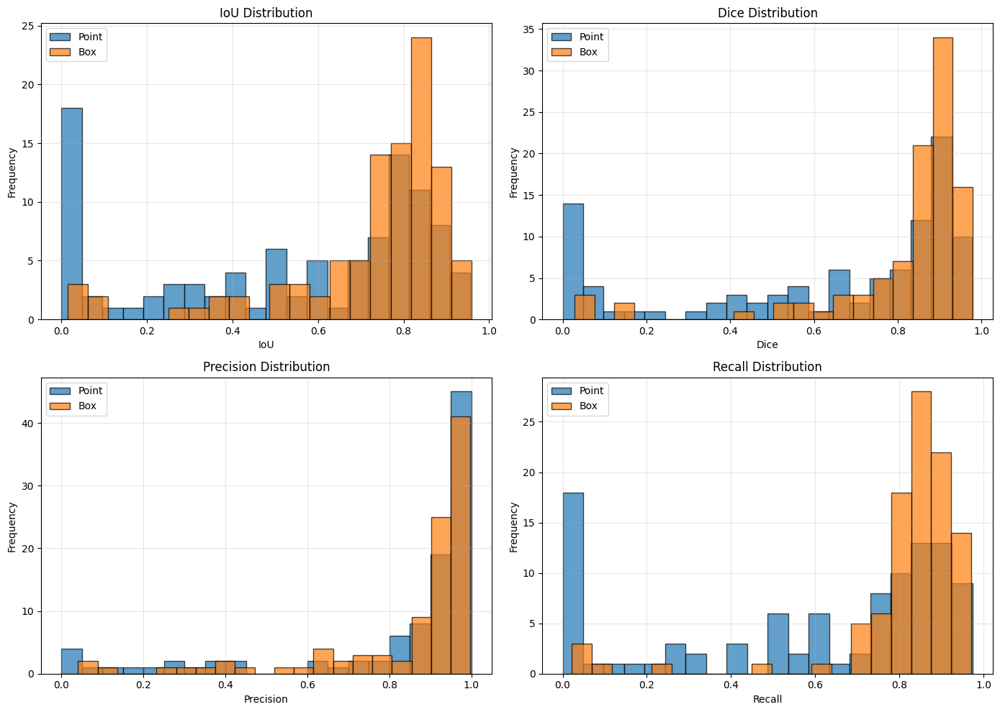
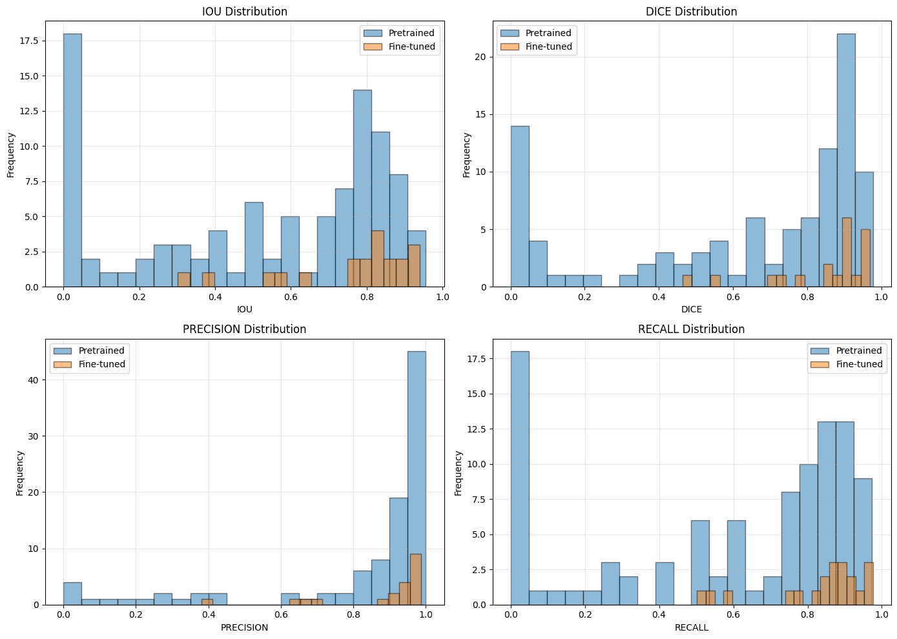
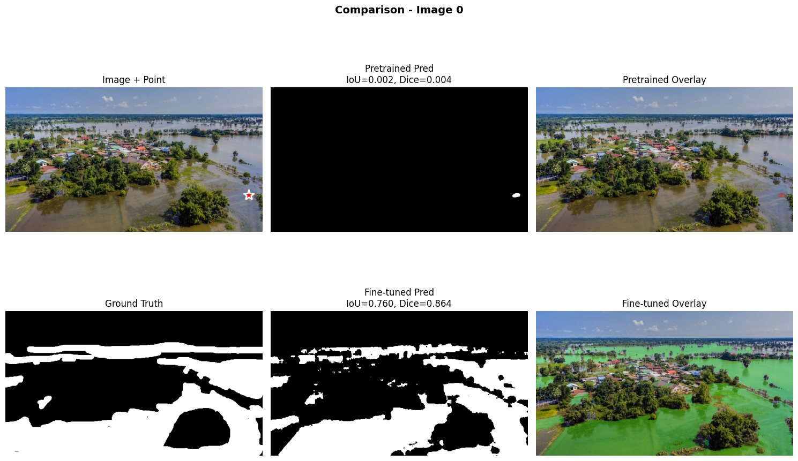
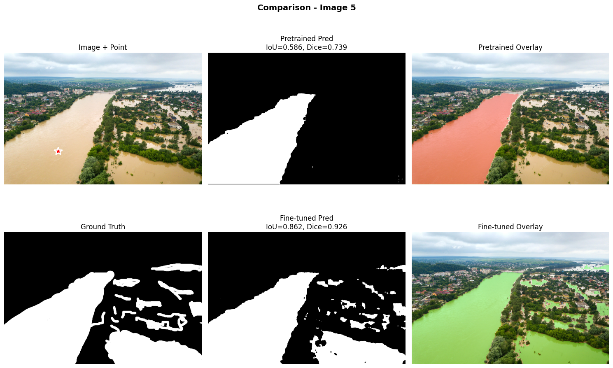
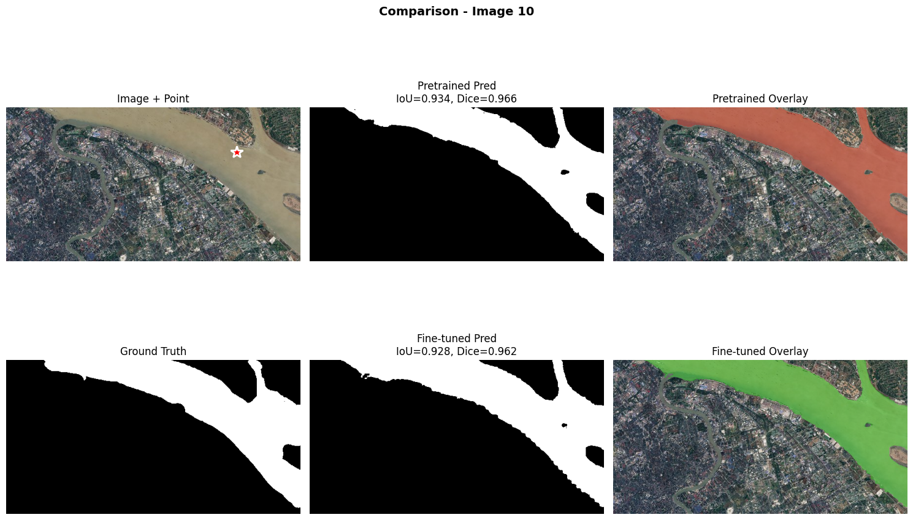
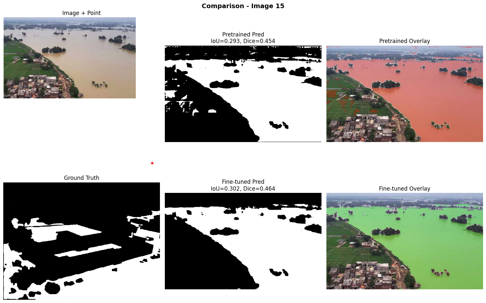
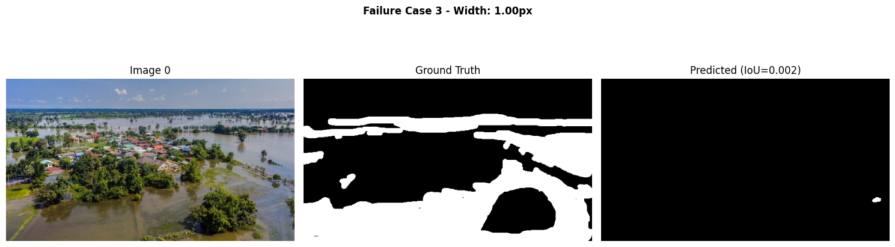

# Segmentación de Inundaciones con SAM — Pretrained vs Fine-tuned (UT3‑12)

## 1) Resumen de práctica
- **Problema:** segmentar áreas inundadas (agua) en imágenes RGB.
- **Modelos:** SAM ViT-B **pretrained** (prompts: point/box) vs **fine-tuned** para este dominio.
- **Métricas:** IoU, Dice, Precision, Recall (distribuciones e imágenes comparativas).
- **Conclusión breve:** el fine-tuning desplaza las distribuciones hacia valores altos y mejora bordes/continuidad; box suele recuperar mejor zonas extensas de agua que point.

---

## 2) Dataset y muestras

---

## 3) SAM Pretrained — Point vs Box
**Point prompt (ejemplo + overlay)**  

**Box prompt (ejemplo + diferencia FP/FN)**  

**Distribuciones de métricas (Point vs Box)**  

---

## 4) Efecto del Fine-tuning (distribuciones globales)

`Lectura rápida: las barras del fine-tuned se concentran hacia 0.8–0.95 en IoU/Dice y suben en Precision/Recall → mejor ajuste al dominio de inundaciones.`

---

## 5) Comparación cualitativa (mismas imágenes)
**Ejemplo 1**  

**Ejemplo 2**  

**Ejemplo 3**  

**Ejemplo 4**  

---

## 6) Casos de fallo

`Hallazgo: segmentos extremadamente delgados (≈1 px) pueden perderse. Ideas: más data difícil, augmentations que preserven delgados y/o post-process (morph ops) si la app lo tolera.`

---

## 7) Tabla de métricas
**Promedios (redondeo a 3 decimales)**

| Modelo / Prompt      | IoU (↑) | Dice (↑) | Precision (↑) | Recall (↑) |
|----------------------|--------:|---------:|--------------:|-----------:|
| Pretrained – Point   | 0.529   | 0.622    | 0.819         | 0.589      |
| Pretrained – Box     | 0.723   | 0.816    | 0.848         | 0.811      |
| **Fine-tuned**       | **0.758** | **0.849** | **0.880**       | **0.832**    |

**Mejora vs Pretrained – Point**

| Métrica    | Pretrained–Point | Fine-tuned | Mejora (%) |
|------------|------------------:|-----------:|-----------:|
| IoU        | 0.5291            | 0.7576     | 43.17      |
| Dice       | 0.6220            | 0.8488     | 36.46      |
| Precision  | 0.8193            | 0.8803     | 7.46       |
| Recall     | 0.5885            | 0.8316     | 41.29      |

## 8) Conclusión
- **Pretrained:** con prompts funciona como baseline; **box > point** en *recall* cuando el agua ocupa gran parte de la escena.
- **Fine-tuned:** ↑IoU/Dice/Precision/Recall y mejores bordes; ↓falsos positivos por reflejos/vegetación clara.
- **Siguiente paso:** más datos “difíciles”, *loss* ponderada para bordes delgados y evaluar variantes (SAM-HQ/MobileSAM) según recursos.

## Referencias

* Link al proyecto en Colab: [Practica 12.ipynb](https://colab.research.google.com/drive/1sRmm_n6UzxK1QZH3epTeBsnEP90buOpJ#scrollTo=TPsUMPnH2vx4)

---
