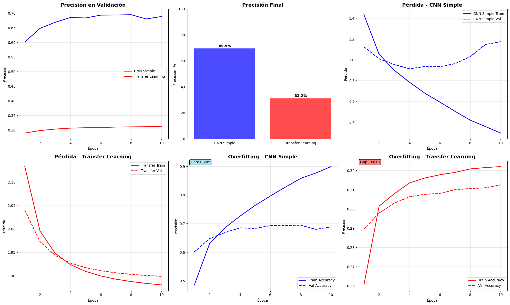
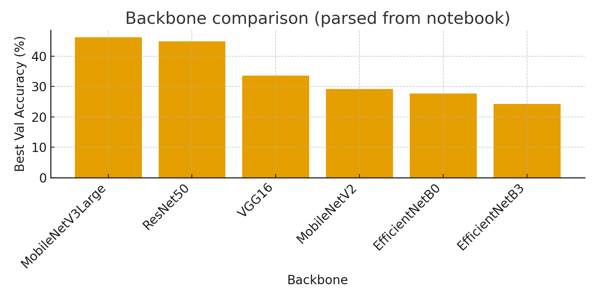

# ¿CNN desde cero o Transfer Learning? — CIFAR‑10 (UT3‑9)

## 1) Resumen de práctica
- **Dataset**: CIFAR‑10 (50k train / 10k test, 32×32×3, 10 clases).
- **Modelos**: CNN simple vs Transfer Learning (Keras Applications) + mini‑benchmark de backbones.
- **Precisión en test**: CNN simple ≈ 69.5% vs TL ≈ 31.2%.
- **Overfitting (gap máx. train‑val)**: CNN 0.205 vs TL 0.010.
- **Complejidad**: CNN (≈2,122,186 params) vs TL (total ≈2,270,794, entrenables ≈12,810).
- **Conclusión breve**: a 32×32, la CNN rinde más. TL mejora si subimos resolución, usamos GAP+BN+Dropout y hacemos fine‑tuning parcial.

## 2) Setup y configuración
- TensorFlow/Keras con detección de GPU y seeds fijadas para reproducibilidad.
- **Batch size**: 128, epoc: 10, EarlyStopping por `val_accuracy`.

## 3) Dataset y preparación
- Carga de **CIFAR‑10** desde `keras.datasets`.
- **Normalización** a [0,1] y one‑hot de etiquetas.
- Nombres de clases: airplane, automobile, bird, cat, deer, dog, frog, horse, ship, truck.

## 4) CNN simple — diseño
- Arquitectura: `Conv(32,3) → ReLU → MaxPool(2)` ×2 → `Flatten → Dense(512) → Softmax`.
- Optimizador: **Adam(1e‑3)**, loss `categorical_crossentropy`.
- Parámetros: **≈2,122,186**.

## 5) Transfer Learning — diseño
- Base **preentrenada ImageNet** (`include_top=False`) congelado, + cabeza `Flatten → Softmax` (baseline de la consigna).
- Optimizador: **Adam(1e‑3)** (y opcional FT con LR 1e‑4).
- Parámetros totales: **≈2,270,794**; entrenables iniciales: ≈12,810 (con base congelada).
- Nota: en TL se recomienda `GlobalAveragePooling2D + BatchNorm + Dropout` en lugar de `Flatten` para mejor generalización.

## 6) Entrenamiento
- Dos corridas separadas (CNN y TL) con el mismo pipeline de validación.
- Callback **EarlyStopping** (paciencia=3) y métrica principal `val_accuracy`.

## 7) Evaluación y comparación

- **Precisión final**: CNN ≈ **69.5%** | TL ≈ **31.2%**.
- **Overfitting**: gap CNN **0.205** | TL **0.010**.
- Lectura: la CNN aprende más patrón específico; el TL, con cabeza sencilla y 32×32, queda limitado. Mejora al subir resolución y hacer FT parcial.

## 8) Paso 7 — Investigación libre (mini‑benchmark)
- Mejores backbones (val acc máx.): **MobileNetV3Large** (46.3%) y **ResNet50** (45.0%).

*Imagen comparativa creada con IA basada en resultados obtenidos:*

- Metodología: misma cabeza ligera para todos; etapa 1 (cabeza) → etapa 2 (FT parcial con LR menor, BN congeladas).
- Qué funcionó: `IMG_SIZE ≥ 160`, `GAP + BN + Dropout`, label smoothing pequeño (0.05–0.1), y descongelar 20–60 capas finales.

## 9) Conclusión

- En **32×32**, la **CNN** superó al **Transfer Learning** (69.5% vs 31.2%); TL necesita más resolución y una cabeza adecuada con fine-tuning parcial.
- El **gap train–val** guió las decisiones: la CNN **sobreajusta** (0.205), mientras que TL generaliza más.
- Posible próximo paso: repetir TL a **224px** con FT parcial y una matriz de confusión; luego, validar en otro dataset.

