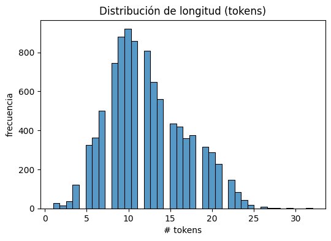
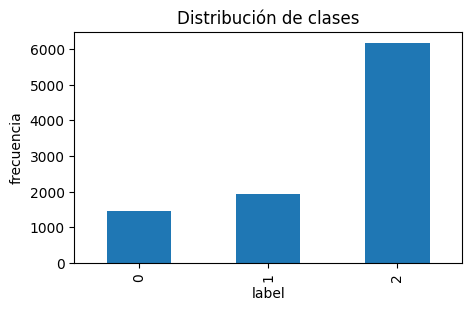
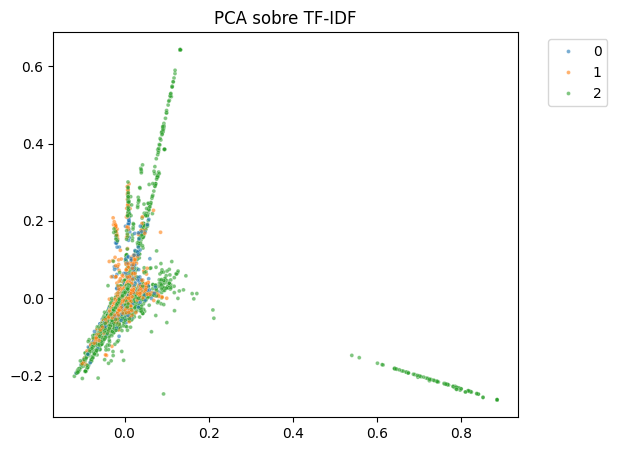
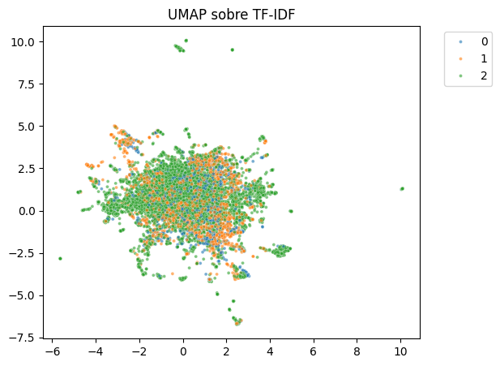
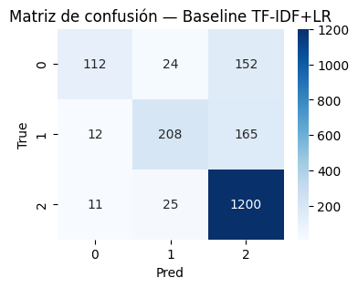
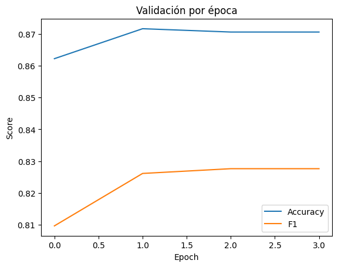

# Analisis de Sentimiento Financiero con TF-IDF y FinBERT (UT4-13)

## 1) Resumen de práctica
- Problema: clasificar sentimiento en noticias/tweets financieros (3 etiquetas) usando el dataset `zeroshot/twitter-financial-news-sentiment`.
- Dos enfoques: (a) baseline TF-IDF + Logistic Regression; (b) transformer **ProsusAI/finbert** fine-tune con Trainer de HF.
- Resultado: FinBERT supera al baseline (+7.4 pts en accuracy y +14.5 pts en F1 macro). 
- Riesgo clave: fuerte desbalance (clase 2 domina) y alta confusividad entre 0/1.

## 2) Dataset y EDA
- Splits originales: 9,543 train / 2,388 validation.
- Distribucion de tokens: media ~12, rango 1-32.  
  
- Distribucion de clases (0/1/2): 1,442 / 1,923 / 6,178 (desbalance hacia la clase 2).  
  
- N-grams mas frecuentes por clase (Top 20):
  - Clase 0: terminos de caidas/alertas ("misses", "fall", "drop"...).
  - Clase 1: vocabulario positivo ("up", "beats", "price target").
  - Clase 2: marcado por tokens neutros/noticiosos y el dominio (`https`, `marketscreener`).
- Wordcloud clase 0 (negativa) muestra enfasis en caidas, revenue y mercados.  
  

## 3) Separabilidad con representaciones clasicas
- TF-IDF (max_features=30k, ngram_range=(1,2)).
- PCA 2D: nubes fuertemente solapadas, poca separacion lineal.  
  
- UMAP 2D: agrupaciones densas pero sin clusters por clase; hay outliers dispersos.  
  

## 4) Baseline: TF-IDF + Logistic Regression
- Split 80/20 estratificado sobre `df` (texto crudo -> TF-IDF).
- Metrica en test: **accuracy = 0.80**, **F1 macro = 0.68**.
- Reporte de clasificacion (precision/recall/F1):
  - Clase 0: 0.83 / 0.39 / 0.53 (poca cobertura, muchos FN).
  - Clase 1: 0.81 / 0.54 / 0.65.
  - Clase 2: 0.79 / 0.97 / 0.87 (modelo favorece la clase mayoritaria).
- Matriz de confusion: se ve fuga de clases 0 y 1 hacia la 2.  
  

## 5) Modelo Transformer: FinBERT (ProsusAI/finbert)
- Tokenizer y modelo base orientados a finanzas; max_length no modificado (por defecto 512 tokens, suficiente para los tweets).
- Ajuste con `Trainer` (3 epocas) sobre el split de train; eval en validation set original.
- Salida de evaluacion (epoch 3): **loss 0.4693**, **accuracy = 0.8706**, **F1 = 0.8276**.
- Curvas de validacion por epoca: accuracy se estabiliza en ~0.871 y F1 ~0.828.  
  

## 6) Comparativa Baseline vs FinBERT
| Modelo | Accuracy | F1 macro |
| ------ | -------- | -------- |
| TF-IDF + LR | 0.7962 | 0.6831 |
| **FinBERT fine-tune** | **0.8706** | **0.8276** |

- Mejora absoluta: +7.4 pts en accuracy, +14.5 pts en F1 macro.
- Reduccion de errores: FinBERT captura mejor matices, especialmente para clases minoritarias (0/1) donde el baseline sufria recall bajo.

## 7) Conclusiones y proximos pasos
- FinBERT es claramente superior para lenguaje financiero corto; el baseline queda como referencia ligera.
- Desbalance sigue presente: conviene usar `class weights` o `focal loss` para mejorar recall en clases 0/1.
- Aumentar datos o aplicar data augmentation textual (backtranslation, synonym swap) podria ayudar.
- Medir inference cost (latencia/tamano) y considerar DistilBERT finetune para un punto medio.
- Añadir calibracion de probabilidades si el modelo se usa para decision de riesgo.

## Referencias

* Link al proyecto en Colab: [Practica 13.ipynb](https://colab.research.google.com/drive/15qBKECuBlStqLy-d_aL3BR5odrpktWwT?usp=drive_open#scrollTo=6hd3v-uA8UA-)

---
